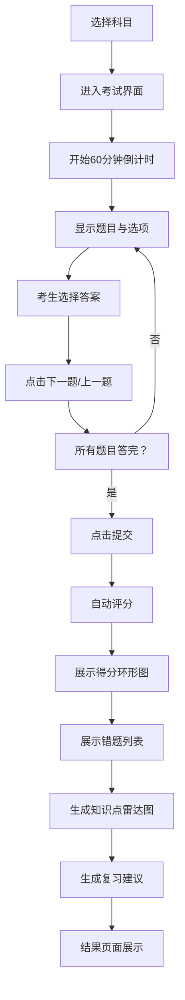

## 1. 产品概述

职业资格在线模拟考试系统，为考生提供自选科目限时答题服务，考试结束后自动评分并生成详细的错题分析报告，包含知识点薄弱项分析和个性化复习建议。

- **主要用途**：职业资格考试模拟练习、错题分析与针对性复习
- **目标用户**：备考职业资格证书的考生、需要管理题库的管理员
- **核心价值**：通过模拟考试和智能错题分析，帮助考生高效备考，提升通过率

## 2. 核心功能

### 2.1 用户角色

| 角色 | 访问方式 | 核心权限 |
|------|----------|----------|
| 考生 | 直接访问 | 选择科目、参加考试、查看成绩、查看历史记录、查看错题分析 |
| 管理员 | 访问`/admin`路径 | 查看所有考生成绩汇总、添加新题目、管理题库 |

### 2.2 功能模块

1. **首页/科目选择页**：科目卡片展示、历史成绩入口、管理员入口
2. **考试界面**：题目展示、倒计时、选项交互、上一题/下一题导航、提交按钮
3. **结果展示页**：得分环形图、错题列表、知识点分析雷达图、复习建议
4. **历史记录页**：最近10次考试记录卡片列表
5. **管理员后台**：成绩汇总表格、添加题目表单

### 2.3 页面详情

| 页面名称 | 模块名称 | 功能描述 |
|---------|----------|----------|
| 科目选择页 | 科目卡片 | 展示Java基础、项目管理、网络安全三个科目卡片，点击进入对应考试 |
| 科目选择页 | 历史记录入口 | 按钮导航到历史成绩页面 |
| 科目选择页 | 管理员入口 | 链接导航到管理员后台 |
| 考试界面 | 顶部状态栏 | 显示当前题目序号（如3/30）、剩余倒计时（60分钟，精确到秒） |
| 考试界面 | 题目区域 | 显示题目文本和四个选项按钮 |
| 考试界面 | 底部导航 | 上一题/下一题按钮，边界条件时禁用置灰 |
| 结果展示页 | 得分环形图 | 带进度动画的得分展示，圆弧颜色红到绿渐变 |
| 结果展示页 | 错题列表 | 浅红背景展示错题，包含正确选项和解析 |
| 结果展示页 | 雷达图 | Canvas绘制五维知识点分析图 |
| 结果展示页 | 复习建议 | 三条自动生成的个性化复习建议 |
| 历史记录页 | 成绩卡片 | 横向卡片展示最近10次考试记录，悬停上浮效果 |
| 管理员后台 | 成绩表格 | 展示所有考生的成绩汇总 |
| 管理员后台 | 添加题目表单 | 表单包含题目文本、四个选项、正确答案和所属科目 |

## 3. 核心流程

### 考生考试流程
考生在首页选择科目后进入考试界面，系统开始60分钟倒计时。考生逐题作答，可通过上一题/下一题切换。所有题目答完后点击提交，系统自动评分并展示结果页面，包含得分、错题列表、知识点雷达图和复习建议。考生可随时查看历史成绩记录。

### 管理员流程
管理员通过`/admin`路径直接进入后台，可查看所有考生成绩汇总表格，或通过表单添加新题目到题库。

## 4. 用户界面设计

### 4.1 设计风格
- **主题色**：主色调蓝色`#3182ce`，辅助色青色`#00b5d8`，背景色浅蓝灰`#f7fafc`
- **卡片风格**：白色背景，圆角12px，轻阴影`0 2px 8px rgba(0,0,0,0.08)`
- **按钮样式**：圆角8px矩形，点击时缩放0.97再恢复（0.1s），选中状态背景`#3182ce`文字白色，过渡0.2s ease
- **字体**：倒计时使用monospace字体，红色`#e53e3e`
- **布局**：考试界面居中单栏（最大宽度800px），结果页面两栏布局

### 4.2 页面设计概述

| 页面名称 | 模块名称 | UI元素 |
|---------|----------|--------|
| 科目选择页 | 科目卡片 | 三张卡片，蓝色主题，悬停阴影加深，点击缩放反馈 |
| 考试界面 | 倒计时 | monospace字体，红色`#e53e3e`，精确到秒 |
| 考试界面 | 选项按钮 | 宽100%高48px，圆角8px，白色背景，选中时`#3182ce`背景白字 |
| 结果展示页 | 环形进度图 | 1.5s ease-out动画，红到绿渐变色，分数居中 |
| 结果展示页 | 错题卡片 | 浅红背景`#fff5f5`，显示正确选项和解析 |
| 结果展示页 | 雷达图 | Canvas五边形，五个维度，线宽2px`#3182ce`，填充透明度0.2 |
| 历史记录页 | 成绩卡片 | 320px×80px，圆角12px，悬停上浮4px阴影加深 |
| 管理员后台 | 成绩表格 | 标准数据表格，斑马纹，悬停高亮 |
| 管理员后台 | 添加题目表单 | 表单控件统一风格，蓝色提交按钮 |

### 4.3 响应式
- **桌面端（≥768px）**：结果页面两栏布局（左侧得分与雷达图，右侧错题列表）
- **移动端（<768px）**：两栏变为单栏堆叠，卡片和按钮自适应宽度，触摸优化
- **触摸优化**：按钮最小高度48px，确保可点击区域充足

### 4.4 交互动效
- **按钮点击**：`transform: scale(0.97)` 再恢复，持续0.1s
- **选项选中**：背景色过渡0.2s ease
- **环形进度**：1.5s ease-out动画，从0过渡到实际得分
- **卡片悬停**：上浮4px，阴影加深
- **页面切换**：平滑过渡效果
