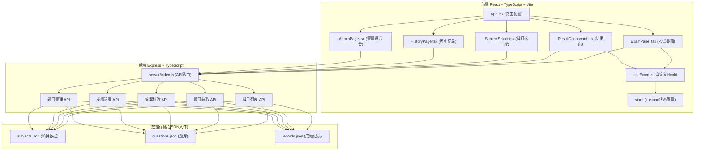
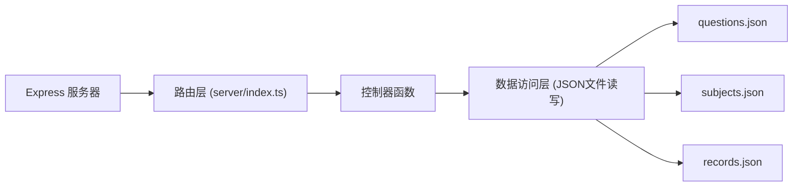
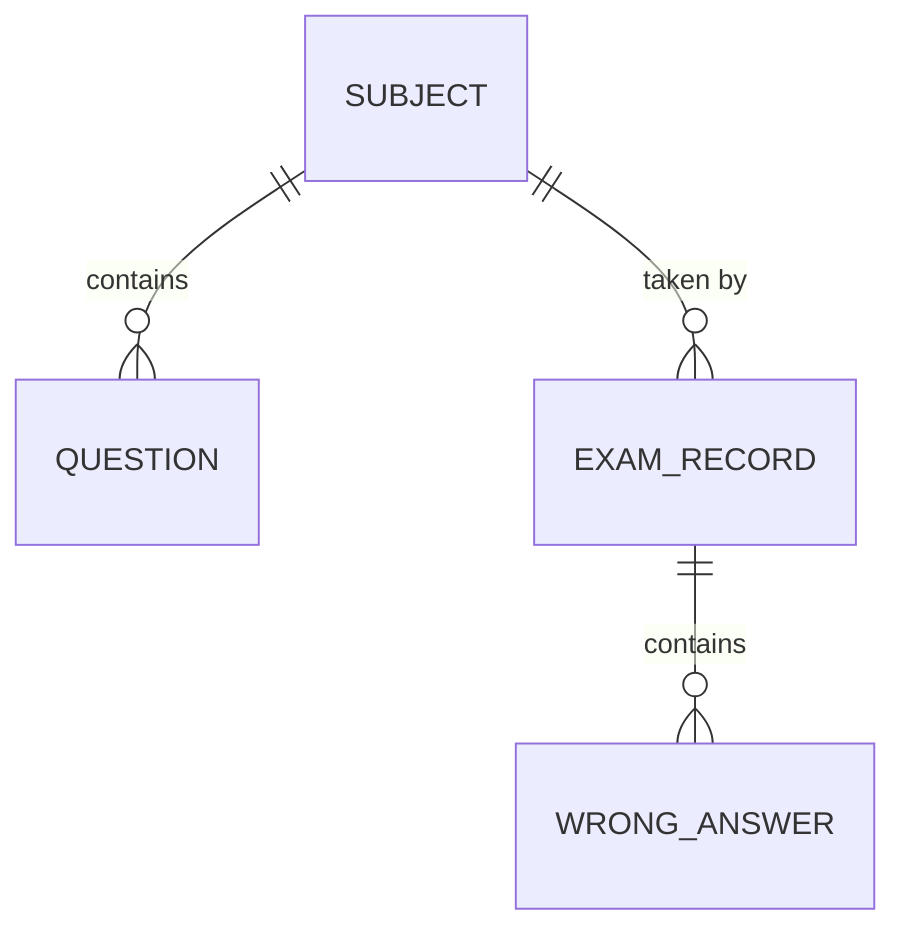

## 1. 架构设计



## 2. 技术描述

- **前端**：React@18 + TypeScript + Vite + React Router DOM + Zustand + TailwindCSS
- **初始化工具**：vite-init（react-express-ts模板）
- **后端**：Express@4 + TypeScript + CORS
- **数据存储**：JSON文件存储（subjects.json、questions.json、records.json）
- **第三方库**：
  - `uuid`：生成唯一标识符
  - `dayjs`：日期时间处理
  - `lucide-react`：图标库
  - `tailwindcss`：样式框架

## 3. 路由定义

| 路由 | 页面组件 | 用途 |
|------|----------|------|
| `/` | SubjectSelect | 科目选择首页 |
| `/exam/:subjectId` | ExamPanel | 考试界面 |
| `/result/:examId` | ResultDashboard | 考试结果展示页 |
| `/history` | HistoryPage | 历史成绩记录页 |
| `/admin` | AdminPage | 管理员后台 |

## 4. API 定义

### 4.1 类型定义

```typescript
interface Subject {
  id: string;
  name: string;
  description: string;
  icon: string;
  questionCount: number;
}

interface Question {
  id: string;
  subjectId: string;
  text: string;
  options: string[];
  correctAnswer: number;
  knowledgePoint: string;
  dimension: 'basic' | 'logic' | 'code' | 'security' | 'management';
  explanation: string;
}

interface ExamRecord {
  id: string;
  subjectId: string;
  subjectName: string;
  score: number;
  totalQuestions: number;
  correctCount: number;
  duration: number;
  answers: Record<string, number>;
  dimensionScores: Record<string, number>;
  createdAt: string;
}

interface ExamResult {
  score: number;
  correctCount: number;
  totalQuestions: number;
  wrongAnswers: WrongAnswer[];
  dimensionScores: Record<string, number>;
  suggestions: string[];
}

interface WrongAnswer {
  questionId: string;
  questionText: string;
  userAnswer: number;
  correctAnswer: number;
  options: string[];
  explanation: string;
  knowledgePoint: string;
  dimension: string;
}
```

### 4.2 接口定义

| 方法 | 路径 | 描述 | 请求参数 | 响应 |
|------|------|------|----------|------|
| GET | `/api/subjects` | 获取科目列表 | 无 | `Subject[]` |
| GET | `/api/questions/:subjectId` | 获取指定科目题目 | `subjectId: string` | `Question[]` |
| POST | `/api/exam/submit` | 提交考试答案并评分 | `{ subjectId: string, answers: Record<string, number>, duration: number }` | `ExamResult` |
| GET | `/api/records` | 获取所有成绩记录 | 无 | `ExamRecord[]` |
| GET | `/api/records/latest` | 获取最近10条成绩记录 | 无 | `ExamRecord[]` |
| GET | `/api/records/:id` | 获取单条成绩详情 | `id: string` | `ExamRecord` |
| POST | `/api/questions` | 添加新题目 | `Omit<Question, 'id'>` | `Question` |

## 5. 服务端架构



## 6. 数据模型

### 6.1 实体关系



### 6.2 数据文件结构

#### subjects.json
```json
[
  {
    "id": "java",
    "name": "Java基础",
    "description": "Java程序设计基础知识考试",
    "icon": "Code",
    "questionCount": 30
  },
  {
    "id": "pm",
    "name": "项目管理",
    "description": "项目管理知识体系考试",
    "icon": "FolderKanban",
    "questionCount": 30
  },
  {
    "id": "security",
    "name": "网络安全",
    "description": "网络安全基础知识考试",
    "icon": "Shield",
    "questionCount": 30
  }
]
```

#### questions.json 示例
```json
[
  {
    "id": "q1",
    "subjectId": "java",
    "text": "Java中哪个关键字用于定义常量？",
    "options": ["static", "final", "const", "constant"],
    "correctAnswer": 1,
    "knowledgePoint": "Java关键字",
    "dimension": "basic",
    "explanation": "final关键字用于定义常量，一旦赋值后不可修改。"
  }
]
```

#### records.json 示例
```json
[
  {
    "id": "record-uuid-1",
    "subjectId": "java",
    "subjectName": "Java基础",
    "score": 85,
    "totalQuestions": 30,
    "correctCount": 26,
    "duration": 2400,
    "answers": { "q1": 1, "q2": 0 },
    "dimensionScores": {
      "basic": 80,
      "logic": 90,
      "code": 75,
      "security": 85,
      "management": 0
    },
    "createdAt": "2026-06-17T10:30:00Z"
  }
]
```
