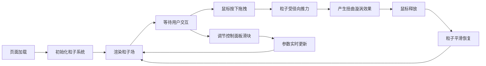

## 1. 产品概述
实时流体粒子扭曲特效展示项目，用户可通过鼠标拖拽与800个粒子产生扭曲和漩涡效果，用于展示WebGL流体力学视觉效果。
- 主要目的：展示实时粒子物理模拟和视觉效果，目标用户为开发者、设计师和视觉艺术爱好者
- 产品价值：提供直观、高性能的粒子交互演示，展示Three.js和React的结合能力

## 2. 核心功能

### 2.1 用户角色
本项目无需用户角色区分，为单页面展示应用。

### 2.2 功能模块
1. **主展示页**：粒子场渲染、鼠标交互、控制面板

### 2.3 页面详情
| 页面名称 | 模块名称 | 功能描述 |
|-----------|-------------|---------------------|
| 主展示页 | 粒子场渲染 | 800个粒子实时渲染，速度动态变色，径向发光效果，粒子间连线 |
| 主展示页 | 鼠标交互 | 鼠标拖拽产生径向推力，粒子扭曲漩涡效果，阻尼和随机抖动 |
| 主展示页 | 控制面板 | 推力强度、粒子大小、连线阈值三个可调节滑块 |

## 3. 核心流程
用户打开页面 → 看到随机分布的粒子场 → 按住鼠标左键拖拽 → 粒子受推力影响产生扭曲漩涡 → 释放鼠标 → 粒子逐渐恢复随机游走 → 通过左侧控制面板调节参数 → 实时观察粒子行为变化

## 4. 用户界面设计

### 4.1 设计风格
- 主色调：深黑背景 (#000000
- 粒子渐变色：深蓝 #1565c0 → 青色 #00bcd4 → 亮黄 #fdd835
- 控制面板：半透明深色背景 rgba(10,10,20,0.7)，毛玻璃效果，圆角16px
- 滑块颜色：亮黄色 #fdd835
- 字体：现代无衬线字体
- 布局风格：沉浸式全屏粒子背景 + 左侧悬浮控制面板

### 4.2 页面设计概述
| 页面名称 | 模块名称 | UI 元素 |
|-----------|-------------|-------------|
| 主展示页 | 粒子场 | 全屏500x500粒子区域，动态粒子，粒子连线，发光效果 |
| 主展示页 | 控制面板 | 左侧220px宽面板，三个滑块组件，标签显示数值 |

### 4.3 响应式
- 桌面端优先，Canvas自适应窗口尺寸，控制面板固定左侧悬浮显示

### 4.4 3D 场景指引
- 环境：全屏黑色背景
- 相机：正交相机，2D粒子系统
- 粒子：Three.js Points + BufferGeometry
- 连线：自定义ShaderMaterial
- 交互：鼠标位置追踪，径向力场计算
- 性能：稳定50FPS以上
