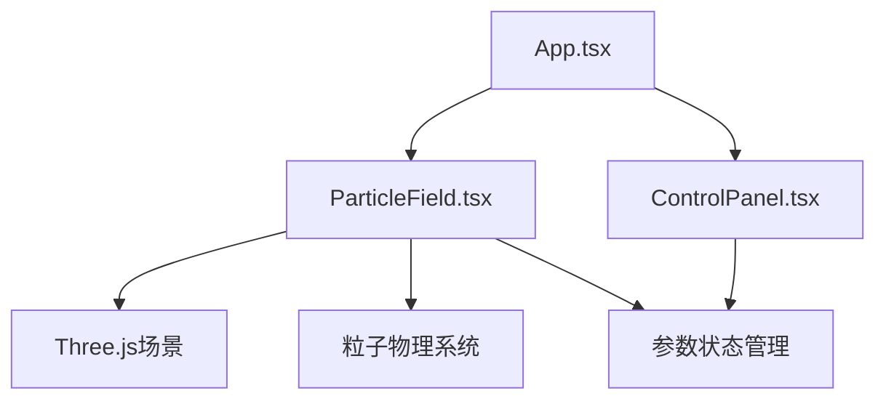

## 1. 架构设计


## 2. 技术描述
- 前端：React 18 + TypeScript
- 3D渲染：Three.js + @react-three/fiber + @react-three/drei
- 构建工具：Vite
- 状态管理：React useState/useRef
- 样式：内联样式（CSS-in-JS）

## 3. 项目文件结构
```
auto52/
├── package.json
├── vite.config.js
├── tsconfig.json
├── index.html
└── src/
    ├── App.tsx
    ├── ParticleField.tsx
    └── ControlPanel.tsx
```

## 4. 核心技术实现

### 4.1 粒子系统
- 使用 Three.js Points + BufferGeometry 管理800个粒子
- 粒子位置、速度数据存储在 TypedArray 中
- 每帧更新粒子物理状态

### 4.2 鼠标交互
- 鼠标按下时记录位置，计算半径80px内粒子的径向推力
- 推力强度 = 基础强度 × (1 - 距离/80)
- 阻尼系数0.9，随机抖动1.2
- 释放后1秒平滑过渡回随机游走

### 4.3 颜色与连线
- 粒子颜色根据速度插值：深蓝#1565c0 → 青色#00bcd4 → 亮黄#fdd835
- 径向渐变模拟发光效果
- 连线距离阈值30px，半透明白色 rgba(255,255,255,0.1)

### 4.4 控制面板
- 三个滑块组件：推力强度(0.5-3.0)、粒子大小(1-6px)、连线阈值(10-60px)
- 滑块样式：宽160px高4px，滑块圆点直径14px，亮黄色#fdd835

