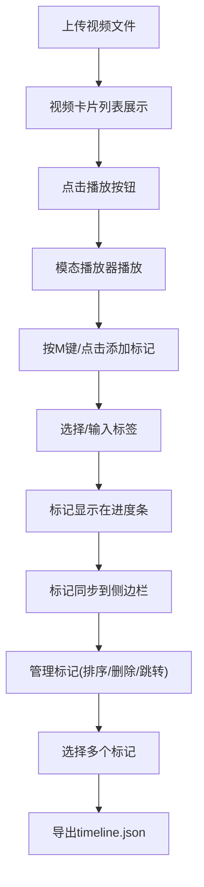

## 1. 产品概述

ClipMarker 是一款面向音视频创作者的视频素材标记与管理工具，帮助创作者快速标记、分类和整理大量原始视频素材，解决素材检索困难、人工整理耗时的痛点问题。

- 核心价值：通过时间戳标记和标签分类，实现视频素材的高效管理和快速检索
- 目标用户：视频剪辑师、Vlog创作者、自媒体从业者、影视后期制作人员
- 市场价值：提升素材整理效率50%以上，缩短后期制作周期

## 2. 核心功能

### 2.1 用户角色
| 角色 | 注册方式 | 核心权限 |
|------|----------|----------|
| 创作者 | 无需注册，本地使用 | 上传视频、添加标记、管理标记、导出时间线 |

### 2.2 功能模块
1. **视频上传区**：支持拖拽/点击上传MP4/MOV视频，展示视频卡片列表
2. **视频播放器**：带进度条的模态播放器，支持播放控制和时间戳标记
3. **标签标记系统**：预设10种彩色标签，支持键盘快捷键(M键)快速标记
4. **标记管理面板**：按视频分组展示所有标记，支持跳转、拖拽排序、删除
5. **时间线导出**：导出JSON格式剪辑草稿，包含片段信息和排序

### 2.3 页面详情
| 页面名称 | 模块名称 | 功能描述 |
|----------|----------|----------|
| 主页面 | 视频上传区 | 拖拽上传、点击上传、视频卡片列表展示 |
| 主页面 | 模态播放器 | 视频播放、进度控制、时间戳标记、标签选择 |
| 主页面 | 标记侧边栏 | 标记列表、分组展示、拖拽排序、删除、跳转播放 |
| 主页面 | 导出功能 | 多选标记、导出JSON时间线文件 |

## 3. 核心流程

用户从上传视频开始，播放视频时在关键时间点添加标记和标签，所有标记自动汇总到侧边栏，用户可管理和调整标记，最终选择需要的片段导出剪辑时间线。

## 4. 用户界面设计

### 4.1 设计风格
- **主色调**：背景 #121212，卡片背景 #1e1e1e，侧边栏背景 #252525
- **强调色**：#ff5722（橙色），用于播放按钮和交互元素
- **文字颜色**：#e0e0e0（浅灰色主文字）
- **按钮风格**：圆角设计，点击时0.2s按压缩放效果（scale 0.95）
- **布局风格**：左右分栏布局，左侧75%，右侧固定240px边栏
- **图标风格**：简洁的线性图标，播放按钮使用白色三角形

### 4.2 页面设计概述
| 页面名称 | 模块名称 | UI Elements |
|----------|----------|-------------|
| 主页面 | 视频卡片 | 320x180px，圆角8px，深灰背景，文件名、时长、文件大小信息 |
| 主页面 | 播放按钮 | 圆形直径36px，#ff5722背景，白色三角形图标 |
| 主页面 | 模态播放器 | 640x360px，进度条带彩色标记线，悬停显示标签信息 |
| 主页面 | 标签弹出框 | 10个预设标签，60x24px，圆角12px，颜色从#e53935到#1e88e5渐变 |
| 主页面 | 标记行 | 时间戳、标签名、32x32px缩略图，支持拖拽排序 |

### 4.3 响应式
- **桌面端**（≥768px）：左右布局，左侧75%视频区，右侧240px标记边栏
- **移动端**（<768px）：单列上下滚动布局，边栏改为底部区域
- **触摸优化**：增大点击区域，支持触摸拖拽排序

### 4.4 性能要求
- 视频播放和标记拖拽操作帧率 ≥ 30FPS
- 视频上传大小限制：单文件不超过200MB
- 支持格式：MP4、MOV
