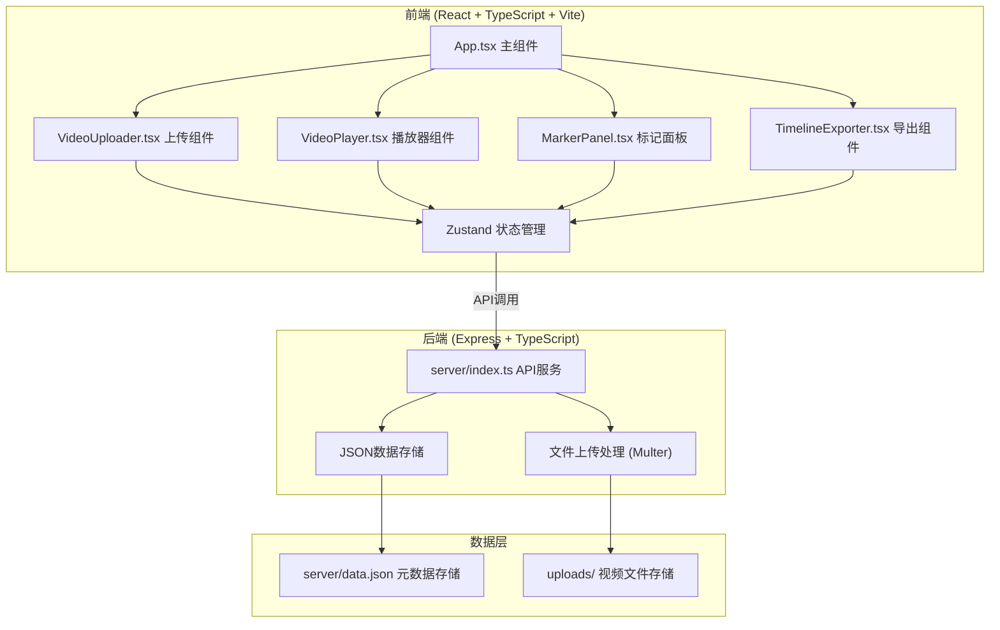
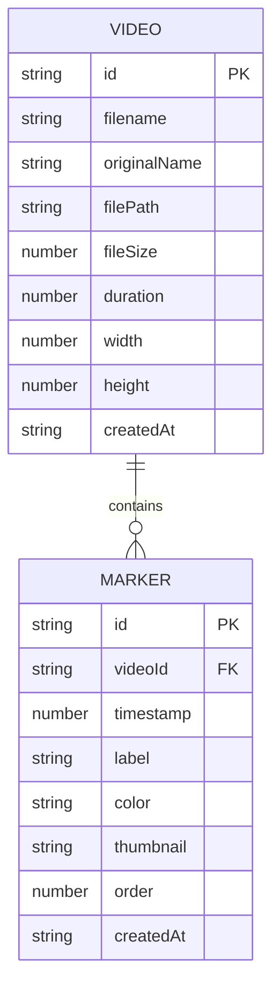

## 1. 架构设计



## 2. 技术描述

- **前端框架**：React@18 + TypeScript@5 + Vite@5
- **构建工具**：Vite@5，开发服务器端口3000
- **状态管理**：Zustand
- **样式方案**：Tailwind CSS@3 + CSS变量
- **后端框架**：Express@4 + TypeScript
- **文件上传**：Multer@1.4.5
- **跨域处理**：Cors@2.8.5
- **唯一ID**：UUID@9
- **数据存储**：JSON文件（server/data.json）
- **代理配置**：Vite代理 /api 到后端端口4000

## 3. 项目结构

```
auto54/
├── package.json
├── vite.config.js
├── tsconfig.json
├── index.html
├── src/
│   ├── App.tsx              # 主组件，布局管理
│   ├── VideoUploader.tsx    # 视频上传和卡片展示
│   ├── VideoPlayer.tsx      # 播放器和标记功能
│   ├── MarkerPanel.tsx      # 侧边栏标记管理
│   ├── TimelineExporter.tsx # 时间线导出
│   └── store.ts             # Zustand状态管理
├── server/
│   ├── index.ts             # Express后端服务
│   └── data.json            # 初始化数据文件
└── uploads/                 # 视频上传目录
```

## 4. 路由定义

| 路由 | 目的 |
|------|------|
| / | 主应用页面 |
| /api/videos [GET] | 获取视频列表 |
| /api/videos [POST] | 上传视频文件 |
| /api/videos/:id [DELETE] | 删除视频 |
| /api/markers [GET] | 获取所有标记 |
| /api/markers [POST] | 添加标记 |
| /api/markers/:id [PUT] | 更新标记 |
| /api/markers/:id [DELETE] | 删除标记 |
| /uploads/:filename | 访问上传的视频文件 |

## 5. API 类型定义

```typescript
// 视频数据类型
interface Video {
  id: string;
  filename: string;
  originalName: string;
  filePath: string;
  fileSize: number;
  duration: number; // 秒
  width: number;
  height: number;
  createdAt: string;
}

// 标记数据类型
interface Marker {
  id: string;
  videoId: string;
  timestamp: number; // 秒
  label: string;
  color: string;
  thumbnail?: string;
  order: number;
  createdAt: string;
}

// 预设标签类型
interface PresetLabel {
  name: string;
  color: string;
}

// 导出时间线类型
interface TimelineExport {
  version: string;
  exportedAt: string;
  clips: TimelineClip[];
}

interface TimelineClip {
  videoId: string;
  videoPath: string;
  videoName: string;
  startTime: number; // 精确到帧
  endTime: number;
  duration: number;
  label: string;
  color: string;
  order: number;
}
```

## 6. 数据模型

### 6.1 实体关系图



### 6.2 数据存储结构 (data.json)

```json
{
  "videos": [],
  "markers": [],
  "presetLabels": [
    { "name": "A-Roll", "color": "#e53935" },
    { "name": "B-Roll", "color": "#d81b60" },
    { "name": "采访", "color": "#8e24aa" },
    { "name": "空镜", "color": "#5e35b1" },
    { "name": "特效", "color": "#3949ab" },
    { "name": "转场", "color": "#1e88e5" },
    { "name": "字幕", "color": "#039be5" },
    { "name": "音乐", "color": "#00acc1" },
    { "name": "调色", "color": "#00897b" },
    { "name": "其他", "color": "#43a047" }
  ]
}
```

## 7. 核心功能实现要点

### 7.1 视频上传
- 使用 Multer 处理 multipart/form-data 上传
- 文件大小限制 200MB，仅接受 MP4/MOV 格式
- 使用 ffprobe 读取视频元数据（时长、分辨率）
- 生成唯一文件名存储到 uploads/ 目录

### 7.2 播放器与标记
- 使用 HTML5 Video API 实现播放控制
- Canvas 绘制进度条和彩色标记线
- 键盘事件监听（M键添加标记）
- requestAnimationFrame 确保 30FPS 动画流畅度

### 7.3 拖拽排序
- 使用 HTML5 Drag and Drop API
- 实时更新标记顺序并持久化到后端
- 拖拽时的视觉反馈和动画效果

### 7.4 时间线导出
- 计算标记片段起止时间（精确到帧，假设30fps）
- 生成符合标准的 JSON 格式
- 使用 Blob 和 URL.createObjectURL 实现文件下载
