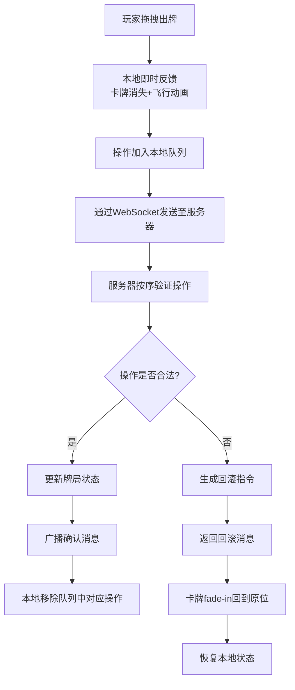

## 1. 产品概述
本项目是一款基于本地延迟补偿机制的多人联机卡牌对战应用，旨在解决网络延迟导致的出牌时机错过问题。通过本地即时预判与服务器回滚机制，让玩家在100-300ms模拟延迟下依然获得流畅的游戏体验。
- 核心价值：在弱网环境下提供流畅的卡牌对战交互，解决网络延迟导致的游戏体验下降问题
- 目标用户：联机卡牌游戏玩家，特别是对实时交互体验敏感的用户

## 2. 核心功能

### 2.1 用户角色
| 角色 | 说明 | 核心权限 |
|------|------|----------|
| 本地玩家 | 用户本人操作 | 拖拽出牌、查看状态、统计信息 |
| AI对手 | 模拟远端玩家 | 自动根据牌局状态出牌 |

### 2.2 功能模块
1. **卡牌对战主界面**：手牌展示、出牌区域、双方状态面板、延迟统计
2. **本地延迟补偿系统**：操作队列、即时反馈、冲突回滚
3. **网络通信模块**：WebSocket双向通信、延迟模拟、消息序列化
4. **AI对战系统**：最优出牌策略、延迟模拟行为
5. **游戏状态管理**：牌局状态验证、回合轮转、胜负判定

### 2.3 页面详情
| 页面名称 | 模块名称 | 功能描述 |
|-----------|-------------|---------------------|
| 对战主界面 | 手牌展示区 | 7张手牌横向排列，支持拖拽交互，悬浮放大效果 |
| 对战主界面 | 出牌区域 | 中央偏下位置，接收出牌，显示出牌动画 |
| 对战主界面 | 玩家状态面板 | 左侧显示本地玩家昵称、手牌数、血条 |
| 对战主界面 | AI状态面板 | 右侧显示AI头像、等待/出牌状态 |
| 对战主界面 | 回合指示器 | 底部中央显示当前回合归属，脉冲动画 |
| 对战主界面 | 延迟统计面板 | 右上角显示延迟值、队列积压数、颜色变化提示 |
| 结算界面 | 对战统计 | 显示平均延迟、回滚次数、有效出牌率 |

## 3. 核心流程
玩家拖拽手牌到出牌区域 → 卡牌立即从手牌区消失并执行飞行动画 → 操作加入本地队列并发送至服务器 → 服务器按序列号验证操作合法性 → 合法则广播确认消息 → 不合法则返回回滚指令 → 本地收到确认后从队列移除 → 收到回滚则卡牌fade-in回到手牌原位并恢复状态

## 4. 用户界面设计

### 4.1 设计风格
- **主色调**：深色卡牌游戏风格，背景深灰#0d1117，牌桌#1a1a2e
- **强调色**：出牌闪光淡蓝#448aff，回滚闪光淡红#ff5252，悬浮金色边框#ffd700
- **状态色**：满血绿#66bb6a，半血橙#ffa726，残血红#ef5350
- **字体**：使用现代游戏感字体，牌面文字白色
- **布局风格**：卡片式布局，圆角设计，多层阴影营造深度感
- **动效**：ease-out缓动，60FPS流畅动画，微交互反馈

### 4.2 页面设计概述
| 页面名称 | 模块名称 | UI元素 |
|-----------|-------------|-------------|
| 对战主界面 | 牌桌区域 | 圆角16px，内阴影0 0 20px rgba(0,0,0,0.5)，深色背景 |
| 对战主界面 | 手牌卡牌 | 60x90px，圆角8px，深蓝#1a237e背景，白色文字，悬浮1.1倍放大 |
| 对战主界面 | 出牌区域 | 240x120px，浅灰半透明rgba(255,255,255,0.05)，中央偏下 |
| 对战主界面 | 血条 | 160x16px，按血量变色，圆角设计 |
| 对战主界面 | 延迟指示器 | 绿/黄/红三色动态变化，实时数值显示 |
| 对战主界面 | 回合指示 | 脉冲动画0.3s缩放，突出当前玩家 |

### 4.3 响应性
- 桌面优先设计，适配1280x720及以上分辨率
- 关键交互区域尺寸固定，确保操作精度
- 画布区域320x480px，状态面板自适应布局

### 4.4 动效设计
- 出牌动画：0.2s ease-out飞向出牌区
- 回滚动画：0.4s fade-in回到手牌原位
- 悬浮效果：放大至1.1倍 + 金色边框
- 出牌闪光：淡蓝#448aff 0.15s
- 回滚闪光：淡红#ff5252 0.3s
- 回合指示：0.3s脉冲缩放动画
