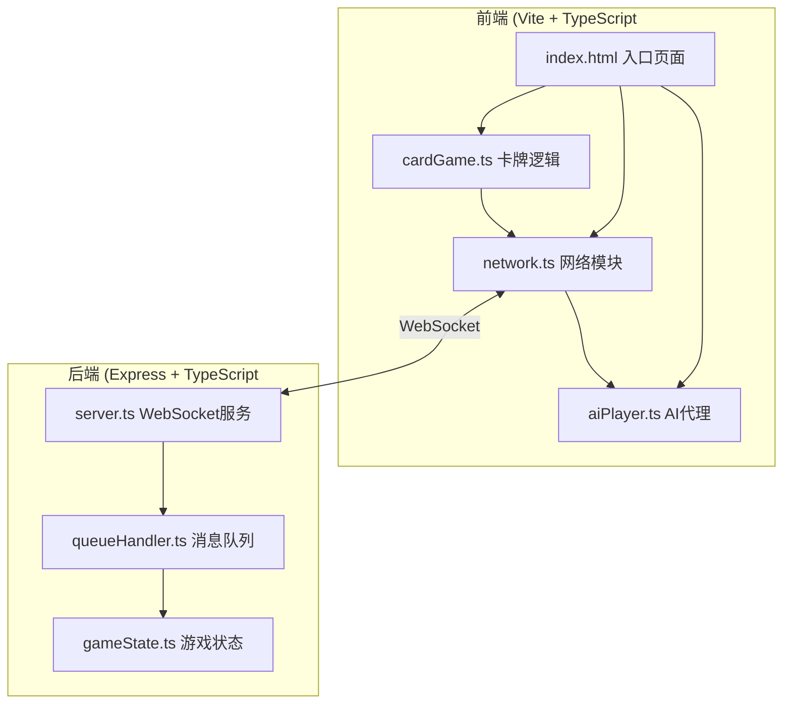
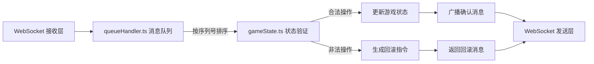

## 1. 架构设计



## 2. 技术描述
- **前端**：原生TypeScript + Vite构建工具
- **后端**：Express@4 + ws@8 (WebSocket库)
- **通信协议**：WebSocket双向通信
- **数据存储**：JSON文件 + 内存状态
- **开发工具**：ts-node + nodemon热重载

## 3. 路由定义
| 路由/端点 | 用途 |
|-------|---------|
| WebSocket /ws | 建立WebSocket连接，处理游戏消息 |
| HTTP /api/status | 获取游戏状态 (备用) |

## 4. 项目结构
```
auto56/
├── index.html              # 前端入口页面
├── package.json           # 项目依赖配置
├── vite.config.js        # Vite构建配置
├── tsconfig.json         # TypeScript配置
└── src/
    ├── client/              # 前端代码
    │   ├── cardGame.ts      # 卡牌游戏逻辑
    │   ├── network.ts     # 网络通信模块
    │   └── aiPlayer.ts   # AI玩家代理
    └── server/              # 后端代码
        ├── server.ts          # Express + WebSocket服务入口
        ├── gameState.ts       # 游戏状态管理
        └── queueHandler.ts # 消息队列处理
```

## 5. API定义

### 5.1 消息类型定义

```typescript
// 客户端发送到服务器的操作消息
interface ClientMessage {
  type: 'PLAY_CARD';
  sequence: number;
  timestamp: number;
  playerId: string;
  cardId: string;
  payload: any;
}

// 服务器返回的确认消息
interface ServerAck {
  type: 'ACK';
  sequence: number;
  status: 'success' | 'rollback';
  reason?: string;
  gameState: GameState;
}

// 服务器广播的游戏状态
interface ServerState {
  type: 'STATE_UPDATE';
  gameState: GameState;
}

// AI出牌消息
interface AIPlayMessage {
  type: 'AI_PLAY';
  sequence: number;
  timestamp: number;
  cardId: string;
}
```

### 5.2 游戏状态数据结构

```typescript
interface Card {
  id: string;
  name: string;
  attack: number;
  type: 'attack' | 'defense' | 'skill';
}

interface Player {
  id: string;
  name: string;
  hp: number;
  maxHp: number;
  hand: Card[];
}

interface GameState {
  players: Record<string, Player>;
  currentPlayerId: string;
  discardPile: Card[];
  turnCount: number;
  lastPlayedCard?: Card;
  gameOver: boolean;
  winner?: string;
}

interface QueuedOperation {
  sequence: number;
  timestamp: number;
  playerId: string;
  cardId: string;
  originalIndex: number;
  type: 'local' | 'remote';
}
```

## 6. 服务器架构图



## 7. 数据流向说明

### 7.1 前端数据流向：
- `cardGame.ts`（用户拖拽出牌） → `network.ts`（添加序列号、入队、发送）
→ WebSocket → 服务器

- 服务器确认/回滚 → `network.ts`（处理响应、出队）→ `cardGame.ts`（更新UI/回滚）

### 7.2 后端数据流向：
- WebSocket接收 → `queueHandler.ts`（排队、按序处理）→ `gameState.ts`（验证、更新状态）→ WebSocket广播

### 7.3 AI数据流向：
- `network.ts`（接收状态更新）→ `aiPlayer.ts`（计算最优出牌）→ 延迟模拟 → `network.ts`（发送AI出牌）

## 8. 性能约束
- 本地操作反馈：≤50ms
- 界面帧率：60FPS
- 内存占用：≤200MB
- 操作队列最大缓存：10条
- 模拟延迟范围：100-300ms
