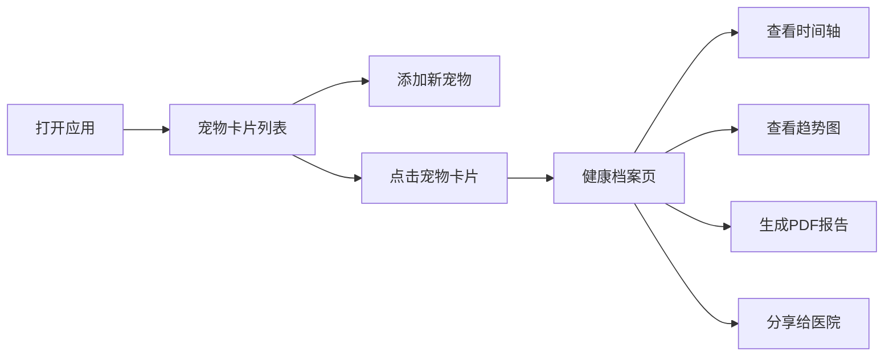

## 1. 产品概述

宠物健康档案管理系统，帮助宠物主人建立电子健康档案，记录疫苗接种、驱虫、体重体温等数据，自动生成可视化健康趋势图和PDF体检报告，并支持与宠物医院分享档案获取兽医建议。

- **核心价值**：为宠物主人提供便捷的健康记录管理工具，通过数据可视化和专业医院联动，提升宠物健康管理水平
- **目标用户**：宠物主人、宠物医院兽医

## 2. 核心功能

### 2.1 用户角色

| 角色 | 注册方式 | 核心权限 |
|------|----------|----------|
| 宠物主人 | 直接使用 | 添加/编辑/删除宠物档案、记录健康数据、生成PDF报告、分享档案给医院 |
| 宠物医院 | 通过分享链接访问 | 查看宠物档案、添加兽医建议（只读编辑） |

### 2.2 功能模块

1. **宠物列表页**：宠物卡片展示、添加宠物、编辑宠物、删除宠物、头像上传
2. **健康档案页**：时间轴记录展示、健康数据详情弹窗、体重体温折线图、生成报告按钮、分享档案功能
3. **PDF报告生成**：宠物基本信息、健康时间轴摘要、折线统计图、自动下载
4. **医院分享**：邮箱输入、生成有效期7天的分享链接、医院查看档案、兽医建议提交

### 2.3 页面详情

| 页面名称 | 模块名称 | 功能描述 |
|----------|----------|----------|
| 宠物列表页 | 宠物卡片列表 | 以卡片形式展示所有宠物，支持悬停3D旋转效果 |
| 宠物列表页 | 添加宠物 | 弹出表单填写宠物基本信息 |
| 宠物列表页 | 编辑/删除 | 左下角编辑和删除按钮，删除有确认对话框 |
| 宠物列表页 | 头像上传 | 点击圆形头像区域可上传本地图片 |
| 健康档案页 | 时间轴组件 | 垂直时间轴展示疫苗、驱虫、体重等记录 |
| 健康档案页 | 记录详情弹窗 | 点击时间节点展开完整数据字段 |
| 健康档案页 | 折线统计图 | Canvas绘制近30天体重体温双折线图 |
| 健康档案页 | 生成报告按钮 | 一键生成PDF体检报告并下载 |
| 健康档案页 | 分享档案 | 输入医院邮箱生成分享链接 |
| 健康档案页 | 兽医建议 | 医院端可添加建议，展示为浅蓝色背景卡片 |

## 3. 核心流程

### 3.1 主人使用流程

宠物主人打开应用 → 查看宠物卡片列表 → 添加新宠物/点击宠物卡片 → 进入健康档案页 → 查看时间轴和趋势图 → 生成PDF报告/分享给医院

### 3.2 医院查看流程

医院收到分享链接 → 打开链接查看档案 → 浏览健康记录 → 添加兽医建议 → 提交保存

## 4. 用户界面设计

### 4.1 设计风格

- **主色调**：#f57c00（暖橙色）
- **辅助色**：#795548（棕色）
- **背景色**：#fafafa（浅灰白）
- **按钮风格**：统一圆角8px，hover时背景加深10%并添加阴影
- **字体**：Google Fonts Roboto
- **布局风格**：卡片式布局 + 顶部导航栏
- **图标风格**：线性图标（铅笔、垃圾桶等）
- **动画过渡**：所有交互0.2-0.3s过渡动画

### 4.2 页面设计概览

| 页面名称 | 模块名称 | UI元素 |
|----------|----------|--------|
| 宠物列表页 | 宠物卡片 | 240x320px卡片，圆角20px，#fce4ec到#fff3e0渐变背景，圆形头像（100px直径，3px #ffb74d边框），宠物名称（22px粗体#4e342e），品种出生日期（14px #8d6e63），悬停Y轴旋转5度，0.3s过渡 |
| 宠物列表页 | 删除确认框 | 半透明遮罩，圆角12px居中对话框 |
| 健康档案页 | 时间轴 | 垂直排列，圆形节点12px直径（疫苗#43a047绿色/驱虫#ef6c00橙色/体重#5c6bc0紫色），2px灰色虚线连接，右侧显示日期和内容 |
| 健康档案页 | 详情弹窗 | 圆角16px，宽400px，白色背景，阴影0 4px 20px rgba(0,0,0,0.15) |
| 健康档案页 | 折线图 | Canvas绘制，体重线#43a047实线2px，体温线#ef5350虚线2px，高300px，悬停tooltip |
| 健康档案页 | 医生建议 | 浅蓝背景#e3f2ee，左边框4px solid #1976d2 |

### 4.3 响应式设计

桌面端优先设计，适配常见屏幕尺寸。宠物卡片采用网格布局，根据屏幕宽度自动调整列数。

### 4.4 性能指标

- 页面切换响应时间 ≤ 500ms
- 列表渲染响应时间 ≤ 500ms
- PDF报告生成时间 ≤ 3秒（10条健康记录）
