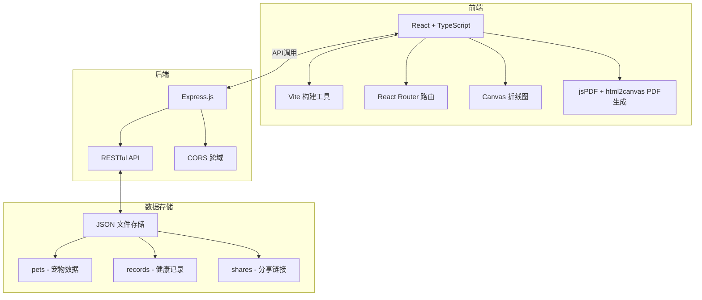
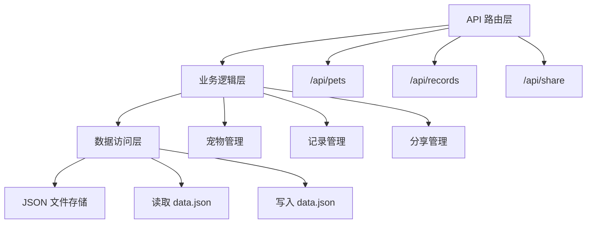
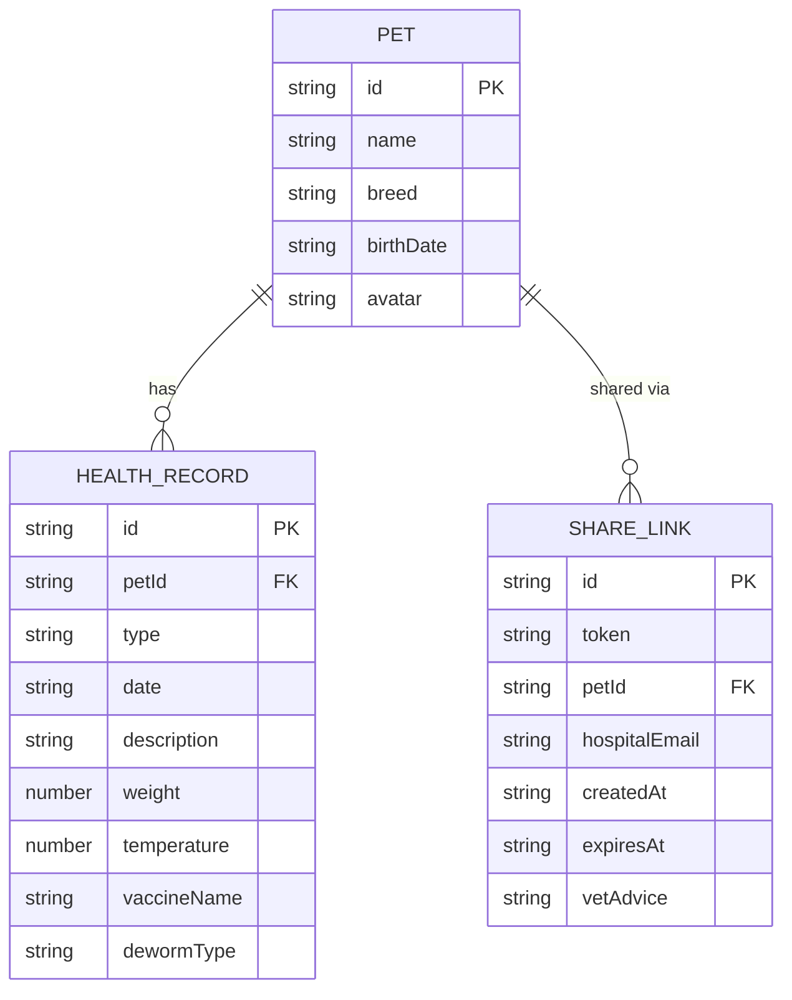

## 1. 架构设计



## 2. 技术说明

- **前端框架**：React 18 + TypeScript
- **构建工具**：Vite
- **路由管理**：react-router-dom
- **HTTP请求**：原生 fetch API
- **PDF生成**：jspdf + html2canvas
- **日期处理**：dayjs
- **唯一ID**：uuid
- **后端框架**：Express 4
- **跨域处理**：cors
- **数据存储**：JSON 文件（data.json）
- **开发服务器端口**：3000

## 3. 路由定义

| 路由 | 页面 | 说明 |
|------|------|------|
| / | 宠物列表页 | 展示所有宠物卡片 |
| /pet/:id | 健康档案页 | 展示单只宠物的健康档案 |
| /share/:token | 分享档案页 | 医院通过分享链接查看档案 |

## 4. API 定义

### 4.1 宠物相关

```typescript
// 宠物数据类型
interface Pet {
  id: string;
  name: string;
  breed: string;
  birthDate: string;
  avatar: string; // base64 或默认图标
}

// GET /api/pets - 获取所有宠物
// Response: Pet[]

// POST /api/pets - 添加宠物
// Request: { name, breed, birthDate, avatar? }
// Response: Pet

// PUT /api/pets/:id - 更新宠物
// Request: Partial<Pet>
// Response: Pet

// DELETE /api/pets/:id - 删除宠物
// Response: { success: boolean }
```

### 4.2 健康记录相关

```typescript
type RecordType = 'vaccine' | 'deworm' | 'weight';

interface HealthRecord {
  id: string;
  petId: string;
  type: RecordType;
  date: string;
  description: string;
  weight?: number; // kg
  temperature?: number; // ℃
  vaccineName?: string;
  dewormType?: string;
}

// GET /api/records/:petId - 获取宠物的所有健康记录
// Response: HealthRecord[]

// POST /api/records - 添加健康记录
// Request: HealthRecord (without id)
// Response: HealthRecord
```

### 4.3 分享相关

```typescript
interface ShareLink {
  id: string;
  token: string;
  petId: string;
  hospitalEmail: string;
  createdAt: string;
  expiresAt: string;
  vetAdvice?: string;
}

// POST /api/share - 创建分享链接
// Request: { petId, hospitalEmail }
// Response: { token, shareUrl, expiresAt }

// GET /api/share/:token - 获取分享的档案信息
// Response: { pet, records, vetAdvice, expiresAt }

// POST /api/share/:token/advice - 添加兽医建议
// Request: { advice: string }
// Response: { success: boolean, advice: string }
```

## 5. 服务端架构图



## 6. 数据模型

### 6.1 数据模型定义



### 6.2 初始数据结构

data.json 初始结构：

```json
{
  "pets": [],
  "records": [],
  "shares": []
}
```

## 7. 项目文件结构

```
.
├── package.json
├── vite.config.js
├── tsconfig.json
├── index.html
├── data.json              # JSON数据存储文件
└── src/
    ├── App.tsx            # 路由和主布局
    ├── main.tsx           # 入口文件
    ├── index.css          # 全局样式
    ├── pages/
    │   ├── HomePage.tsx   # 宠物列表页
    │   └── ProfilePage.tsx # 健康档案页
    ├── components/
    │   ├── PetCard.tsx    # 宠物卡片组件
    │   ├── Timeline.tsx   # 时间轴组件
    │   └── LineChart.tsx  # 折线图组件
    ├── utils/
    │   ├── api.ts         # API调用封装
    │   └── pdfGenerator.ts # PDF生成工具
    └── server/
        └── server.ts      # Express后端服务
```
