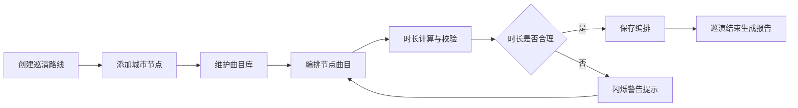

## 1. 产品概述

音乐人巡演管理系统，帮助独立音乐人高效管理巡演路线和现场曲目动态调整。解决音乐人在巡演途中手动记录混乱、曲目调整不便、行程规划不清晰的痛点。

- 主要用途：巡演路线创建与可视化、曲目库管理与动态编排、巡演报告生成
- 目标用户：独立音乐人、巡演经理、演出策划人
- 产品价值：减少手动记录混乱，提升巡演规划效率，实现曲目快速调整与行程可视化

## 2. 核心功能

### 2.1 功能模块

1. **巡演路线管理**：城市节点创建、路线可视化（Leaflet地图）、节点详情编辑与删除
2. **曲目库管理**：歌曲增删改查、时长/调性/标签设置
3. **曲目编排**：每个城市节点分配曲目列表、拖拽排序、自动计算总时长、时长异常警告
4. **巡演报告**：总里程统计、曲目变更记录、观演人次统计

### 2.2 页面详情

| 页面名称 | 模块名称 | 功能描述 |
|-----------|-------------|---------------------|
| 巡演详情页 | 地图组件 | Leaflet地图展示城市节点沿线路线，点击节点弹详情浮窗 |
| 巡演详情页 | 曲目列表组件 | 支持拖拽排序，实时计算总时长，异常警告提示 |
| 巡演详情页 | 节点管理 | 添加/编辑/删除城市节点（日期、场地、经纬度、备注） |
| 巡演详情页 | 巡演报告 | 总里程、曲目变更记录、观演人次统计展示 |

## 3. 核心流程

用户创建巡演路线 → 添加城市节点（日期、场地、经纬度、备注）→ 维护曲目库 → 为每个城市节点编排曲目（拖拽排序）→ 系统自动计算总时长并异常警告 → 巡演结束后生成报告

## 4. 用户界面设计

### 4.1 设计风格

- **主色**：紫罗兰 #7c3aed
- **辅色**：青绿 #06b6d4
- **背景**：深色主题（深灰 #1e1e1e / 黑色渐变）
- **文字**：白色
- **按钮/卡片**：hover 时缩放 1.02，背景色 0.3s ease 渐变更亮
- **地图浮窗**：圆角 12px，阴影 8px rgba(0,0,0,0.2)，深灰 #1e1e1e 转黑渐变背景，白色文字
- **警告动画**：时长异常时节点图标变红，0.8s ease-in-out infinite 闪烁动画

### 4.2 页面设计概述

| 页面名称 | 模块名称 | UI 元素 |
|-----------|-------------|-------------|
| 巡演详情页 | 地图组件 | Leaflet 地图、自定义图标节点、连线、详情浮窗（编辑/删除按钮） |
| 巡演详情页 | 曲目列表组件 | 拖拽卡片、时长显示、警告提示条、标签展示 |
| 巡演详情页 | 节点表单 | 城市、日期、场地、经纬度、备注输入框 |
| 巡演详情页 | 报告区域 | 统计卡片、变更记录列表 |

### 4.3 响应式设计

- 桌面端（>1024px）：地图左侧展示，右侧曲目列表与管理区域
- 平板端（768px-1024px）：上下布局，地图与列表各占半屏
- 手机端（<768px）：地图节点以列表形式展示，垂直排列曲目列表
- 触摸优化：拖拽区域增大，按钮最小尺寸 44px

## 5. 性能指标

- 地图拖拽和节点单击响应时间：< 200ms
- 曲目列表拖拽排序动画帧率：≥ 50FPS
- 页面首次加载：< 3s
