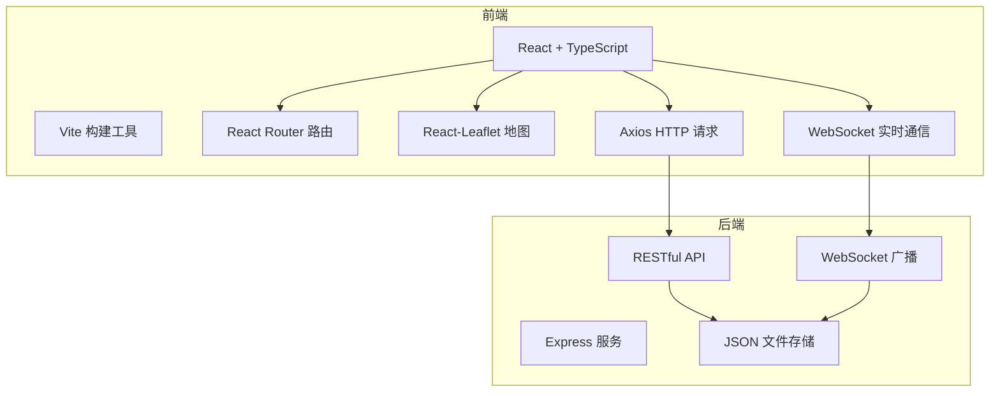
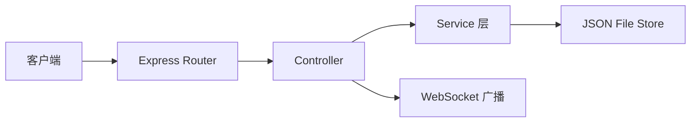
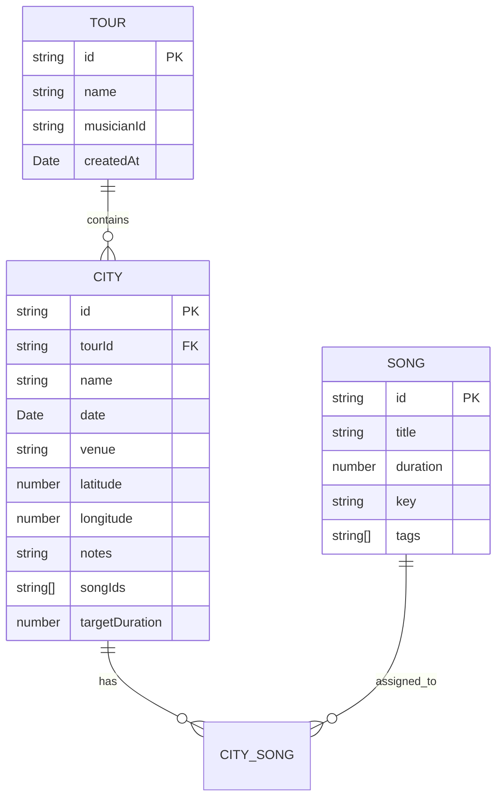

## 1. 架构设计



## 2. 技术描述

- **前端框架**：React 18 + TypeScript
- **构建工具**：Vite（端口 3000，代理 /api 到 localhost:5000）
- **路由**：react-router-dom
- **地图**：leaflet + react-leaflet
- **HTTP 请求**：axios
- **日期处理**：dayjs
- **ID 生成**：uuid
- **后端框架**：Express 4
- **跨域**：cors
- **实时通信**：WebSocket
- **数据存储**：JSON 文件（data.json）
- **状态管理**：React Hooks（useState, useEffect, useContext）

## 3. 路由定义

| 路由 | 用途 |
|-------|---------|
| / | 巡演列表首页（跳转默认巡演详情） |
| /tour/:id | 巡演详情页（地图 + 曲目管理） |

## 4. API 定义

### 4.1 巡演路线 API

| 方法 | 路径 | 描述 | 请求/响应 |
|------|------|------|-----------|
| GET | /api/tours | 获取所有巡演 | 响应：Tour[] |
| GET | /api/tours/:id | 获取单个巡演详情 | 响应：Tour |
| POST | /api/tours | 创建巡演 | 请求：TourCreate，响应：Tour |
| PUT | /api/tours/:id | 更新巡演 | 请求：TourUpdate，响应：Tour |
| DELETE | /api/tours/:id | 删除巡演 | 响应：{ success: boolean } |

### 4.2 城市节点 API

| 方法 | 路径 | 描述 | 请求/响应 |
|------|------|------|-----------|
| POST | /api/tours/:id/cities | 添加城市节点 | 请求：CityCreate，响应：City |
| PUT | /api/tours/:id/cities/:cityId | 更新城市节点 | 请求：CityUpdate，响应：City |
| DELETE | /api/tours/:id/cities/:cityId | 删除城市节点 | 响应：{ success: boolean } |
| PUT | /api/tours/:id/cities/:cityId/songs | 更新节点曲目列表 | 请求：{ songIds: string[] }，响应：City |

### 4.3 曲目 API

| 方法 | 路径 | 描述 | 请求/响应 |
|------|------|------|-----------|
| GET | /api/songs | 获取所有曲目 | 响应：Song[] |
| POST | /api/songs | 创建曲目 | 请求：SongCreate，响应：Song |
| PUT | /api/songs/:id | 更新曲目 | 请求：SongUpdate，响应：Song |
| DELETE | /api/songs/:id | 删除曲目 | 响应：{ success: boolean } |

### 4.4 巡演报告 API

| 方法 | 路径 | 描述 | 请求/响应 |
|------|------|------|-----------|
| GET | /api/tours/:id/report | 生成巡演报告 | 响应：TourReport |

## 5. 服务端架构



## 6. 数据模型

### 6.1 实体关系图



### 6.2 JSON 存储结构

```json
{
  "tours": [
    {
      "id": "uuid",
      "name": "巡演名称",
      "musicianId": "uuid",
      "createdAt": "ISO日期"
    }
  ],
  "cities": [
    {
      "id": "uuid",
      "tourId": "uuid",
      "name": "城市名",
      "date": "ISO日期",
      "venue": "场地名",
      "latitude": 39.9042,
      "longitude": 116.4074,
      "notes": "备注",
      "songIds": ["song-id-1", "song-id-2"],
      "targetDuration": 90
    }
  ],
  "songs": [
    {
      "id": "uuid",
      "title": "歌曲名",
      "duration": 4.5,
      "key": "C大调",
      "tags": ["经典", "互动"]
    }
  ]
}
```
