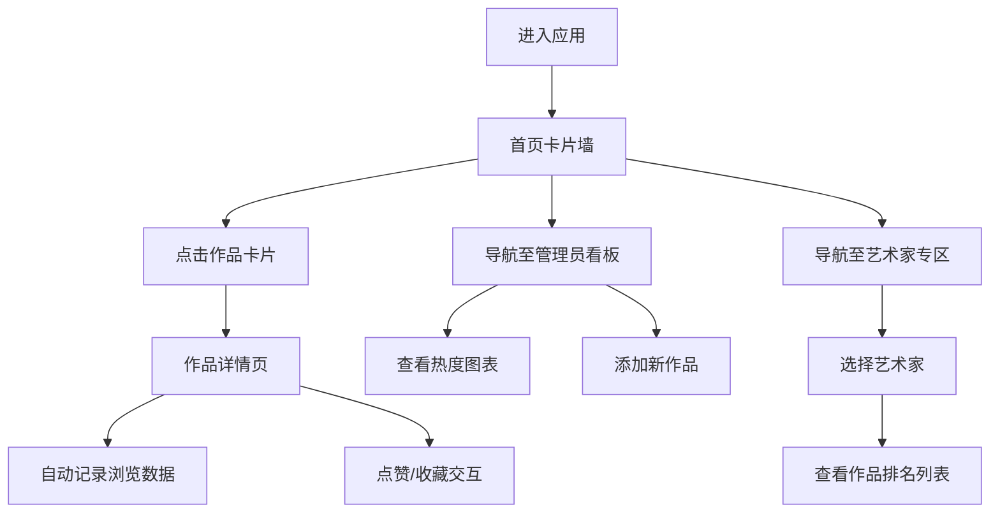

## 1. 产品概述
小型线上艺术市集实时热度追踪应用，解决市集开幕后管理员和艺术家对作品热度感知滞后、无法快速调整展示策略的问题。目标用户为市集管理员和参展艺术家，提供艺术品浏览热度、点赞数、收藏趋势的实时跟踪与排名展示。

## 2. 核心功能

### 2.1 用户角色
| 角色 | 登录方式 | 核心权限 |
|------|----------|----------|
| 管理员 | 默认入口 | 添加艺术品、查看分析看板、管理全部作品 |
| 艺术家 | 选择艺术家名称进入 | 查看个人作品列表、热度排名、统计数据 |

### 2.2 功能模块
1. **首页**：卡片墙展示所有在售作品、点赞/收藏交互
2. **作品详情页**：大图展示、详细信息、点赞收藏、浏览历史记录
3. **管理员分析看板**：类别热度柱状图、24小时浏览趋势折线图、添加艺术品表单
4. **艺术家专区**：个人作品列表、按浏览量排序排名展示

### 2.3 页面详情
| 页面名称 | 模块名称 | 功能描述 |
|----------|----------|----------|
| 首页 | 卡片墙 | 240x320px渐变卡片，展示封面图、标题、艺术家名、点赞数、收藏数，悬停上移4px阴影效果 |
| 首页 | 点赞/收藏按钮 | 心形/星形图标，点击有缩放回弹动画，数据增量更新 |
| 作品详情页 | 作品展示 | 400px宽居中大图、类别标签、描述、价格、点赞收藏按钮 |
| 作品详情页 | 浏览记录 | 最近5条浏览记录，10秒自动刷新浏览量 |
| 管理员看板 | 类别热度图 | 横向柱状图，宽度按浏览量比例，渐变色，tooltip显示数值 |
| 管理员看板 | 浏览趋势图 | 24小时折线图，X轴时间Y轴浏览量，折线#4fc3f7 |
| 管理员看板 | 添加作品 | 表单：标题、艺术家名、类别、价格、描述、封面图上传(≤5MB JPG/PNG) |
| 艺术家专区 | 作品排名 | 封面缩略图、标题、点赞/收藏/浏览量，按浏览量降序，1-3名金色背景 |

## 3. 核心流程
用户打开应用 → 浏览首页作品卡片墙 → 点击作品卡片进入详情页 → 自动记录浏览数据 → 点赞/收藏作品 → 管理员进入看板查看数据图表/添加作品 → 艺术家进入专区查看个人作品排名

## 4. 用户界面设计

### 4.1 设计风格
- **主色调**：粉紫白色调，粉色渐变(#fce4ec → #f8bbd0)卡片，紫色(#b39ddb, #7986cb, #5c6bc0)数据可视化
- **强调色**：点赞#e91e63粉红、收藏#ffc107金黄、价格#4caf50绿色、折线#4fc3f7天蓝
- **中性色**：导航#37474f深灰、标题#424242深灰、副标题#757575浅灰、边框#e0e0e0、排名#bdbdbd灰/#ffd700金
- **按钮风格**：圆形44px直径，白底边框，点击后变色填充
- **字体**：系统默认字体，标题16px加粗，副标题14px常规，价格20px加粗
- **布局**：顶部导航栏56px高，卡片网格响应式(4/3/2/1列)，页面宽度min320px/max1200px
- **图标**：心形点赞、星形收藏，lucide-react图标库

### 4.2 页面设计概览
| 页面名称 | 模块名称 | UI元素 |
|----------|----------|--------|
| 全局 | 导航栏 | #37474f深色背景，白色14px文字，56px高度，顶部滑入动画(0.3s ease) |
| 首页 | 卡片墙 | 响应式网格，16px圆角渐变卡片，悬停上移4px+阴影(0.2s ease-out) |
| 首页 | 卡片内容 | 240x200px封面图(上圆角16px)，16px深灰标题加粗，14px浅灰艺术家名 |
| 详情页 | 作品信息 | 400px宽8px圆角大图，12px圆角紫色类别标签，20px绿色加粗价格 |
| 详情页 | 交互按钮 | 44px圆形白底边框按钮，点击缩放回弹(0.2s, 1.15x→1.0) |
| 看板 | 图表区 | 左柱状图右折线图，横向渐变柱，折线带白色描边数据点 |
| 艺术家专区 | 排名列表 | 40x40px圆角缩略图，1-3名金色排名标记，其余灰色 |

### 4.3 响应式设计
- 桌面端(>1024px)：卡片4列
- 平板端(768-1024px)：卡片3列
- 移动端(480-768px)：卡片2列
- 极窄屏(<480px)：卡片1列
- 页面最小宽度320px，最大宽度1200px居中显示
- 触控区域最小44x44px
