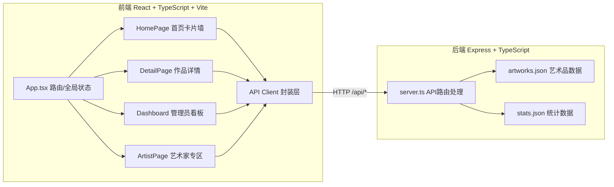
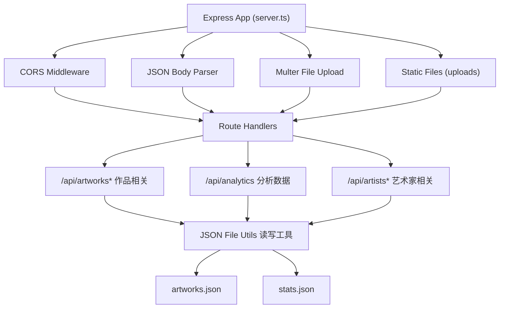
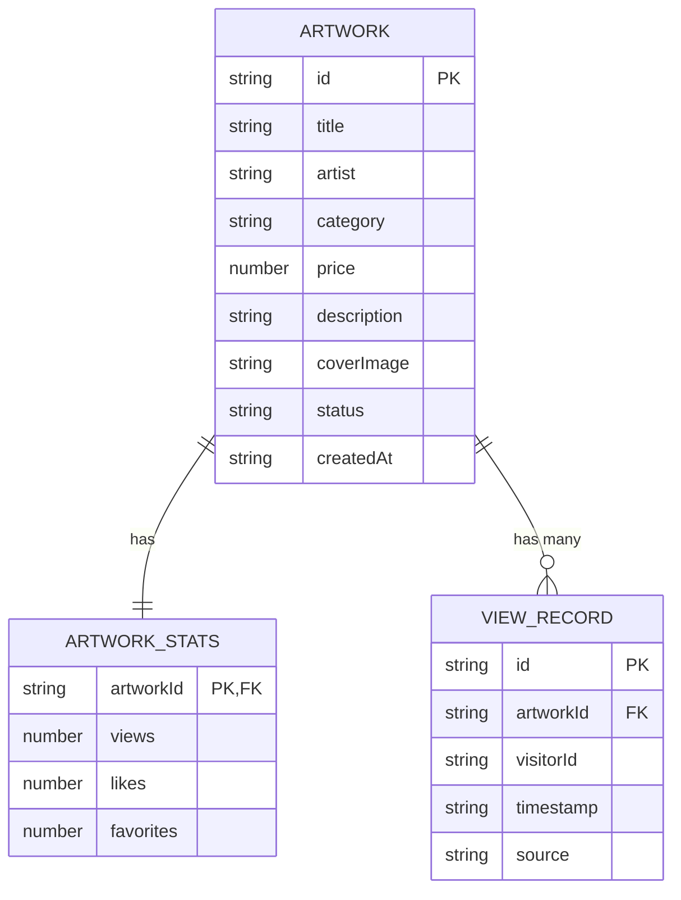

## 1. 架构设计



## 2. 技术描述
- **前端**：React 18 + TypeScript + Vite + React Router DOM 6 + Recharts + Day.js + Lucide React
- **后端**：Express 4 + TypeScript + CORS + UUID + TS-Node + Nodemon
- **数据存储**：JSON 文件存储（artworks.json, stats.json）
- **构建工具**：Vite 前端构建，TS-Node 后端运行
- **状态管理**：React useState/useEffect 管理组件状态，不引入额外状态库

## 3. 路由定义
| 前端路由 | 页面组件 | 用途 |
|----------|----------|------|
| / | HomePage | 首页卡片墙，展示所有在售作品 |
| /artwork/:id | DetailPage | 作品详情页，展示大图和浏览记录 |
| /dashboard | Dashboard | 管理员分析看板，图表展示+添加作品 |
| /artist | ArtistPage | 艺术家专区，个人作品排名列表 |

## 4. API 定义

### 4.1 类型定义

```typescript
interface Artwork {
  id: string;
  title: string;
  artist: string;
  category: 'painting' | 'sculpture' | 'photography' | 'digital';
  price: number;
  description: string;
  coverImage: string;
  status: 'onsale' | 'sold';
  createdAt: string;
}

interface ArtworkStats {
  artworkId: string;
  views: number;
  likes: number;
  favorites: number;
}

interface ViewRecord {
  id: string;
  artworkId: string;
  visitorId: string;
  timestamp: string;
  source: string;
}

interface HourlyStats {
  hour: string;
  views: number;
}

interface CategoryStats {
  category: string;
  views: number;
}

interface AnalyticsData {
  categoryStats: CategoryStats[];
  hourlyStats: HourlyStats[];
}

interface ArtistWork extends Artwork {
  views: number;
  likes: number;
  favorites: number;
}
```

### 4.2 API 端点

| 方法 | 路径 | 请求 | 响应 | 用途 |
|------|------|------|------|------|
| GET | /api/artworks | - | Artwork[] | 获取所有在售作品列表 |
| GET | /api/artworks/:id | - | Artwork & ArtworkStats | 获取单件作品详情及统计 |
| POST | /api/artworks | FormData(title,artist,category,price,description,image) | Artwork | 管理员添加新作品 |
| POST | /api/artworks/:id/like | {visitorId: string} | {liked: boolean, likes: number} | 切换点赞状态 |
| POST | /api/artworks/:id/favorite | {visitorId: string} | {favorited: boolean, favorites: number} | 切换收藏状态 |
| POST | /api/artworks/:id/view | {visitorId: string, source: string} | ViewRecord | 记录浏览行为 |
| GET | /api/artworks/:id/views | - | ViewRecord[] | 获取最近5条浏览记录 |
| GET | /api/analytics | - | AnalyticsData | 获取分析看板数据 |
| GET | /api/artists/:name/works | - | ArtistWork[] | 获取艺术家名下作品及统计 |
| GET | /api/artists | - | string[] | 获取所有艺术家名称列表 |

## 5. 服务端架构



## 6. 数据模型

### 6.1 ER 图



### 6.2 JSON 数据结构

**artworks.json:**
```json
{
  "artworks": [
    {
      "id": "uuid-string",
      "title": "作品标题",
      "artist": "艺术家名",
      "category": "painting",
      "price": 1000,
      "description": "作品描述",
      "coverImage": "/uploads/filename.jpg",
      "status": "onsale",
      "createdAt": "2024-01-01T00:00:00.000Z"
    }
  ]
}
```

**stats.json:**
```json
{
  "artworkStats": {
    "artwork-id": { "views": 100, "likes": 20, "favorites": 10 }
  },
  "viewRecords": [
    {
      "id": "uuid-string",
      "artworkId": "artwork-id",
      "visitorId": "device-or-ip-id",
      "timestamp": "2024-01-01T00:00:00.000Z",
      "source": "direct"
    }
  ],
  "userLikes": { "visitor-id": ["artwork-id-1", "artwork-id-2"] },
  "userFavorites": { "visitor-id": ["artwork-id-1", "artwork-id-2"] }
}
```

## 7. 项目文件结构

```
auto66/
├── package.json
├── vite.config.js
├── tsconfig.json
├── index.html
├── public/
│   └── uploads/              (上传的封面图)
├── src/
│   ├── client/
│   │   ├── App.tsx           (路由+全局状态)
│   │   ├── pages/
│   │   │   ├── HomePage.tsx
│   │   │   ├── DetailPage.tsx
│   │   │   ├── Dashboard.tsx
│   │   │   └── ArtistPage.tsx
│   │   ├── components/       (复用UI组件)
│   │   ├── api/              (API客户端封装)
│   │   └── styles/           (全局样式)
│   └── server/
│       ├── server.ts         (Express服务)
│       └── data/
│           ├── artworks.json
│           └── stats.json
```
