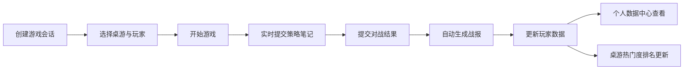

## 1. 产品概述

桌游吧对战记录与策略分析系统，帮助桌游吧老板高效记录每桌对战结果、玩家评分和策略笔记，自动生成战力排名与热门桌游分析，解决记录混乱、玩家无法复盘学习、桌游热门度难以发现的痛点。

- **核心目标**：让桌游对战记录数字化、策略沉淀可追溯、玩家数据可视化
- **目标用户**：桌游吧老板、桌游爱好者
- **市场价值**：提升桌游吧运营效率，增强玩家粘性与社区感

## 2. 核心功能

### 2.1 用户角色
| 角色 | 登录方式 | 核心权限 |
|------|----------|----------|
| 玩家/老板 | 无需登录（本地记录） | 创建会话、记录对战、查看数据、收藏桌游 |

### 2.2 功能模块
1. **游戏桌会话页面**：创建对局、选择桌游、玩家配置、实时策略笔记瀑布流、对战结果提交
2. **个人数据中心**：统计徽章、得分趋势图、桌游分布环形图、连胜记录
3. **桌游热门度排名**：桌游排行表、收藏交互、多列排序、渐变进度条

### 2.3 页面详情
| 页面名称 | 模块名称 | 功能描述 |
|----------|----------|----------|
| 游戏桌会话 | 会话创建表单 | 选择桌游名称、玩家人数、每位玩家角色 |
| 游戏桌会话 | 实时笔记面板 | 瀑布流展示策略笔记，支持点赞（踩）互动 |
| 游戏桌会话 | 对战结果记录 | 记录胜利条件达成顺序、每人得分、游戏时长 |
| 游戏桌会话 | 战报生成 | 时间线展示回合事件、排名变化、精华笔记摘要 |
| 个人数据中心 | 统计徽章 | 总场次、胜率、平均分、最长连胜彩色徽章 |
| 个人数据中心 | 得分趋势图 | 最近10场得分柱状图，胜负颜色区分 |
| 个人数据中心 | 桌游分布图 | 环形图展示不同桌游游玩比例 |
| 桌游热门度排名 | 排行表格 | 总对局数、平均时长、平均回合数、战略笔记数 |
| 桌游热门度排名 | 收藏交互 | 星形收藏按钮，点击动效 |
| 桌游热门度排名 | 排序功能 | 按列点击排序，渐变进度条显示占比 |

## 3. 核心流程

玩家进入应用后，可以创建新的游戏桌会话，选择桌游和玩家后开始游戏。游戏过程中玩家可以实时提交策略笔记，所有笔记以瀑布流展示并支持互动。对局结束后系统自动生成战报和加权评分。玩家可在个人数据中心查看自己的统计数据，在热门度排名页面发现最受欢迎的桌游。

## 4. 用户界面设计

### 4.1 设计风格
- **主色**：深蓝灰 #263238，辅色：浅蓝 #64b5f6，背景：白色 #ffffff
- **卡片设计**：阴影 0 4px 10px rgba(0,0,0,0.1)，hover 提升至 0 8px 20px rgba(0,0,0,0.2)，过渡 0.3s
- **按钮动效**：涟漪动画，半径从0扩大到卡片宽度，半透明主题色
- **导航栏**：顶部固定 56px，深灰 #37474f 背景，白色文字，hover 浅蓝 #64b5f6
- **徽章设计**：圆形 100px×100px，发光阴影动画，四种颜色对应不同数据

### 4.2 页面设计概览
| 页面名称 | 模块名称 | UI 元素 |
|----------|----------|---------|
| 游戏桌会话 | 笔记瀑布流 | 卡片 200px 宽，紫粉渐变背景，圆角 10px，头像+回合数，点赞按钮 |
| 个人数据中心 | 统计徽章 | 圆形彩色徽章，发光动画，数据居中展示 |
| 个人数据中心 | 柱状图 | 绿色胜利柱、红色失败柱，10场历史数据 |
| 桌游热门度排名 | 排行表 | 渐变进度条从浅蓝到深蓝，星形收藏按钮金色闪烁 |

### 4.3 响应式
- 桌面端：多列布局，完整功能展示
- 移动端（<768px）：汉堡菜单导航，卡片单列排列，触控优化

### 4.4 动效细节
- 全局过渡：`transition: all 0.3s ease`
- 徽章发光：阴影脉动动画
- 收藏闪烁：0.5秒金色星光动效
- 导航下划线：0.3秒滑动过渡
- 涟漪按钮：点击扩散波纹效果
