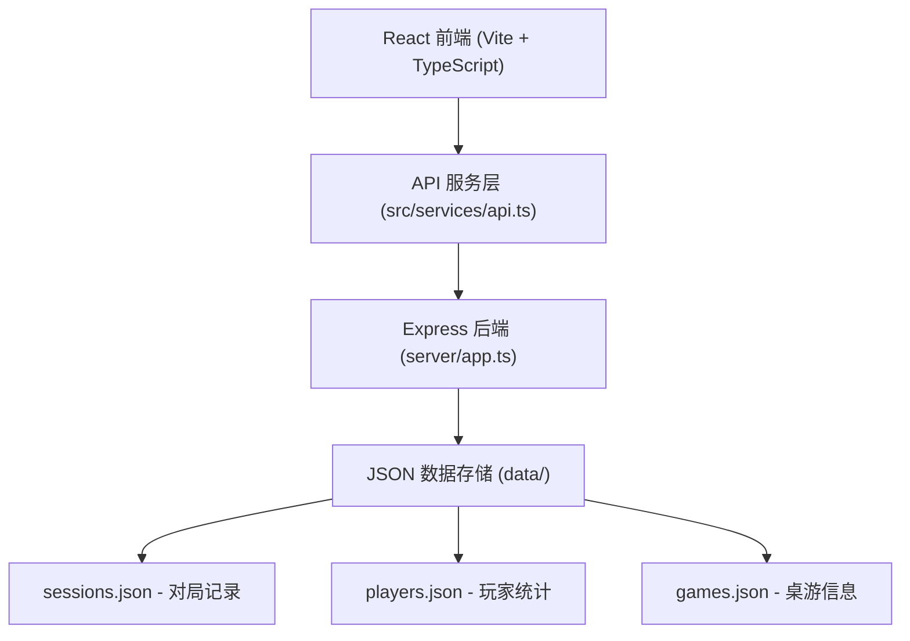
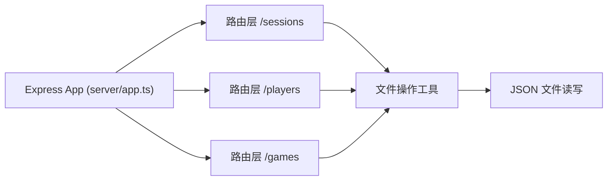
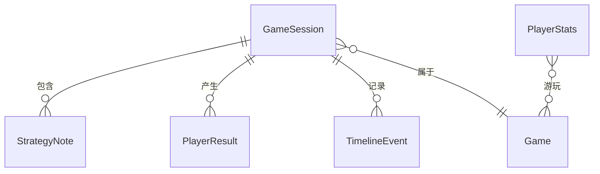

## 1. 架构设计



## 2. 技术说明
- **前端**：React 18 + TypeScript + Vite
- **路由**：react-router-dom v6
- **图表库**：recharts
- **状态管理**：React Hooks + 自定义服务层
- **后端**：Express 4 + TypeScript
- **数据存储**：JSON 文件（sessions / players / games）
- **工具库**：uuid、dayjs、cors
- **样式**：原生 CSS + CSS 变量（不使用 Tailwind，按需求精确还原设计）

## 3. 路由定义
| 路由 | 用途 |
|------|------|
| /session | 游戏桌会话页面（创建、进行中、战报） |
| /player/:id | 个人数据中心页面 |
| /rankings | 桌游热门度排名页面 |

## 4. API 定义

### 4.1 会话相关
```typescript
// GET /sessions - 获取对局列表
// POST /sessions - 创建新对局
// GET /sessions/:id - 获取单局详情
// PUT /sessions/:id - 更新对局状态/结果
// POST /sessions/:id/notes - 添加策略笔记
// POST /sessions/:id/notes/:noteId/like - 点赞笔记

interface GameSession {
  id: string;
  gameName: string;
  playerCount: number;
  players: PlayerInSession[];
  status: 'pending' | 'playing' | 'finished';
  startTime: string;
  endTime?: string;
  durationMinutes?: number;
  rounds?: number;
  notes: StrategyNote[];
  results?: PlayerResult[];
  timeline: TimelineEvent[];
}

interface PlayerInSession {
  id: string;
  name: string;
  avatar?: string;
  role?: string;
}

interface StrategyNote {
  id: string;
  playerId: string;
  playerName: string;
  playerAvatar?: string;
  round: number;
  content: string;
  likes: number;
  likedBy: string[];
  timestamp: string;
}

interface PlayerResult {
  playerId: string;
  playerName: string;
  rank: number;
  score: number;
  weightedScore: number;
}

interface TimelineEvent {
  round: number;
  event: string;
  timestamp: string;
}
```

### 4.2 玩家相关
```typescript
// GET /players/:id/stats - 获取玩家统计数据

interface PlayerStats {
  playerId: string;
  playerName: string;
  totalGames: number;
  wins: number;
  winRate: number;
  averageScore: number;
  longestWinStreak: number;
  currentWinStreak: number;
  recentScores: { gameName: string; score: number; won: boolean; date: string }[];
  gameDistribution: { gameName: string; count: number; percentage: number }[];
}
```

### 4.3 桌游排名相关
```typescript
// GET /games/rankings - 获取桌游热门度排名

interface GameRanking {
  name: string;
  totalSessions: number;
  averageDuration: number;
  averageRounds: number;
  totalNotes: number;
  isFavorite: boolean;
}
```

## 5. 服务端架构图



## 6. 数据模型

### 6.1 数据模型定义



### 6.2 初始数据

**games.json** - 5款预设桌游：
- 卡坦岛 (Catan)
- 璀璨宝石 (Splendor)
- 七大奇迹 (7 Wonders)
- 殖民火星 (Terraforming Mars)
- 冷战热斗 (Twilight Struggle)

**sessions.json** - 初始空数组 `[]`

**players.json** - 初始空对象 `{}`

## 7. 文件结构
```
├── package.json
├── vite.config.js
├── tsconfig.json
├── index.html
├── src/
│   ├── modules/
│   │   ├── session/
│   │   │   └── SessionManager.tsx
│   │   ├── player/
│   │   │   └── PlayerDashboard.tsx
│   │   └── ranking/
│   │       └── GameRankings.tsx
│   ├── services/
│   │   └── api.ts
│   ├── App.tsx
│   ├── main.tsx
│   └── index.css
├── server/
│   └── app.ts
└── data/
    ├── sessions.json
    ├── players.json
    └── games.json
```
