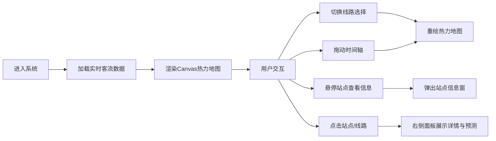

## 1. 产品概述

地铁客流热力感知面板是一套面向城市轨道交通运营方的实时客流监控与预测决策辅助系统。通过Canvas热力地图直观展示各线路站点的客流密度，支持历史回溯与未来一小时客流预测，为运营调度提供数据支撑。

- 目标用户：地铁运营调度人员、客流分析人员
- 核心价值：实时感知客流分布、辅助调度决策、提升运营效率

## 2. 核心功能

### 2.1 用户角色

| 角色 | 注册方式 | 核心权限 |
|------|----------|----------|
| 运营调度员 | 系统内部账号 | 查看实时热力图、切换线路、浏览历史数据、查看预测曲线 |

### 2.2 功能模块

1. **热力地图主视图**：Canvas绘制的地铁线路图，站点以热力色彩展示客流强度
2. **线路选择侧边栏**：支持单选/多选线路切换，展示线路平均客流量
3. **时间轴控制**：拖动滑块浏览过去24小时任意时刻客流分布
4. **客流预测曲线**：展示历史与未来一小时客流趋势
5. **详情面板**：展示选中站点/线路的详细数据与预测图表

### 2.3 页面详情

| 页面名称 | 模块名称 | 功能描述 |
|----------|----------|----------|
| 主面板 | Canvas热力地图 | 灰色底图绘制线路，站点按客流强度绿→红渐变显示，热力半径60px，半透明度0.7 |
| 主面板 | 站点信息窗 | 鼠标悬停弹出，白底圆角阴影，显示站名、客流量、拥挤等级、趋势箭头，向上展开动画0.2s |
| 左侧边栏 | 线路选择列表 | 每行52px高，左侧12px色条，点击选中背景#f0f9ff，色条变16px，过渡0.3s，支持单选/多选 |
| 底部控制区 | 时间轴滑块 | 宽640px，圆形滑块直径20px，拖动查看过去24小时客流，重绘延迟≤100ms |
| 底部控制区 | 预测曲线 | 浅蓝色半透明折线，虚线表示预测，实线表示历史，白色圆点标记数据点 |
| 右侧详情 | 数据面板 | 展示选中站点/线路的具体数据、拥挤等级、预测折线图 |

## 3. 核心流程

用户进入系统后，默认展示全部线路的实时客流热力图。通过左侧线路列表筛选关注线路，拖动底部时间轴查看不同时刻的客流分布，鼠标悬停站点查看详细信息，右侧面板展示选中对象的深度数据与客流预测趋势。

## 4. 用户界面设计

### 4.1 设计风格
- 主色调：深蓝灰 `#1e293b`（背景）、浅色 `#f8fafc`（卡片面板）
- 点缀色：各线路专属色块、蓝色 `#3b82f6`（交互控件）
- 热力渐变色：绿色（低客流）→ 黄色 → 红色（高客流）
- 字体：现代无衬线字体，清晰易读
- 圆角：卡片与控件统一圆角设计（12px）
- 阴影：柔和投影增强层次感

### 4.2 页面设计概述

| 页面名称 | 模块名称 | UI元素 |
|----------|----------|--------|
| 主面板 | Canvas热力地图 | 灰色线路、彩色热力站点、半透明热力半径、站点悬停信息窗动画 |
| 左侧边栏 | 线路选择列表 | 色条动画、选中高亮、客流量数字展示、单选/多选模式切换 |
| 底部控制区 | 时间轴+预测曲线 | 蓝色滑块、轨道色、折线图、虚实线区分历史与预测 |
| 右侧详情 | 数据面板 | 数据卡片、预测图表、趋势指标 |

### 4.3 响应式设计
- **1200px以上**：三栏布局（左侧边栏200px + 中央热力图 + 右侧详情面板）
- **768px以下**：上下滚动布局（热力图置顶，线路选择与详情面板依次排列）
- 触摸设备：增大点击热区，优化滑动交互

### 4.4 性能要求
- Canvas地图渲染帧率 ≥ 30FPS
- 时间轴拖动时热力图重绘延迟 ≤ 100ms
- 动画过渡平滑自然（0.2s~0.3s）
