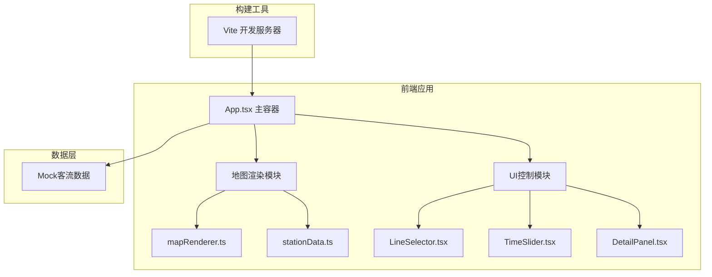

## 1. 架构设计



## 2. 技术说明

- **前端框架**：React 18 + TypeScript
- **构建工具**：Vite 5.x
- **渲染技术**：原生 HTML5 Canvas API 绘制热力地图
- **样式方案**：CSS Modules / 原生 CSS（响应式设计）
- **图表绘制**：Canvas 原生 API 绘制预测折线图
- **状态管理**：React Hooks (useState, useEffect, useRef, useMemo)
- **Mock数据**：内置模拟数据生成器，模拟线路、站点、客流数据

## 3. 模块定义

### 3.1 地图渲染模块

| 文件 | 职责 |
|------|------|
| `src/map/mapRenderer.ts` | Canvas热力图绘制、站点事件处理（悬停、点击）、动画帧管理 |
| `src/map/stationData.ts` | 站点坐标管理、客流数据结构、热力值计算、颜色映射算法 |

### 3.2 UI控制模块

| 文件 | 职责 | Props |
|------|------|-------|
| `src/components/LineSelector.tsx` | 线路选择列表组件 | lines: Line[], selectedIds: string[], onToggle: (id: string) => void, mode: 'single' \| 'multi' |
| `src/components/TimeSlider.tsx` | 时间轴滑块组件 | currentTime: number, onChange: (time: number) => void, predictionData: number[] |
| `src/components/DetailPanel.tsx` | 右侧详情面板 | selectedStation: Station \| null, selectedLine: Line \| null, predictionCurve: Point[] |
| `src/App.tsx` | 主容器组件 | 无，初始化状态与数据流协调 |

### 3.3 入口与配置文件

| 文件 | 说明 |
|------|------|
| `package.json` | 依赖配置与启动脚本 |
| `index.html` | HTML入口，挂载点 `<div id="root">` |
| `tsconfig.json` | TypeScript严格模式配置 |
| `vite.config.js` | Vite配置，端口3000 |
| `src/main.tsx` | React入口文件 |

## 4. 数据模型

### 4.1 类型定义

```typescript
interface Station {
  id: string;
  name: string;
  lineId: string;
  x: number;
  y: number;
  currentFlow: number;
  capacity: number;
  trend: 'up' | 'down' | 'stable';
  history: number[];
  prediction: number[];
}

interface Line {
  id: string;
  name: string;
  color: string;
  stations: string[];
  avgFlow: number;
}

interface Point {
  x: number;
  y: number;
}
```

### 4.2 热力计算逻辑

- 客流密度 = currentFlow / capacity
- 颜色映射：密度0→绿色 `#22c55e`，密度0.5→黄色 `#eab308`，密度1→红色 `#ef4444`
- 热力半径：60px，使用径向渐变 + 半透明度0.7实现光晕效果

## 5. 性能优化策略

1. **Canvas分层渲染**：线路底图静态缓存，站点热力动态重绘
2. **requestAnimationFrame**：统一渲染循环，保证30FPS+
3. **节流处理**：时间轴拖动使用节流函数，控制重绘频率
4. **离屏Canvas**：热力光晕预渲染为离屏画布，运行时直接贴图
5. **useMemo/useCallback**：避免不必要的React重渲染
