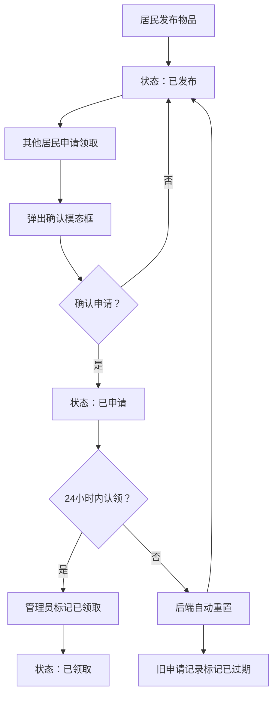

## 1. 产品概述

社区闲置物品交换平台（"易物社区"），让居民可以发布闲置物品的图片和描述，其他居民可以申请领取，组织者可以跟踪每件物品的申请进度和最终去向。解决社区闲置物品流转效率低、信息不对称的问题，面向社区居民和活动组织者。

## 2. 核心功能

### 2.1 用户角色

| 角色 | 注册方式 | 核心权限 |
|------|----------|----------|
| 居民 | 无需注册，输入姓名即可 | 发布物品、浏览物品、申请领取 |
| 管理员 | 固定入口 | 管理物品状态、查看申请记录、导出CSV |

### 2.2 功能模块

1. **首页**：物品网格展示、分类筛选、申请领取、查看详情入口
2. **发布物品页**：物品发布表单（标题、分类、描述、图片上传）
3. **物品详情页**：物品完整信息、申请历史、申请领取按钮
4. **管理后台**：物品列表管理、状态切换、导出CSV、过期记录管理

### 2.3 页面详情

| 页面名称 | 模块名称 | 功能描述 |
|----------|----------|----------|
| 首页 | 物品卡片网格 | 3列网格布局展示物品，每卡片320x400px，含图片、标题、分类标签、状态、申请/详情按钮 |
| 首页 | 申请领取模态框 | 居民确认申请，输入姓名，确认/取消操作 |
| 发布物品页 | 发布表单 | 标题输入、分类下拉（家具/电器/书籍/衣物/其他）、描述文本框、图片上传（单张≤3MB JPG/PNG） |
| 物品详情页 | 物品信息 | 左侧大图4:3，右侧标题/描述/发布者头像/发布时间/状态/申请历史列表 |
| 物品详情页 | 申请领取按钮 | 已发布状态可点击申请，已申请后按钮禁用 |
| 管理后台 | 物品列表 | 所有物品列表视图，含标题/分类/发布者/状态标签/申请人数/操作列 |
| 管理后台 | 状态管理 | 标记已领取（抖动动画300ms+进度条），已领取不可再操作 |
| 管理后台 | 导出CSV | 导出物品ID/标题/分类/发布者/状态/申请人列表 |
| 管理后台 | 过期记录管理 | 查看/清空已过期申请记录 |

## 3. 核心流程

### 发布物品流程
居民选择分类→填写标题和描述→上传图片→提交→生成唯一ID→状态标记为"已发布"→首页展示

### 申请领取流程
居民浏览物品→点击申请领取→弹出确认模态框→输入姓名→确认→状态变为"已申请"→添加申请记录

### 管理员审核流程
管理员查看物品列表→查看申请记录→点击标记已领取→状态变为"已领取"→不可再操作

### 自动过期流程
后端每5分钟检查→发现已申请超过24小时无人认领→状态重置为"已发布"→旧申请记录标记"已过期"

## 4. 用户界面设计

### 4.1 设计风格

- 主色：清新绿 #4caf50，辅助色：深绿 #2e7d32、浅绿 #e8f5e9/#c8e6c9
- 中性色：白色 #ffffff、浅灰 #f5f5f5/#e0e0e0
- 强调色：橙色 #ff9800（已申请）、灰色 #9e9e9e（已领取）
- 按钮风格：圆角矩形，悬浮变色+缩放效果
- 字体：系统字体栈，标题加粗
- 布局：顶部固定导航栏+居中内容区域（最大1200px）

### 4.2 页面设计概览

| 页面名称 | 模块名称 | UI元素 |
|----------|----------|--------|
| 首页 | 导航栏 | 高度64px白底，Logo"易物社区"24px深绿，右侧导航链接 |
| 首页 | 卡片网格 | 3列网格，卡片320x400px圆角20px，渐变背景#e8f5e9→#c8e6c9，悬浮阴影加深+上移2px |
| 首页 | 物品卡片 | 顶部16:9图片浅灰阴影，标题18px深绿加粗，分类标签圆角8px浅黄#fff9c4，状态圆点+文字 |
| 首页 | 申请模态框 | 居中白色圆角16px，阴影0px 8px 32px rgba(0,0,0,0.2)，宽度400px |
| 发布页 | 表单 | 标题/分类/描述/图片上传区域，绿色提交按钮 |
| 详情页 | 布局 | 左右分栏，左侧4:3大图object-fit contain浅灰背景，右侧信息面板 |
| 管理后台 | 列表 | 表格式列表，彩色状态标签，操作按钮含动画 |

### 4.3 响应式设计

- 桌面优先，最大宽度1200px居中
- <768px：卡片2列，按钮14px
- <480px：卡片1列，导航链接折叠为汉堡菜单（展开动画200ms）
- 左右各20px内边距

### 4.4 动效设计

- 按钮点击：scale(0.95) 持续100ms + 背景色过渡200ms ease
- 卡片悬浮：阴影从rgba(0,0,0,0.1)→rgba(0,0,0,0.2) + translateY(-2px)，300ms
- 模态框：淡出动画200ms
- 标记已领取：抖动动画300ms + 进度条0→100%填充
- 加载状态：旋转绿色圆环1秒后淡出
