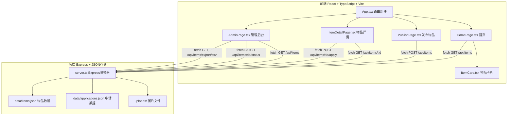
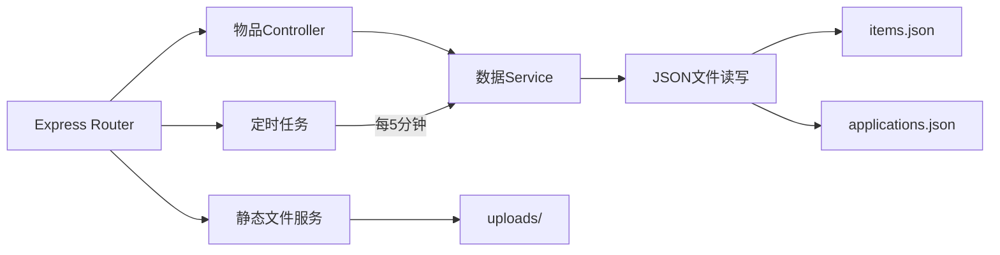
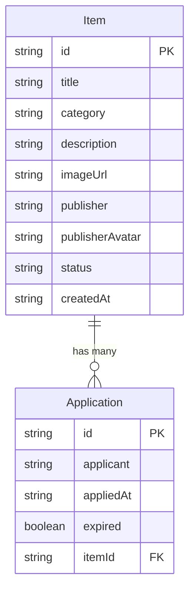

## 1. 架构设计



## 2. 技术说明

- 前端：React@18 + TypeScript + Vite
- 初始化工具：vite-init（react-express-ts模板）
- 后端：Express@4 + cors + uuid + dayjs
- 数据库：JSON文件存储（items.json, applications.json）
- 图片存储：本地uploads目录，压缩至最大宽度1024px

## 3. 路由定义

| 路由 | 用途 |
|------|------|
| / | 首页，展示物品卡片网格 |
| /publish | 发布物品页面 |
| /items/:id | 物品详情页面 |
| /admin | 管理员后台页面 |

## 4. API定义

### 4.1 物品接口

```typescript
interface Item {
  id: string;
  title: string;
  category: "家具" | "电器" | "书籍" | "衣物" | "其他";
  description: string;
  imageUrl: string;
  publisher: string;
  publisherAvatar: string;
  status: "已发布" | "已申请" | "已领取";
  createdAt: string;
  applications: Application[];
}

interface Application {
  id: string;
  applicant: string;
  appliedAt: string;
  expired: boolean;
}
```

### 4.2 请求/响应

| 方法 | 路径 | 请求体 | 响应 |
|------|------|--------|------|
| GET | /api/items | - | Item[] |
| GET | /api/items/:id | - | Item |
| POST | /api/items | FormData(标题,分类,描述,图片) | Item |
| PATCH | /api/items/:id/status | { status: string } | Item |
| POST | /api/items/:id/apply | { applicant: string } | Item |
| DELETE | /api/items/:id/applications/:appId | - | Item |
| DELETE | /api/items/:id/expired-applications | - | Item |
| GET | /api/items/export/csv | - | CSV文件下载 |

## 5. 服务器架构



## 6. 数据模型

### 6.1 数据模型定义



### 6.2 JSON文件结构

**items.json**
```json
[
  {
    "id": "uuid-1",
    "title": "旧书架",
    "category": "家具",
    "description": "三层书架，9成新",
    "imageUrl": "/uploads/xxx.jpg",
    "publisher": "张三",
    "publisherAvatar": "",
    "status": "已发布",
    "createdAt": "2026-06-17T10:00:00Z",
    "applications": []
  }
]
```

### 6.3 文件调用关系与数据流向

```
index.html
  └─ 加载 src/main.tsx
       └─ 渲染 App.tsx（路由组件）
            ├─ HomePage.tsx ←→ fetch GET /api/items → server.ts → items.json
            │    └─ ItemCard.tsx（展示物品，触发申请回调）
            ├─ PublishPage.tsx → fetch POST /api/items → server.ts → items.json + uploads/
            ├─ ItemDetailPage.tsx ←→ fetch GET/POST /api/items/:id → server.ts → items.json
            └─ AdminPage.tsx ←→ fetch GET/PATCH/DELETE /api/items → server.ts → items.json

server.ts（Express服务器）
  ├─ 读取/写入 items.json（物品+申请数据合并存储）
  ├─ 处理图片上传 → uploads/目录
  ├─ 图片压缩（最大宽度1024px）
  └─ 定时任务（每5分钟检查过期申请）
```
