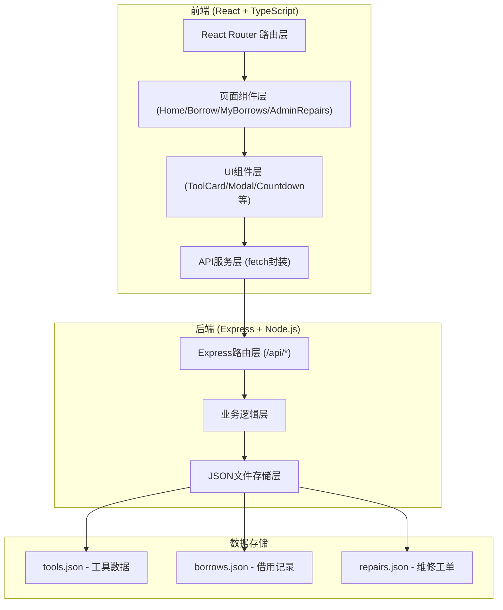
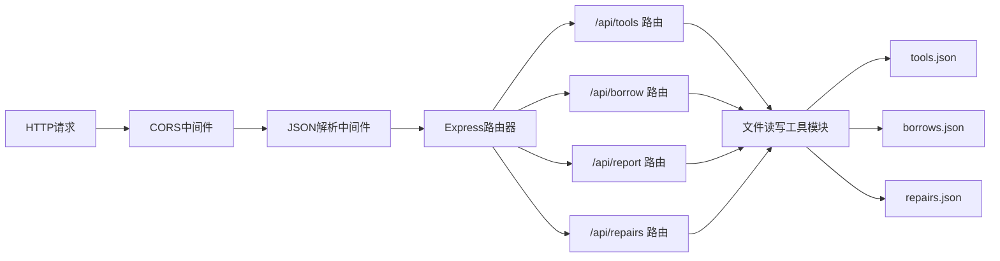
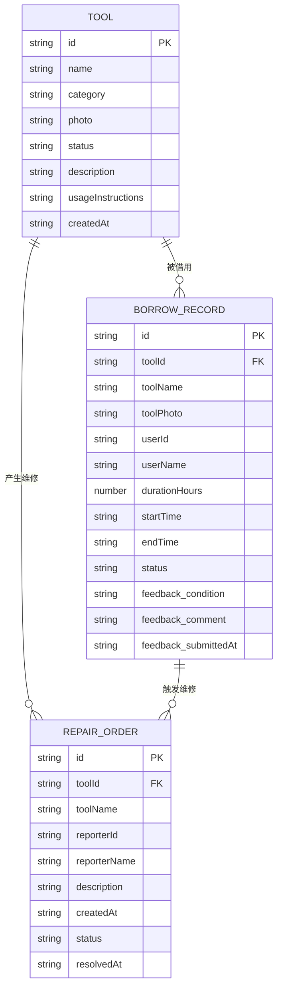

## 1. 架构设计



## 2. 技术说明

- **前端框架**：React 18 + TypeScript（严格模式）
- **构建工具**：Vite + @vitejs/plugin-react
- **路由管理**：react-router-dom v6
- **样式方案**：原生CSS（CSS Modules/全局CSS变量），无需UI组件库
- **日期处理**：dayjs
- **后端框架**：Express 4
- **跨域处理**：cors中间件
- **唯一ID生成**：uuid
- **数据存储**：本地JSON文件（data目录下）
- **启动端口**：前端Vite默认端口(5173)，后端Express 3001端口

## 3. 路由定义

| 前端路由 | 页面组件 | 用途 |
|----------|----------|------|
| / | Home.tsx | 首页工具搜索和浏览 |
| /borrow/:toolId | Borrow.tsx | 借用申请详情页 |
| /my-borrows | MyBorrows.tsx | 个人借用记录列表 |
| /admin/repairs | AdminRepairs.tsx | 管理员维修工单管理 |

| 后端API路由 | 请求方法 | 用途 |
|-------------|----------|------|
| /api/tools | GET | 获取所有工具列表 |
| /api/tools/:id | GET | 获取单个工具详情（含最近借用记录） |
| /api/borrow | POST | 提交借用申请 |
| /api/borrows | GET | 获取当前用户借用记录（模拟用户ID） |
| /api/report | POST | 提交工具使用反馈 |
| /api/repairs | GET | 获取所有维修工单 |
| /api/repairs/:id/resolve | POST | 标记维修工单已修复 |

## 4. API 数据定义

### 4.1 TypeScript 类型定义

```typescript
type ToolStatus = 'available' | 'borrowed' | 'repairing';

interface Tool {
  id: string;
  name: string;
  category: string;
  photo: string;
  status: ToolStatus;
  description: string;
  usageInstructions: string;
  createdAt: string;
}

interface BorrowRecord {
  id: string;
  toolId: string;
  toolName: string;
  toolPhoto: string;
  userName: string;
  userId: string;
  durationHours: number;
  startTime: string;
  endTime: string;
  status: 'active' | 'returned' | 'overdue';
  feedback?: {
    condition: 'normal' | 'wear' | 'damaged';
    comment: string;
    submittedAt: string;
  };
}

interface RepairOrder {
  id: string;
  toolId: string;
  toolName: string;
  reporterId: string;
  reporterName: string;
  description: string;
  createdAt: string;
  status: 'pending' | 'resolved';
  resolvedAt?: string;
}
```

### 4.2 请求/响应格式

**POST /api/borrow 请求体：**
```json
{
  "toolId": "uuid-string",
  "userId": "user-001",
  "userName": "张三",
  "durationHours": 4
}
```

**POST /api/report 请求体：**
```json
{
  "borrowId": "uuid-string",
  "condition": "damaged",
  "comment": "钻头断裂，需要更换"
}
```

## 5. 服务器架构



## 6. 数据模型

### 6.1 ER图



### 6.2 初始数据（tools.json）

至少包含5个工具：电钻、角磨机、焊机、螺丝刀套装、扳手等，涵盖不同分类和状态（可用、已借出、维修中均有分布）。

### 6.3 文件结构

```
project-root/
├── package.json
├── vite.config.js
├── tsconfig.json
├── index.html
├── src/
│   ├── App.tsx
│   ├── styles/
│   │   └── global.css
│   └── pages/
│       ├── Home.tsx
│       ├── Borrow.tsx
│       ├── MyBorrows.tsx
│       └── AdminRepairs.tsx
├── server/
│   └── index.ts
└── data/
    ├── tools.json
    ├── borrows.json
    └── repairs.json
```
