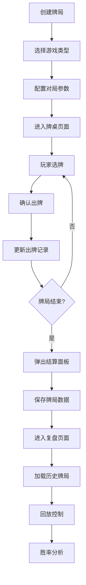

## 1. 产品概述

牌类游戏回合记录与复盘分析应用，支持斗地主、UNO等牌类游戏的对局记录、实时渲染与历史回放。玩家可快速记录每手牌与出牌顺序，系统自动生成牌局回放进度条和单局胜率统计。

- **目标用户**：牌类游戏爱好者、需要复盘分析的玩家
- **核心价值**：轻量化的牌局记录工具，支持Canvas实时渲染与历史回放分析

## 2. 核心功能

### 2.1 功能模块

1. **游戏入口页面**：创建新牌局、选择游戏类型、对局配置
2. **牌桌游戏页面**：Canvas绘制牌桌、手牌区域、出牌记录、柱状统计
3. **胜负结算面板**：弹出结算、显示得分与时长、生成牌局ID
4. **复盘回放页面**：历史记录列表、牌局ID查询、进度条控制回放
5. **胜率分析卡片**：回放结束后弹出统计分析

### 2.2 页面详情

| 页面名称 | 模块名称 | 功能描述 |
|---------|---------|---------|
| 游戏入口 | 牌局创建 | 选择游戏类型（斗地主/UNO）、填写对局配置、开始游戏 |
| 牌桌页面 | 牌桌渲染 | Canvas绘制深蓝色渐变背景、桌面区域、玩家手牌区域 |
| 牌桌页面 | 出牌交互 | 点击选牌（上移+加粗边框）、确认出牌（淡入动画）、出牌记录列表 |
| 牌桌页面 | 实时统计 | 手牌流转柱状图、出牌次数统计 |
| 结算面板 | 胜负结算 | 居中弹出、缩放动画、显示手牌张数/得分/时长/牌局ID |
| 复盘页面 | 历史记录 | 历史牌局列表、ID查询加载、悬停高亮 |
| 复盘页面 | 回放控制 | 进度条拖动、0.5x/1x/2x速度切换、显示当前操作信息 |
| 复盘页面 | 胜率分析 | 回放结束弹出胜率分析卡片 |

## 3. 核心流程

## 4. 用户界面设计

### 4.1 设计风格

- **主色调**：深蓝色渐变 `#1a237e` → `#283593`（牌桌背景）
- **桌面色**：浅灰色 `#cfd8dc`
- **强调色**：紫色按钮 `#7c4dff`，悬停 `#b388ff`
- **牌背色**：浅蓝色 `#42a5f5`
- **牌面色**：白色 `#ffffff` 带黑色花色符号
- **选中边框**：黄色 `#ffd54f`，2px粗

### 4.2 按钮与组件样式

- **按钮**：圆角8px，实色背景，白色文字，悬停亮度提升
- **动画缓动**：`cubic-bezier(0.4, 0, 0.2, 1)`
- **弹窗**：圆角16px，渐变色背景，缩放入场动画
- **列表项**：圆角8px，深色背景，悬停变色

### 4.3 布局规范

- **牌桌宽度**：自适应窗口，最小1000px，最大1600px
- **小于1000px时**：牌自动缩小至80%
- **出牌记录列表**：右侧纵向滚动，每项280px×40px
- **历史记录项**：300px×50px
- **结算面板**：400px×300px
- **胜率分析卡片**：360px×220px

### 4.4 页面设计概览

| 页面名称 | 模块名称 | UI元素 |
|---------|---------|-------|
| 游戏入口 | 牌局创建 | 标题、游戏类型选择器、配置输入框、开始按钮 |
| 牌桌页面 | 牌桌Canvas | 渐变背景、桌面区域、玩家手牌、出牌区、柱状图 |
| 牌桌页面 | 出牌记录 | 右侧滚动列表、玩家颜色圆点、白色文字 |
| 结算面板 | 弹窗 | 居中显示、缩放动画、渐变色背景、数据展示 |
| 复盘页面 | 历史列表 | 左侧列表、深色卡片、悬停效果 |
| 复盘页面 | 回放控制 | 底部进度条、速度切换按钮、操作信息显示 |

## 5. 性能要求

- **回放帧率**：60fps，无卡顿
- **拖动进度条帧率**：不低于30fps
- **响应式**：自适应窗口宽度，小屏自动缩放
