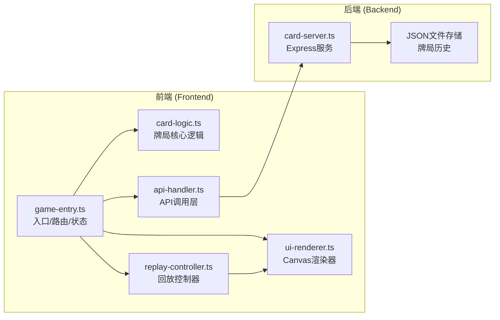

## 1. 架构设计



## 2. 技术描述

- **前端**：TypeScript + Vite + HTML5 Canvas
- **构建工具**：Vite
- **后端**：Express + JSON文件存储
- **状态管理**：前端模块内状态（非第三方库）
- **动画**：Canvas 2D API + requestAnimationFrame

### 依赖包

| 包名 | 用途 |
|------|------|
| typescript | TypeScript 编译器 |
| vite | 构建与开发服务器 |
| @vitejs/plugin-basic-ssl | HTTPS 支持 |
| uuid | 生成唯一牌局ID |
| express | 后端服务框架 |

## 3. 路由与页面定义

| 路由/视图 | 用途 |
|-----------|------|
| / | 游戏入口（创建牌局） |
| /game/:id | 牌桌游戏页面 |
| /replay/:id | 复盘回放页面 |

注：使用前端简易路由（Hash或History模式），不引入第三方路由库。

## 4. API 定义

### 4.1 类型定义

```typescript
// 牌型
type CardSuit = 'hearts' | 'diamonds' | 'clubs' | 'spades' | 'none'; // none for UNO
type CardRank = string;

interface Card {
  id: string;
  suit: CardSuit;
  rank: CardRank;
  color?: string; // for UNO
}

// 玩家
interface Player {
  id: string;
  name: string;
  color: string;
  hand: Card[];
  score: number;
}

// 出牌记录
interface PlayRecord {
  playerId: string;
  cards: Card[];
  playType: string; // 牌型描述
  timestamp: number;
}

// 牌局
interface GameSession {
  id: string;
  gameType: 'landlord' | 'uno';
  players: Player[];
  records: PlayRecord[];
  startTime: number;
  endTime?: number;
  winnerId?: string;
  config: GameConfig;
}

interface GameConfig {
  playerCount: number;
  playerNames: string[];
}
```

### 4.2 接口列表

| 方法 | 路径 | 描述 |
|------|------|------|
| POST | /api/games | 创建新牌局 |
| GET | /api/games | 获取牌局历史列表 |
| GET | /api/games/:id | 获取单局详情 |
| POST | /api/games/:id/records | 添加出牌记录 |
| POST | /api/games/:id/finish | 结束牌局 |

## 5. 数据存储

使用 JSON 文件存储，文件路径：`server/data/games.json`

- 存储所有牌局历史记录
- 支持按 ID 查询
- 支持列表获取

## 6. 核心模块说明

### 6.1 game-entry.ts
- 应用入口，初始化全局状态
- 简易前端路由管理
- 页面切换逻辑
- 全局事件总线

### 6.2 card-logic.ts
- 牌型定义与比较规则
- 胜负判断逻辑
- 发牌与手牌管理
- 出牌合法性校验

### 6.3 ui-renderer.ts
- Canvas 绘制牌桌背景
- 手牌区域绘制与交互
- 出牌动画效果
- 柱状图统计渲染
- 60fps 渲染循环

### 6.4 replay-controller.ts
- 时间轴管理
- 进度条控制
- 回放速度调节（0.5x/1x/2x）
- 操作逐条回放
- 帧同步控制

### 6.5 api-handler.ts
- 封装 fetch 请求
- 牌局数据序列化
- 错误处理
- 请求/响应拦截

### 6.6 card-server.ts
- Express 服务启动
- 静态文件服务
- RESTful API 实现
- JSON 文件读写
- 数据校验
