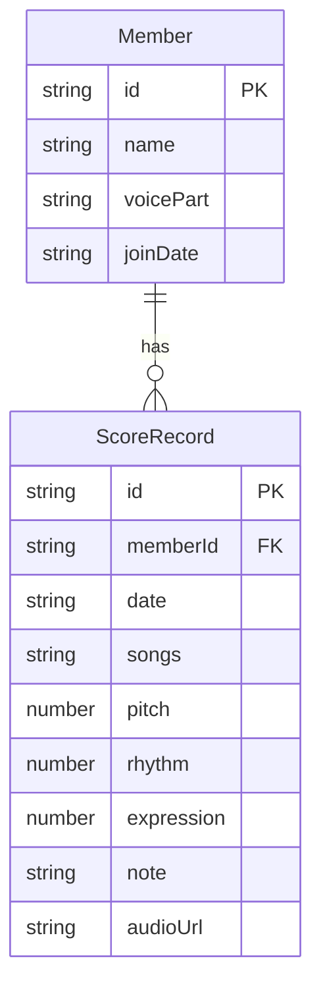

## 1. 架构设计

```mermaid
flowchart TD
    "Frontend[React + TypeScript + Vite]" --> "API[Express REST API]"
    "API" --> "Storage[JSON File Storage]"
    "Frontend" --> "Charts[Recharts 可视化]"
    "Frontend" --> "Audio[Web Audio API 录音]"
```

## 2. 技术说明

- 前端：React@18 + TypeScript + Vite + Recharts（图表）+ TailwindCSS（样式）+ Zustand（状态管理）
- 初始化工具：vite-init（react-express-ts模板）
- 后端：Express@4 + CORS + UUID
- 数据库：JSON文件存储（server/data/members.json、server/data/scores.json）

## 3. 路由定义

| 路由 | 用途 |
|------|------|
| / | 团员管理页面（默认首页），展示团员列表与评分入口 |
| /rehearsal | 排演记录页面，展示历史排演记录卡片与筛选 |
| /member/:id | 个人详情页面，展示雷达图与趋势折线图 |

## 4. API定义

### 4.1 TypeScript 类型定义

```typescript
interface Member {
  id: string;
  name: string;
  voicePart: string;
  joinDate: string;
}

interface ScoreRecord {
  id: string;
  memberId: string;
  date: string;
  songs: string[];
  pitch: number;
  rhythm: number;
  expression: number;
  note: string;
  audioUrl?: string;
}
```

### 4.2 请求/响应 Schema

| 方法 | 路径 | 请求体 | 响应 |
|------|------|--------|------|
| GET | /api/members | - | Member[] |
| GET | /api/members/:id/scores | - | ScoreRecord[] |
| POST | /api/scores | ScoreRecord（无id） | ScoreRecord（含id） |
| POST | /api/members | { name, voicePart } | Member |
| GET | /api/scores?from=&to=&songs= | 查询参数 | ScoreRecord[] |

## 5. 服务端架构图

```mermaid
flowchart LR
    "Controller[路由控制器]" --> "Service[业务逻辑层]"
    "Service" --> "Repository[数据访问层]"
    "Repository" --> "DB[JSON文件存储]"
```

## 6. 数据模型

### 6.1 数据模型定义



### 6.2 数据定义

- members.json：存储团员数组，每条记录包含 id、name、voicePart、joinDate
- scores.json：存储评分记录数组，每条记录包含 id、memberId、date、songs（数组）、pitch、rhythm、expression、note、audioUrl
- 初始数据：预置6名团员和若干排演记录作为演示数据

## 7. 文件结构与调用关系

```
project/
├── package.json
├── vite.config.js
├── tsconfig.json
├── index.html
├── server/
│   ├── server.js          ← Express主入口，定义API路由
│   └── data/
│       ├── members.json   ← 团员数据存储
│       └── scores.json    ← 评分记录数据存储
├── src/
│   ├── App.tsx            ← 路由分发与全局状态，接收API数据分发给子组件
│   ├── main.tsx           ← 应用入口
│   ├── stores/
│   │   └── useAppStore.ts ← Zustand全局状态管理
│   ├── pages/
│   │   ├── MembersPage.tsx  ← 团员管理页面
│   │   ├── RehearsalPage.tsx ← 排演记录页面
│   │   └── MemberDetailPage.tsx ← 个人详情页面
│   ├── components/
│   │   ├── Sidebar.tsx       ← 左侧导航栏
│   │   ├── ScorePanel.tsx    ← 评分面板（滑块+录音+备注）
│   │   ├── ProgressChart.tsx ← 雷达图与折线图
│   │   ├── RecordCard.tsx    ← 排演记录卡片
│   │   └── AudioRecorder.tsx ← 录音组件
│   ├── utils/
│   │   └── dataHelper.ts   ← 工具函数（日期格式化、均值计算、图表数据生成）
│   └── api/
│       └── index.ts        ← API调用封装
```

### 数据流向

1. **评分提交**：ScorePanel表单输入 → api/index.ts调用POST /api/scores → server.js处理并写入scores.json → 前端重新GET最新数据 → Zustand store更新 → 组件重新渲染
2. **图表渲染**：MemberDetailPage从Zustand获取团员评分数据 → 传入ProgressChart → dataHelper.ts处理数据结构 → Recharts渲染图表
3. **记录筛选**：RehearsalPage输入筛选条件 → api/index.ts调用GET /api/scores?from=&to=&songs= → server.js查询scores.json → 返回筛选结果 → 更新前端状态
