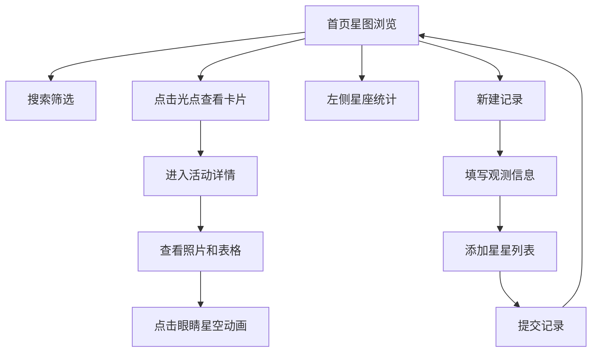

## 1. 产品概述
星迹（StarTrace）—— 社区天文爱好者观星活动记录与分享平台。帮助小组成员在郊外观星后统一整理观测数据（星星名称、星座、亮度、观测时间、天气条件、望远镜参数），形成可回顾的观测档案，并支持按亮度和位置筛选最值得再看的星星。

## 2. 核心功能

### 2.1 用户角色
| 角色 | 注册方式 | 核心权限 |
|------|----------|----------|
| 天文爱好者 | 无需注册 | 创建/浏览观星记录、查看星图、星座统计 |

### 2.2 功能模块
1. **首页**：星图展示所有记录星星、搜索筛选、左侧边栏星座柱状图统计
2. **新建记录页**：创建观星活动记录，填写观测信息、添加星星、上传照片
3. **活动详情页**：查看单次观测完整数据、照片展示、星星表格、星空模拟动画

### 2.3 页面详情
| 页面名称 | 模块名称 | 功能描述 |
|----------|----------|----------|
| 首页 | 星图区域 | 所有星星以光点圆形展示，直径根据视星等计算，点击弹出信息卡片 |
| 首页 | 搜索框 | 右上角输入框，实时筛选星星名称或星座，平滑滚动到匹配位置 |
| 首页 | 星座柱状图 | 左侧边栏按星座分组统计，柱状图展示，点击显示该星座星星列表 |
| 首页 | 总览卡片 | 柱状图下方，显示总活动数、总星星数、最近观测日期 |
| 新建记录页 | 观测信息表单 | 日期、地点（自动获取或手动输入经纬度）、天气状况下拉选择 |
| 新建记录页 | 天气卡片 | 根据天气状况切换背景色（晴朗#e3f2fd、多云#cfd8dc、有云#b0bec5、有月光#fff3e0） |
| 新建记录页 | 星星列表 | 添加星星：名称、星座、视星等（-1.46~6.0）、观测方式、照片（最多3张） |
| 活动详情页 | 信息头部 | 日期（YYYY年MM月DD日）和地点 |
| 活动详情页 | 照片展示 | 横向滚动照片区，每张120x120px object-fit:cover |
| 活动详情页 | 星星表格 | 列：名称、星座、星等、观测方式；最后一列小眼睛图标 |
| 活动详情页 | 星空模拟动画 | 点击眼睛图标弹出深蓝色画布随机白色闪烁点，持续3秒自动关闭 |

## 3. 核心流程
用户打开首页浏览星图 → 点击"新建记录"进入创建页 → 填写观测信息、添加星星 → 提交后返回首页 → 点击星星光点查看信息 → 进入活动详情查看完整数据 → 点击眼睛图标体验星空模拟

## 4. 用户界面设计

### 4.1 设计风格
- 主色调：深色天文主题，背景#0d1b2a，卡片#1b2838
- 强调色：标题#90caf9，按钮#1565c0（hover #1976d2）
- 文字颜色：正文#e0e0e0，标题#90caf9
- 按钮样式：圆角8px，hover变色
- 字体：系统字体栈，天文科技感
- 布局：左侧边栏统计 + 右侧主内容区

### 4.2 页面设计概览
| 页面名称 | 模块名称 | UI元素 |
|----------|----------|--------|
| 首页 | 星图区域 | 深色背景，黄色光点(#ffd54f)带box-shadow发光效果，内圈半透明光晕 |
| 首页 | 信息卡片 | 宽240px高160px圆角12px白底0.5px灰色边框，底部星座主题色横条 |
| 首页 | 柱状图 | 柱子宽20px最高200px，#7c4dff到#b388ff渐变，间距12px |
| 首页 | 搜索框 | input placeholder="搜索星星名称或星座..." |
| 新建记录页 | 表单卡片 | 天气卡片背景随选择变色 |
| 详情页 | 数据卡片 | 宽350px高自动圆角16px，#f3e5f5到#e1bee7渐变 |
| 详情页 | 眼睛图标 | hover旋转15度变色#7c4dff |

### 4.3 响应式
桌面优先设计，主要针对桌面浏览器使用场景

### 4.4 星座主题色
| 星座 | 颜色 |
|------|------|
| 仙后座 | #e91e63 |
| 猎户座 | #2196f3 |
| 大熊座 | #4caf50 |
| 天鹅座 | #ff9800 |
