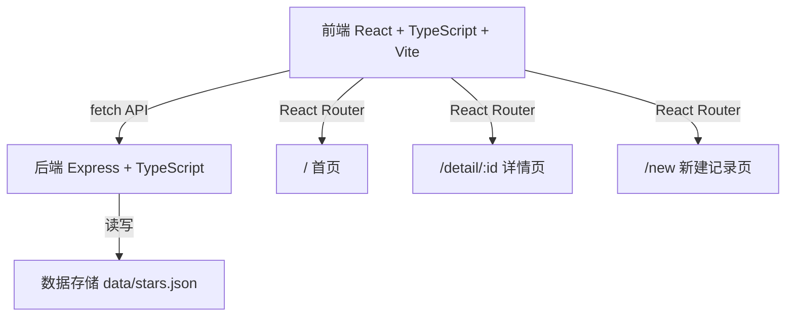
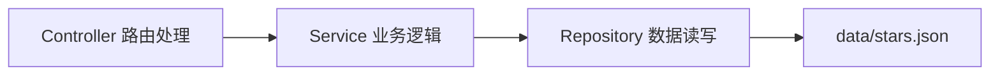
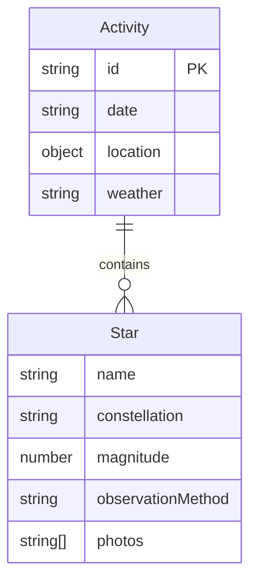

## 1. 架构设计


## 2. 技术说明
- 前端：React 18 + TypeScript + Vite + React Router DOM
- 后端：Express 4 + TypeScript + CORS + UUID
- 数据存储：JSON 文件（data/stars.json）
- 初始化工具：Vite

## 3. 路由定义
| 路由 | 用途 |
|------|------|
| / | 首页：星图展示、搜索、星座统计 |
| /detail/:id | 活动详情页：观测数据、照片、星星表格 |
| /new | 新建记录页：创建观星活动记录 |

## 4. API 定义
| 方法 | 路径 | 说明 | 请求体 | 响应 |
|------|------|------|--------|------|
| GET | /api/stars | 获取所有观星活动 | - | Activity[] |
| GET | /api/stars/:id | 获取单个活动详情 | - | Activity |
| POST | /api/stars | 创建新观星活动 | Activity | { success: boolean, data: Activity } |

### TypeScript 类型定义
```typescript
interface Star {
  name: string;
  constellation: string;
  magnitude: number;
  observationMethod: '肉眼' | '双筒望远镜' | '天文望远镜';
  photos: string[];
}

interface Activity {
  id: string;
  date: string;
  location: { lat: number; lng: number; name?: string };
  weather: '晴朗' | '多云' | '有云' | '有月光';
  stars: Star[];
  photos: string[];
}
```

## 5. 服务器架构


## 6. 数据模型
### 6.1 数据模型定义


## 7. 文件结构
```
├── package.json
├── vite.config.js
├── tsconfig.json
├── index.html
├── data/
│   └── stars.json
├── server/
│   └── index.ts
└── src/
    ├── App.tsx
    └── pages/
        ├── HomePage.tsx
        ├── DetailPage.tsx
        └── NewRecordPage.tsx
```
