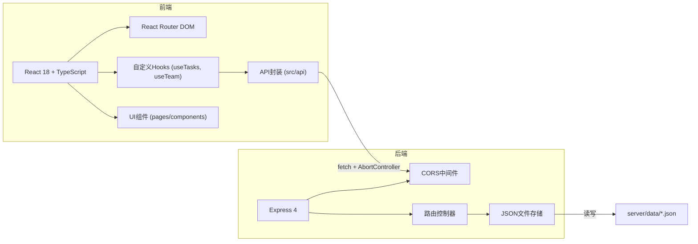
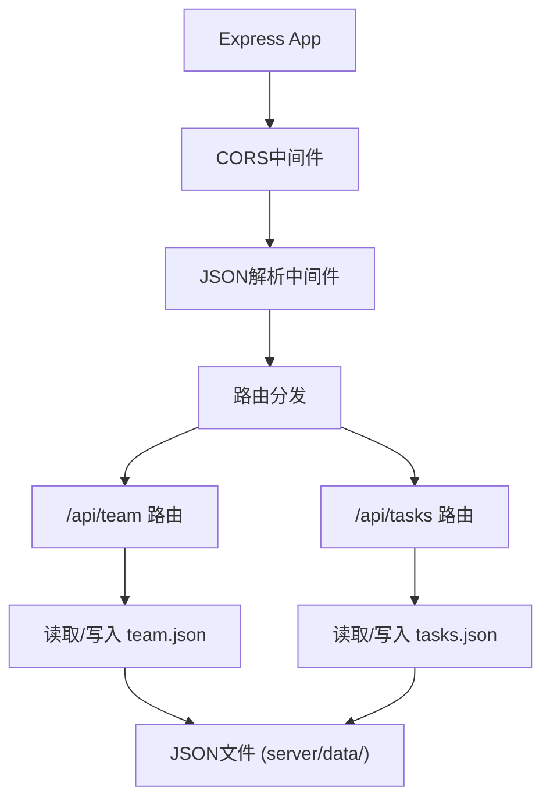
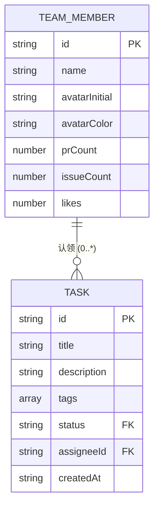

## 1. 架构设计



## 2. 技术说明
- 前端：React@18 + TypeScript + Vite@6 + React Router DOM@6
- 初始化工具：Vite模板 react-ts
- 后端：Express@4 + CORS + UUID + Day.js
- 数据库：JSON文件持久化存储（server/data目录）
- 状态管理：React内置 useState + useEffect + 自定义Hooks
- 构建工具：Vite (开发端口3000)

## 3. 路由定义
| 路由路径 | 页面组件 | 功能 |
|----------|----------|------|
| / | Dashboard | 看板首页 - 成员列表、排行榜、点赞 |
| /tasks | TaskBoard | 任务看板 - 三列视图、拖拽、认领 |

## 4. API定义

### 4.1 TypeScript类型
```typescript
// 成员类型
interface TeamMember {
  id: string;
  name: string;
  avatarInitial: string;
  avatarColor: string;
  prCount: number;      // PR合并数
  issueCount: number;   // Issue解决数
  likes: number;
}

// 任务状态
type TaskStatus = 'pending' | 'in_progress' | 'completed';

// 任务类型
interface Task {
  id: string;
  title: string;
  description: string;
  tags: string[];
  status: TaskStatus;
  assigneeId: string | null;
  createdAt: string;
}
```

### 4.2 接口列表
| 方法 | 路径 | 请求体 | 响应 | 说明 |
|------|------|--------|------|------|
| GET | /api/team | - | TeamMember[] | 获取团队成员列表 |
| POST | /api/team/:id/like | - | { likes: number } | 给成员点赞+1 |
| GET | /api/tasks | - | Task[] | 获取所有任务 |
| POST | /api/tasks/:id/status | { status: TaskStatus } | Task | 更新任务状态 |
| POST | /api/tasks/:id/claim | { assigneeId: string } | Task | 认领任务（设置认领人+状态为进行中） |

## 5. 服务端架构图



## 6. 数据模型

### 6.1 数据模型定义


### 6.2 初始数据
#### team.json 示例
```json
[
  {
    "id": "uuid-1",
    "name": "张伟",
    "avatarInitial": "张",
    "avatarColor": "#3b82f6",
    "prCount": 12,
    "issueCount": 8,
    "likes": 45
  }
]
```

#### tasks.json 示例
```json
[
  {
    "id": "task-uuid-1",
    "title": "优化登录页面性能",
    "description": "减少首屏加载时间至2秒以内",
    "tags": ["前端", "性能优化"],
    "status": "pending",
    "assigneeId": null,
    "createdAt": "2026-06-15T10:00:00.000Z"
  }
]
```

## 7. 项目文件结构
```
auto8/
├── package.json
├── vite.config.js
├── tsconfig.json
├── index.html
├── server/
│   ├── index.js           # Express服务器入口
│   └── data/
│       ├── team.json      # 团队成员数据
│       └── tasks.json     # 任务数据
└── src/
    ├── App.tsx            # 根组件+路由+导航
    ├── api/
    │   └── tasks.ts       # API请求封装
    ├── hooks/
    │   ├── useTasks.ts    # 任务状态Hook
    │   └── useTeam.ts     # 团队数据Hook
    ├── components/
    │   ├── Avatar.tsx     # 头像组件
    │   ├── MemberCard.tsx # 成员卡片
    │   ├── TaskCard.tsx   # 任务卡片
    │   ├── TaskColumn.tsx # 任务列
    │   └── ClaimModal.tsx # 认领模态框
    ├── pages/
    │   ├── Dashboard.tsx  # 看板首页
    │   └── TaskBoard.tsx  # 任务看板
    └── utils/
        └── types.ts       # 类型定义
```
