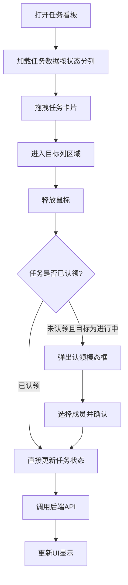

## 1. 产品概述

开源贡献者协作看板应用，帮助技术团队成员追踪开源贡献进度、管理任务认领、互相点赞鼓励，提升团队协作效率和成员参与感。

- 核心目标：可视化团队贡献数据，简化任务流程管理，增强团队凝聚力
- 目标用户：技术团队开发者、开源项目维护者、团队负责人

## 2. 核心功能

### 2.1 用户角色
| 角色 | 注册方式 | 核心权限 |
|------|----------|----------|
| 团队成员 | 系统预置 | 查看看板、认领任务、拖拽任务状态、点赞成员 |

### 2.2 功能模块
1. **看板首页 (Dashboard)**：团队成员卡片、当月贡献计数、点赞功能、月度排行榜、总点赞数
2. **任务看板 (TaskBoard)**：三列任务视图（待认领/进行中/已完成）、拖拽排序、任务认领模态框

### 2.3 页面详情
| 页面名称 | 模块名称 | 功能描述 |
|----------|----------|----------|
| 看板首页 | 顶部统计栏 | 显示团队总点赞数、月度贡献排行榜（前三名带金银铜边框） |
| 看板首页 | 成员卡片网格 | 显示成员姓名、首字母头像、当月贡献计数、点赞按钮及动画 |
| 任务看板 | 三列视图 | 待认领、进行中、已完成三列，支持响应式布局调整 |
| 任务看板 | 拖拽交互 | 任务卡片可拖拽至其他列，带半透明阴影和缩放效果 |
| 任务看板 | 认领模态框 | 拖拽任务至进行中且未认领时弹出，选择认领人确认 |

## 3. 核心流程

### 3.1 点赞流程
用户浏览看板首页 → 点击成员卡片点赞按钮 → 心形图标变红 → +1气泡动画升起 → 调用后端API更新点赞数

### 3.2 任务拖拽认领流程
用户拖拽待认领任务 → 移动至进行中列 → 释放鼠标 → 检测任务无认领人 → 弹出认领模态框 → 选择成员确认 → 更新任务状态和认领人

## 4. 用户界面设计

### 4.1 设计风格
- 主色调：深蓝 #1e293b（导航栏）、浅灰蓝 #f1f5f9（页面背景）
- 强调色：天蓝 #38bdf8（高亮/贡献数）、柔和蓝 #dbeafe（标签/高亮列）
- 点赞色：红 #ef4444、灰色 #94a3b8
- 奖牌色：金 #fbbf24、银 #cbd5e1、铜 #d97706
- 字体：无衬线系统字体，标题加粗16px，正文14px
- 布局：卡片式布局，圆角12px/8px/16px，柔和阴影
- 动画：ease-out缓动，0.2s-0.3s时长，关键帧popUp上升动画

### 4.2 页面设计概览
| 页面名称 | 模块名称 | UI元素 |
|----------|----------|--------|
| 看板首页 | 顶部导航栏 | 64px高度，#1e293b背景，底部3px高亮线指示当前页 |
| 看板首页 | 排行榜 | 前三名头像放大1.3倍，金银铜边框装饰 |
| 看板首页 | 成员卡片 | 280px宽，12px圆角，48px圆形头像，天蓝贡献数加粗 |
| 任务看板 | 任务列 | 320px宽，8px圆角，#f8fafc背景，标题栏#e2e8f0 |
| 任务看板 | 任务卡片 | 16px加粗标题，14px灰色描述，12px圆角蓝标签 |
| 通用 | 模态框 | 400px宽，16px圆角，大阴影，下拉选择+确认按钮 |

### 4.3 响应式设计
- 桌面端（>=1024px）：三列任务看板并排，成员卡片多列网格
- 平板端（768px-1023px）：待认领+进行中合并一列，已完成独立一行
- 手机端（<768px）：单列垂直排列，触摸事件支持拖拽

## 5. 性能与交互要求
- 拖拽响应：使用requestAnimationFrame，<100ms延迟，60fps流畅度
- API请求：AbortController取消机制，防止组件卸载后状态更新
- 动画：CSS keyframes实现点赞+1气泡（上升50px/80px，缩放透明消散）
