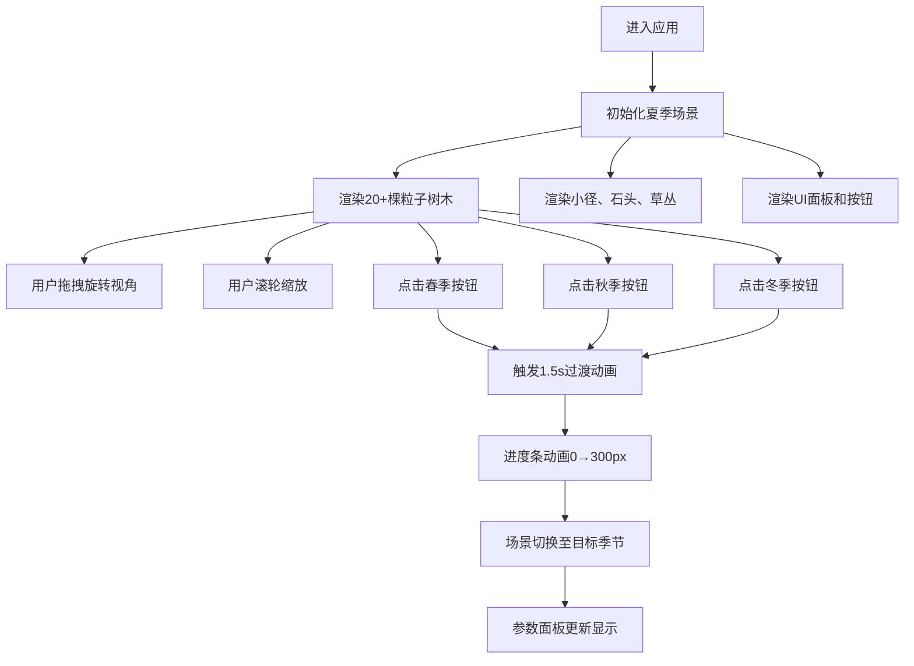

## 1. 产品概述

森林季节模拟器是一个基于WebGL的3D交互式教学应用，专为环境设计初学者打造，帮助其直观感受同一地理区域在春、夏、秋、冬四季下的植被色彩、光照氛围和地面覆盖物差异。

- 解决的核心问题：环境设计初学者难以在平面资料中建立四季变化的立体感知
- 目标用户：环境设计、景观建筑、园林专业学生及初学者
- 产品价值：通过沉浸式3D交互降低学习门槛，提升对季节视觉变化的敏感度

## 2. 核心功能

### 2.1 功能模块

1. **3D森林场景渲染**：20棵以上随机分布的粒子树木、蜿蜒小径、石头、草丛
2. **四季切换系统**：春季/夏季/秋季/冬季四套完整视觉参数一键切换
3. **季节过渡动画**：1.5秒淡入淡出平滑过渡（颜色、粒子大小、位移）
4. **视角交互控制**：鼠标拖拽旋转、滚轮缩放、视差抖动增强立体感
5. **季节参数面板**：悬浮显示当前季节名称、主色调、环境光强度、粒子数量
6. **季节进度条**：可视化展示当前季节切换进度

### 2.3 页面详情

| 页面名称 | 模块名称 | 功能描述 |
|---------|---------|---------|
| 主页面 | 3D森林场景 | R3F渲染的粒子树木、地面、小径、石头、草丛的完整场景 |
| 主页面 | 季节切换按钮组 | 底部中央四个圆形按钮，对应四季主色，点击切换 |
| 主页面 | 季节进度条 | 底部中央进度条，动画展示季节切换进度 |
| 主页面 | 季节参数面板 | 右上角半透明白底面板，显示当前季节详细参数 |
| 主页面 | 视角控制系统 | 鼠标拖拽旋转（距离3-6单位）、滚轮缩放、旋转视差抖动 |

## 3. 核心流程

用户打开应用 → 默认渲染夏季森林场景 → 通过底部季节按钮或鼠标交互探索场景 → 点击其他季节按钮触发过渡动画 → 场景平滑切换到目标季节状态 → 继续交互体验或查看参数面板

## 4. 用户界面设计

### 4.1 设计风格

- **主色调体系**：四季专属色（春#7ec850嫩绿 / 夏#2d8a4e深绿 / 秋#d97706橙黄 / 冬#6b7280灰褐）
- **背景色**：深灰蓝色渐变（#1e293b → #0f172a），营造沉浸式深色画布
- **边框色**：柔和暖色调#f3e8d6（1.5px实线），温暖不刺眼
- **按钮样式**：圆形（半径24px），填充四季主色，hover放大1.05倍+阴影，active缩放0.1s，点击放大1.1倍弹起
- **面板样式**：半透明白底#ffffff80，圆角8px，宽200px
- **进度条**：宽300px高6px圆角3px，背景#cbd5e1，填充当前季节主色
- **字体**：使用现代无衬线字体，保持清晰可读
- **动画过渡**：所有交互元素统一0.2s ease平滑过渡

### 4.2 页面设计概述

| 页面名称 | 模块名称 | UI元素 |
|---------|---------|-------|
| 主页面 | 3D画布容器 | 最小1000x700自适应，#f3e8d6边框，深色渐变背景 |
| 主页面 | 季节参数面板 | 固定右上角，半透明白底圆角，展示季节名/主色调/环境光/粒子数 |
| 主页面 | 季节按钮组 | 固定底部中央，横向排列4个圆形按钮，四季主色 |
| 主页面 | 季节进度条 | 固定底部按钮下方，居中显示，0.8s宽度动画 |
| 主页面 | 3D场景 | 居中渲染，OrbitControls视角控制，粒子树木、小径、石头、草丛 |

### 4.3 响应式设计

- Canvas宽高自适应屏幕，最小尺寸1000x700px
- UI元素固定定位，不受Canvas尺寸影响
- 按钮尺寸固定，确保触控区域足够

### 4.4 3D场景指导

- **环境/HDRI氛围**：纯色天空盒随季节变化（春#87ceeb淡蓝、夏#4a90d9湛蓝、秋#f5a623暖橙、冬#d1d5db灰白）
- **光照设置**：DirectionalLight + AmbientLight，环境光强度随季节（春0.7、夏0.9、秋0.6、冬0.4）
- **相机设置**：PerspectiveCamera，围绕场景中心轨道控制，距离范围3-6单位
- **场景构成**：地面平面、20+随机树木（粒子树冠+圆柱树干）、贝塞尔曲线小径、随机石头、随机草丛
- **交互动画**：视角旋转时树木和石头产生10%角速度的视差抖动，季节切换时粒子1.5s缓动过渡
- **性能预算**：粒子总数≤5000（20树×200粒子=4000），帧率稳定≥45FPS
