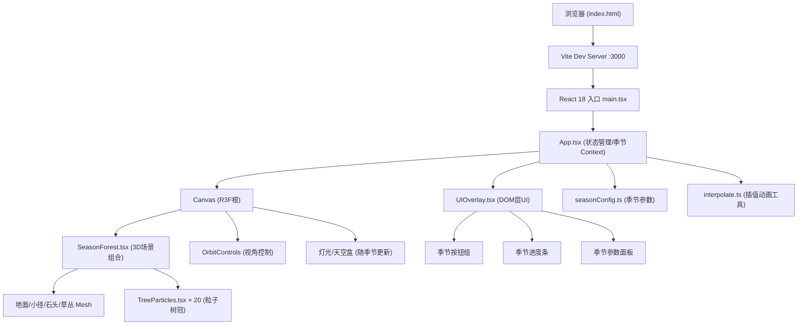

## 1. 架构设计



## 2. 技术说明

- **前端框架**：React 18 + TypeScript (strict模式)
- **构建工具**：Vite 5 (ES2020 target, bundler moduleResolution, HMR开启, 端口3000)
- **3D渲染**：Three.js + @react-three/fiber (R3F) + @react-three/drei (辅助组件)
- **状态管理**：React useState/useRef (轻量级，无需zustand)
- **动画系统**：requestAnimationFrame + 自定义缓动插值工具 (interpolate.ts)
- **样式方案**：内联样式 + CSS变量 (不使用tailwind，减少依赖)
- **类型系统**：TypeScript strict模式，完整类型定义

## 3. 依赖清单

| 包名 | 用途 |
|------|------|
| react | UI框架核心 |
| react-dom | React DOM渲染 |
| three | WebGL 3D引擎 |
| @react-three/fiber | Three.js React封装 |
| @react-three/drei | R3F常用辅助组件(OrbitControls等) |
| typescript | 类型系统 |
| vite | 构建与开发服务器 |
| @vitejs/plugin-react | Vite React支持 |
| @types/react | React类型定义 |
| @types/react-dom | React DOM类型定义 |
| @types/three | Three.js类型定义 |

## 4. 文件结构

```
auto9/
├── package.json            # 依赖与脚本配置
├── index.html              # 入口HTML页面
├── vite.config.js          # Vite构建配置
├── tsconfig.json           # TypeScript严格配置
└── src/
    ├── App.tsx             # 主应用组件，季节状态管理
    ├── components/
    │   ├── SeasonForest.tsx    # 3D森林场景主组件
    │   ├── TreeParticles.tsx   # 单棵树木粒子树冠组件
    │   └── UIOverlay.tsx       # DOM层UI叠加组件(按钮/面板/进度条)
    └── utils/
        ├── seasonConfig.ts     # 四季完整参数配置
        └── interpolate.ts      # 颜色与数值插值动画工具
```

## 5. 季节参数数据模型

```typescript
type SeasonName = 'spring' | 'summer' | 'autumn' | 'winter';

interface SeasonConfig {
  name: string;           // 中文名称
  canopyColor: string;    // 树冠主色 #RRGGBB
  groundColor: string;    // 地面主色
  skyColor: string;       // 天空盒颜色
  ambientIntensity: number; // 环境光强度 0-1
  particleColors: string[]; // 粒子颜色变体数组
  grassColor: string;     // 草丛颜色
}
```

## 6. 核心数据与算法

### 6.1 场景元素随机生成

- **树木位置**：在[-4, 4] × [-4, 4] 范围内使用伪随机函数生成，确保不重叠（最小间距0.8单位）
- **树木高度**：1.5-3单位均匀随机分布
- **石头大小**：0.2-0.5单位，位置沿小径两侧偏移
- **草丛面片**：每丛3-5条细长面片，角度随机散开
- **种子固定**：使用固定种子的随机数生成器，确保每次加载场景一致

### 6.2 季节过渡插值算法

- **颜色插值**：将HEX颜色转为RGB，使用easeInOutCubic缓动函数在1500ms内线性插值RGB各通道
- **数值插值**：粒子大小、位移、环境光强度使用相同缓动曲线
- **进度条动画**：easeOutCubic，800ms从0→300px宽度
- **requestAnimationFrame驱动**：所有动画统一在RAF循环中更新，确保帧率同步

### 6.3 性能优化策略

- **粒子复用**：不销毁重建粒子，仅更新position/color/size属性
- **InstancedMesh**：石头和树干使用实例化渲染减少Draw Call
- **粒子数上限**：总计≤5000个粒子（20树×200=4000预留余量）
- **状态批处理**：季节切换时统一更新BufferAttribute，调用needsUpdate一次
- **自动暂停**：页面不可见时暂停RAF循环（visibilitychange事件）
