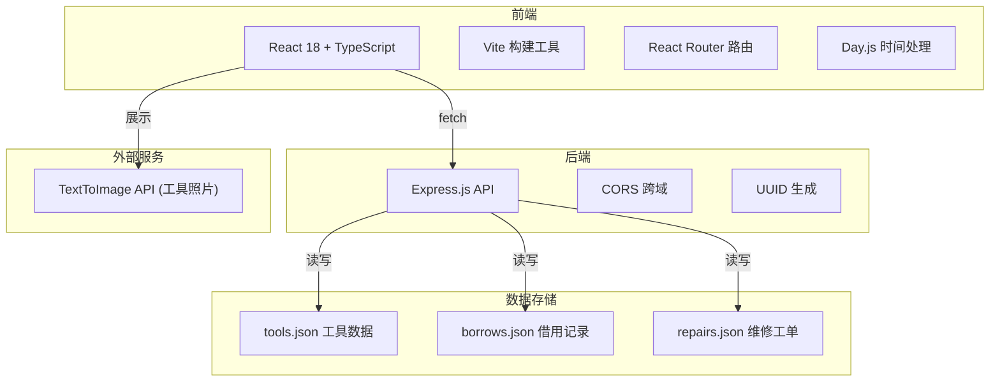
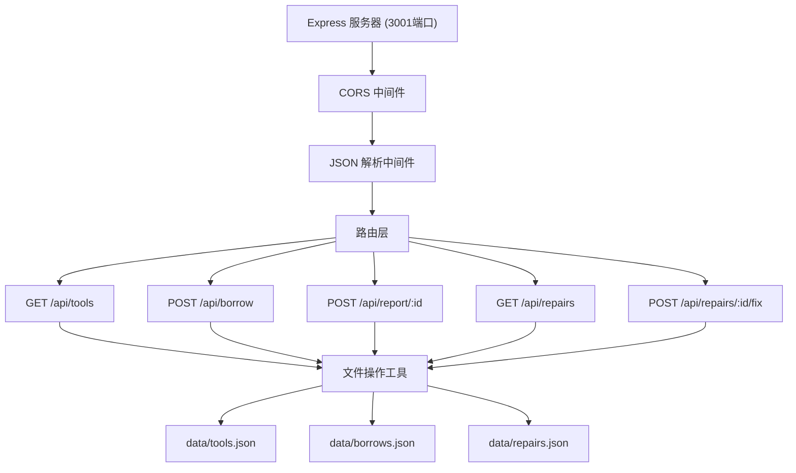
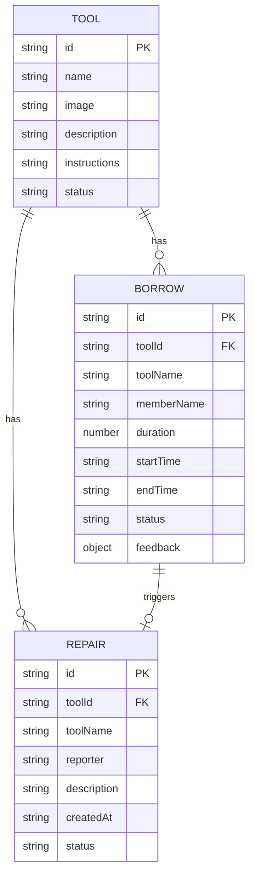

## 1. 架构设计



## 2. 技术描述

- **前端**：React@18 + TypeScript + Vite + React Router DOM + Day.js + UUID
- **初始化工具**：Vite react-ts 模板
- **后端**：Express@4 + CORS + UUID
- **数据库**：JSON文件存储（data/tools.json、data/borrows.json、data/repairs.json）
- **状态管理**：React hooks (useState、useEffect) 本地状态管理
- **样式**：原生CSS + CSS变量 + 响应式媒体查询

## 3. 路由定义

| 路由 | 页面 | 功能 |
|-------|---------|------|
| / | 首页 | 工具搜索浏览、卡片列表、详情弹窗 |
| /borrow/:id | 借用申请页 | 工具信息展示、借用表单提交 |
| /my-borrows | 个人中心 | 借用记录列表、倒计时、反馈提交 |
| /admin/repairs | 维修管理页 | 工单列表、标记修复 |

## 4. API 定义

### TypeScript 类型定义

```typescript
interface Tool {
  id: string;
  name: string;
  image: string;
  description: string;
  instructions: string;
  status: 'available' | 'borrowed' | 'repairing';
}

interface Borrow {
  id: string;
  toolId: string;
  toolName: string;
  memberName: string;
  duration: number;
  startTime: string;
  endTime: string;
  status: 'active' | 'returned' | 'overdue';
  feedback?: {
    condition: 'normal' | 'worn' | 'damaged';
    comment: string;
    timestamp: string;
  };
}

interface Repair {
  id: string;
  toolId: string;
  toolName: string;
  reporter: string;
  description: string;
  createdAt: string;
  status: 'pending' | 'fixed';
}
```

### API 接口

| 方法 | 路径 | 请求 | 响应 | 功能 |
|------|------|------|------|------|
| GET | /api/tools | - | Tool[] | 获取所有工具列表 |
| GET | /api/tools/:id | - | Tool | 获取单个工具详情 |
| POST | /api/borrow | { toolId, memberName, duration } | Borrow | 创建借用记录 |
| GET | /api/borrows | - | Borrow[] | 获取所有借用记录 |
| POST | /api/report/:id | { condition, comment, reporter } | Repair | 提交使用反馈 |
| GET | /api/repairs | - | Repair[] | 获取维修工单列表 |
| POST | /api/repairs/:id/fix | - | Repair | 标记维修完成 |

## 5. 服务器架构



## 6. 数据模型

### 6.1 ER 图



### 6.2 初始数据

**data/tools.json** - 至少包含5个工具
- 电钻、角磨机、焊机、电动螺丝刀、切割机

**data/borrows.json** - 空数组

**data/repairs.json** - 空数组

## 7. 项目结构

```
.
├── package.json
├── vite.config.js
├── tsconfig.json
├── index.html
├── src/
│   ├── App.tsx          # 主路由和布局
│   ├── components/      # 可复用组件
│   ├── types/           # TypeScript类型定义
│   ├── utils/           # 工具函数
│   └── pages/
│       ├── Home.tsx          # 首页
│       ├── Borrow.tsx        # 借用申请页
│       ├── MyBorrows.tsx     # 个人中心
│       └── AdminRepairs.tsx  # 维修管理页
├── server/
│   └── index.ts          # Express后端
└── data/
    ├── tools.json        # 工具数据
    ├── borrows.json      # 借用记录
    └── repairs.json      # 维修工单
```

## 8. 性能优化

- **列表渲染**：使用 React.memo 优化卡片组件，避免不必要重渲染
- **图片加载**：使用 loading="lazy" 懒加载工具照片
- **状态更新**：倒计时使用 requestAnimationFrame 优化性能
- **API请求**：适当使用缓存，避免重复请求
- **列表性能**：保证200ms内渲染完成，必要时使用虚拟滚动
