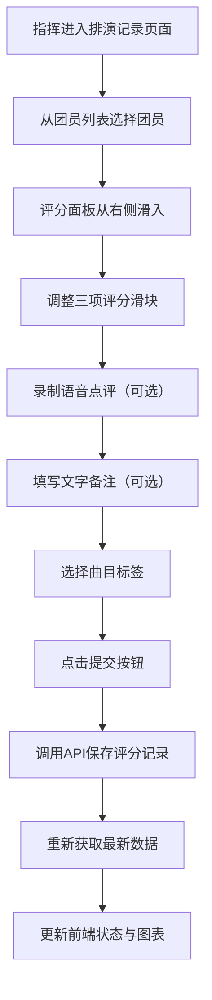

## 1. 产品概述

合唱团排演反馈管理应用，为社区合唱团指挥提供集中式的团员表现记录与评估工具。解决传统微信语音/文字反馈数据零散、无法可视化追踪进步的痛点，通过评分记录、语音点评与多维度图表分析，实现排演数据的系统化管理。

- **目标用户**：社区合唱团指挥
- **核心价值**：集中记录团员音准、节奏、表现力评分，自动生成雷达图与进步趋势图，直观追踪每位团员成长轨迹

## 2. 核心功能

### 2.1 用户角色

| 角色 | 核心权限 |
|------|----------|
| 指挥 | 管理团员档案、录入排演评分、录制语音点评、查看历史记录、筛选分析数据 |

### 2.2 功能模块

1. **团员管理**：团员列表展示、快速选择进行评分
2. **排演记录**：评分录入面板、录音功能、曲目标签管理、历史记录筛选、卡片式展示
3. **个人详情**：雷达图展示综合评分、折线图展示音准/节奏进步趋势

### 2.3 页面详情

| 页面名称 | 模块名称 | 功能描述 |
|----------|----------|----------|
| 团员管理 | 团员列表 | 展示所有团员卡片，点击选择团员进行评分 |
| 排演记录 | 评分面板 | 三个滑块评分、30秒录音、文字备注、曲目标签多选、提交评分 |
| 排演记录 | 历史筛选 | 时间范围筛选、曲目名称多选筛选 |
| 排演记录 | 记录卡片 | 卡片展示排演日期、曲目、平均分条形图、参演人数、曲目标签 |
| 个人详情 | 雷达图 | 最近一次排演三项评分雷达图对比 |
| 个人详情 | 趋势折线图 | 音准得分趋势折线图、节奏得分趋势折线图 |

## 3. 核心流程

指挥进入排演记录页面 → 选择目标团员 → 滑出评分面板 → 调整音准/节奏/表现力滑块评分 → 录制语音点评（可选）→ 填写文字备注（可选）→ 选择曲目标签 → 提交评分 → 系统保存数据并刷新历史记录与图表

## 4. 用户界面设计

### 4.1 设计风格

- **主色调**：深色主题，背景 `#1a1a2e`，卡片背景 `#16213e`，强调色 `#7c4dff`
- **文字主色**：`#e0e0e0`
- **按钮风格**：圆角设计，悬停透明度0.8 + scale 1.02 轻微放大，点击水波纹反馈
- **布局风格**：左侧导航栏（240px）+ 主内容区，响应式适配
- **动画效果**：面板滑入300ms ease-out，录音按钮脉冲动画800ms循环，水波纹300ms

### 4.2 页面设计概述

| 页面名称 | 模块名称 | UI元素 |
|----------|----------|--------|
| 全局 | 左侧导航 | 宽240px，深色背景，三个入口（团员管理/排演记录/个人详情），选中项背景#7c4dff透明度0.2 |
| 排演记录 | 评分面板 | 从右侧滑入，宽360px，包含渐变滑块、录音按钮（脉冲动画）、波形动画、文字输入、提交按钮 |
| 排演记录 | 记录卡片 | 宽100%高160px，渐变背景#f3e5f5→#e1bee7，圆角12px，条形图展示平均分 |
| 个人详情 | 图表区域 | 左侧雷达图（填充#7c4dff透明度0.3），右侧上下两个折线图（#42a5f5，线宽2px，白色数据点） |
| 全局 | 曲目标签 | 自适应宽度，高24px，背景#9575cd，白色文字，圆角12px，间距8px |

### 4.3 响应式设计

- **Desktop-first**：默认桌面端布局
- **断点**：768px
- **小屏适配**：宽度低于768px时，左侧导航收起为汉堡菜单，图表改为垂直堆叠布局
- **最小宽度**：768px

### 4.4 色彩系统

| 用途 | 颜色值 |
|------|--------|
| 页面主背景 | `#1a1a2e` |
| 卡片/面板背景 | `#16213e` |
| 文字主色 | `#e0e0e0` |
| 强调色（紫） | `#7c4dff` |
| 滑块高分 | `#4caf50` |
| 滑块低分 | `#ff8a65` |
| 音准折线 | `#42a5f5` |
| 节奏折线 | `#42a5f5` |
| 音准条形图 | `#42a5f5` |
| 节奏条形图 | `#66bb6a` |
| 表现力条形图 | `#ab47bc` |
| 曲目标签背景 | `#9575cd` |
| 录音脉冲色1 | `#ff5252` |
| 录音脉冲色2 | `#ff8a80` |
