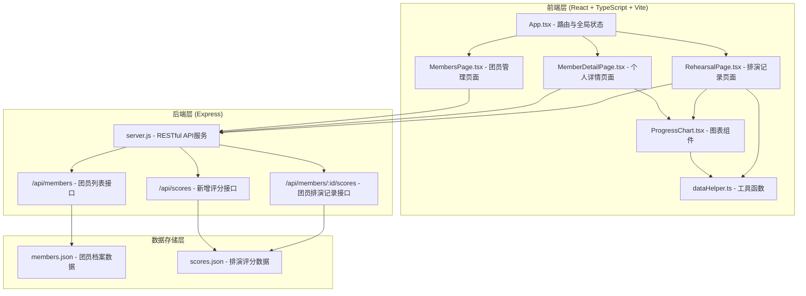
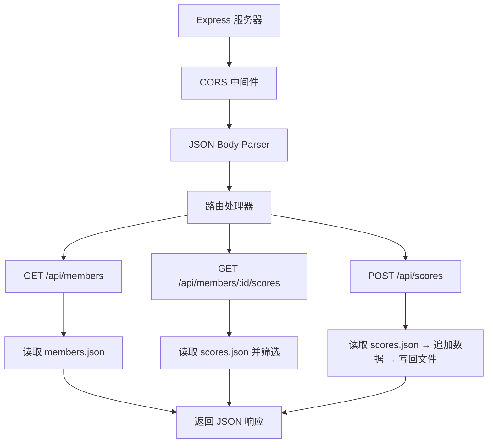
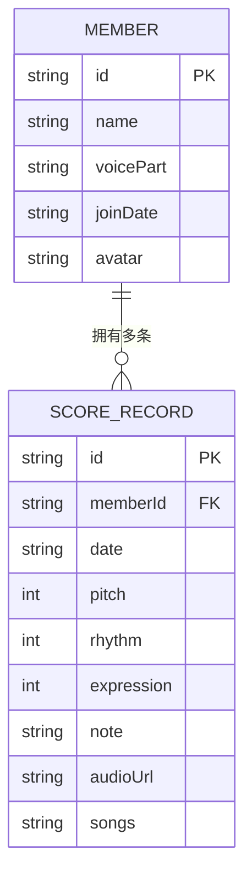

## 1. 架构设计



## 2. 技术描述

- **前端框架**：React 18 + TypeScript
- **构建工具**：Vite 5
- **路由管理**：react-router-dom 6
- **数据可视化**：recharts 2
- **样式方案**：原生 CSS（CSS Modules），不使用 Tailwind
- **后端框架**：Express 4
- **跨域处理**：cors 中间件
- **唯一ID生成**：uuid
- **数据存储**：JSON 文件（members.json、scores.json）

## 3. 路由定义

| 路由 | 页面组件 | 用途 |
|------|----------|------|
| `/` | 重定向至 `/members` | 默认首页 |
| `/members` | MembersPage | 团员管理页面，展示团员列表 |
| `/rehearsal` | RehearsalPage | 排演记录主页面，评分录入与历史记录 |
| `/member/:id` | MemberDetailPage | 个人详情页面，展示图表分析 |

## 4. API 定义

### 4.1 数据类型定义

```typescript
interface Member {
  id: string;
  name: string;
  voicePart: string;
  joinDate: string;
  avatar?: string;
}

interface ScoreRecord {
  id: string;
  memberId: string;
  date: string;
  pitch: number;
  rhythm: number;
  expression: number;
  note?: string;
  audioUrl?: string;
  songs: string[];
}
```

### 4.2 API 接口列表

| 方法 | 路径 | 请求参数 | 响应格式 | 说明 |
|------|------|----------|----------|------|
| GET | `/api/members` | 无 | `{ data: Member[] }` | 获取所有团员列表 |
| GET | `/api/members/:id/scores` | `id`: 团员ID | `{ data: ScoreRecord[] }` | 获取指定团员的所有排演记录 |
| POST | `/api/scores` | `memberId`, `pitch`, `rhythm`, `expression`, `note?`, `audioUrl?`, `songs[]` | `{ data: ScoreRecord }` | 新增一条评分记录 |

## 5. 服务器架构



## 6. 数据模型

### 6.1 实体关系



### 6.2 初始数据

**members.json 初始数据：**
```json
[
  { "id": "...", "name": "张明", "voicePart": "女高音", "joinDate": "2024-03-15" },
  { "id": "...", "name": "李华", "voicePart": "女低音", "joinDate": "2024-03-20" },
  { "id": "...", "name": "王强", "voicePart": "男高音", "joinDate": "2024-04-01" },
  { "id": "...", "name": "赵芳", "voicePart": "女高音", "joinDate": "2024-04-10" },
  { "id": "...", "name": "陈伟", "voicePart": "男低音", "joinDate": "2024-05-01" }
]
```

**预设曲目列表：** `["茉莉花", "月亮代表我的心", "彩虹", "送别"]`

## 7. 文件结构与调用关系

```
auto84/
├── package.json              # 项目配置与依赖
├── vite.config.js            # Vite 构建配置
├── tsconfig.json             # TypeScript 严格模式配置
├── index.html                # 应用入口页面
├── src/
│   ├── App.tsx              # 路由分发 + 全局状态
│   │                         # ↑ 被 index.html 引用
│   │                         # ↓ 引用 pages/* 与组件
│   ├── pages/
│   │   ├── RehearsalPage.tsx    # 排演记录页面（评分录入、历史筛选）
│   │   │                         # ↑ 被 App.tsx 路由引用
│   │   │                         # ↓ 引用 ProgressChart、dataHelper
│   │   ├── MembersPage.tsx      # 团员管理页面
│   │   └── MemberDetailPage.tsx # 个人详情页面
│   │                             # ↓ 引用 ProgressChart、dataHelper
│   ├── components/
│   │   └── ProgressChart.tsx    # 雷达图 + 折线图组件
│   │                             # ↑ 被 RehearsalPage、MemberDetailPage 引用
│   │                             # ↓ 引用 dataHelper
│   ├── utils/
│   │   └── dataHelper.ts        # 格式化、均值计算、图表数据结构
│   │                             # ↑ 被 ProgressChart、RehearsalPage 引用
│   └── types/
│       └── index.ts             # TypeScript 类型定义
└── server/
    ├── server.js             # Express 后端（REST API）
    │                         # ↑ 独立启动，被前端 fetch 调用
    └── data/
        ├── members.json      # 团员档案存储
        └── scores.json       # 排演评分记录存储
```

### 数据流方向

1. **评分提交流程**：
   `RehearsalPage.tsx 表单输入` → `POST /api/scores` → `server.js 写入 scores.json` → `重新 GET 数据` → `App.tsx 更新全局状态` → `子组件重新渲染`

2. **图表渲染流程**：
   `MemberDetailPage.tsx 获取团员ID` → `GET /api/members/:id/scores` → `返回 ScoreRecord[]` → `dataHelper.ts 转换为图表数据结构` → `ProgressChart.tsx 使用 recharts 渲染`

3. **历史记录筛选流程**：
   `RehearsalPage.tsx 筛选条件变更` → `dataHelper.ts 过滤数据` → `重新渲染卡片列表`
