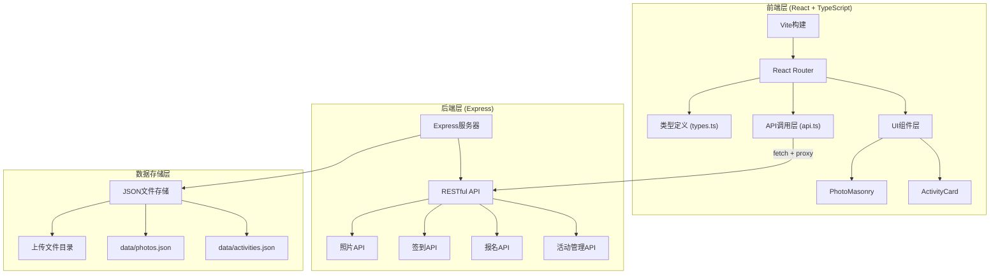
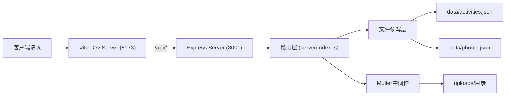
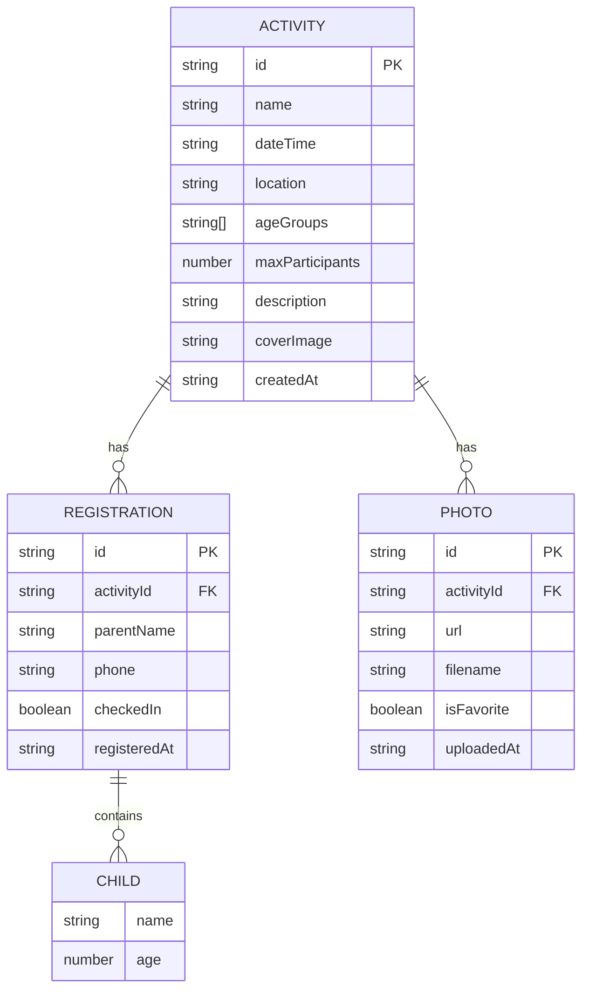

## 1. 架构设计



## 2. 技术栈说明

- **前端框架**: React@18 + TypeScript@5
- **构建工具**: Vite@5
- **路由管理**: react-router-dom@6
- **后端框架**: Express@4
- **跨域处理**: cors@2
- **文件上传**: multer@1
- **唯一ID**: uuid@9
- **样式方案**: 原生CSS + CSS变量
- **开发模式**: Vite代理 `/api` → Express服务器(3001端口)

## 3. 路由定义

| 前端路由 | 页面组件 | 功能说明 |
|----------|----------|----------|
| `/` | 首页 | 活动列表、搜索筛选 |
| `/activity/:id` | 活动详情页 | 活动信息、报名表单、照片展示 |
| `/admin` | 后台管理页 | 创建活动、报名名单管理、照片上传 |
| `/checkin/:id` | 签到管理页 | 签到卡片网格、状态切换 |

## 4. API 定义

### 4.1 TypeScript 类型定义

```typescript
// 活动接口
interface Activity {
  id: string;
  name: string;
  dateTime: string;
  location: string;
  ageGroups: string[];
  maxParticipants: number;
  description: string;
  coverImage: string;
  createdAt: string;
  registrations: Registration[];
}

// 报名接口
interface Registration {
  id: string;
  parentName: string;
  phone: string;
  children: Child[];
  checkedIn: boolean;
  registeredAt: string;
}

// 儿童接口
interface Child {
  name: string;
  age: number;
}

// 照片接口
interface Photo {
  id: string;
  activityId: string;
  url: string;
  filename: string;
  isFavorite: boolean;
  uploadedAt: string;
}
```

### 4.2 API 端点

| 方法 | 路径 | 说明 | 请求体 | 响应 |
|------|------|------|--------|------|
| POST | `/api/activities` | 创建活动 | FormData (name, dateTime, location, ageGroups, maxParticipants, description, coverImage) | Activity |
| GET | `/api/activities` | 获取活动列表 | - | Activity[] |
| GET | `/api/activities/:id` | 获取活动详情 | - | Activity |
| POST | `/api/activities/:id/register` | 提交报名 | { parentName, phone, children } | Registration |
| GET | `/api/activities/:id/registrations` | 获取报名名单 | - | Registration[] |
| PUT | `/api/activities/:id/checkin` | 更新签到状态 | { registrationId, checkedIn } | { success: boolean } |
| POST | `/api/activities/:id/photos` | 上传照片 | FormData (photos[]) | Photo[] |
| GET | `/api/activities/:id/photos` | 获取活动照片 | - | Photo[] |
| PUT | `/api/activities/:id/photos/:photoId/favorite | 切换精彩瞬间 | { isFavorite: boolean } | Photo |
| GET | `/api/activities/search` | 搜索活动 | query: keyword, startDate, endDate, ageGroup | Activity[] |

## 5. 服务器架构图



## 6. 数据模型

### 6.1 数据模型定义



### 6.2 JSON 文件结构

**activities.json 格式：

```json
{
  "activities": [
    {
      "id": "uuid",
      "name": "活动名称",
      "dateTime": "2024-01-15T10:00:00",
      "location": "社区活动中心",
      "ageGroups": ["2-4岁", "4-6岁"],
      "maxParticipants": 20,
      "description": "活动描述...",
      "coverImage": "/uploads/cover.jpg",
      "createdAt": "2024-01-01T00:00:00",
      "registrations": []
    }
  ]
}
```

**photos.json 格式：

```json
{
  "photos": [
    {
      "id": "uuid",
      "activityId": "activity-uuid",
      "url": "/uploads/photo1.jpg",
      "filename": "photo1.jpg",
      "isFavorite": false,
      "uploadedAt": "2024-01-15T12:00:00"
    }
  ]
}
```

## 7. 性能优化策略

1. **图片优化**: 懒加载 + object-fit: cover + 合理尺寸
2. **代码分割**: 按路由分割代码
3. **API 缓存**: 活动列表缓存、照片元数据缓存
4. **瀑布流优化**: 虚拟滚动/Intersection Observer
5. **上传优化**: 分块上传、进度条实时更新
6. **构建优化**: Vite HMR、TypeScript 严格模式

## 8. 文件结构

```
project/
├── package.json
├── vite.config.js
├── tsconfig.json
├── index.html
├── server/
│   └── index.ts
├── src/
│   ├── main.tsx
│   ├── App.tsx
│   ├── api.ts
│   ├── types.ts
│   └── components/
│       ├── ActivityCard.tsx
│       └── PhotoMasonry.tsx
├── data/
│   ├── activities.json
│   └── photos.json
└── uploads/
```
