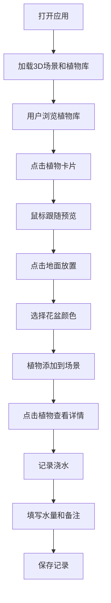

## 1. 产品概述

虚拟迷你花园3D可视化应用，帮助植物爱好者直观规划植物组合、预判空间效果和光照需求，并数字化记录植物生长状态，解决纸质记录难以回溯的问题。

- 目标用户：植物爱好者、园艺初学者、室内装饰设计师
- 核心价值：可视化植物组合规划 + 数字化生长记录管理

## 2. 核心特性

### 2.1 功能模块

1. **3D花园场景**：圆形地面、网格纹理、雾效边界、光照系统、阴影渲染
2. **植物库管理**：6种预置植物（多肉、蕨类、龟背竹、仙人掌、玫瑰、薰衣草），含3D低多边形模型、光照偏好、默认尺寸
3. **植物放置交互**：点击选择植物 → 鼠标预览 → 点击地面放置 → 选择花盆颜色
4. **场景交互控制**：鼠标拖拽旋转视角、滚轮缩放、中键拖拽平移
5. **植物详情面板**：点击植物显示名称、高度、添加日期、光照状态、浇水记录
6. **浇水记录功能**：模态框录入浇水量和备注，生成记录卡片
7. **性能监控**：帧率指示灯，低于30fps红色闪烁

### 2.2 页面详情

| 页面名称 | 模块名称 | 功能描述 |
|---------|---------|---------|
| 主页面 | 3D场景区域 | 圆形地面网格、植物实例渲染、光照阴影、雾效边界 |
| 主页面 | 左侧植物库面板 | 240px宽，6种植物卡片网格布局，含缩略图、名称、光照标签 |
| 主页面 | 右侧详情面板 | 320px宽，毛玻璃效果，显示植物信息和浇水记录 |
| 主页面 | 浇水记录模态框 | 400x280px，滑块输入浇水量，文本框输入备注 |
| 主页面 | 取色器面板 | 40色圆形取色器，用于选择花盆颜色 |
| 主页面 | 性能指示灯 | 右上角，绿色/红色显示帧率状态 |

## 3. 核心流程

### 3.1 植物放置流程
用户从左侧植物库选择植物卡片 → 植物跟随鼠标显示半透明预览 → 用户在3D场景地面点击放置位置 → 弹出取色器选择花盆颜色 → 确认后植物实例化添加到场景 → 自动记录添加日期和初始状态

### 3.2 浇水记录流程
用户点击场景中植物 → 右侧显示详情面板 → 点击记录浇水按钮 → 弹出模态框 → 滑块选择浇水量、输入备注 → 提交 → 记录卡片添加到浇水记录列表

### 3.3 流程图

## 4. 用户界面设计

### 4.1 设计风格
- **主题色调**：暗色主题，背景#1a1a2e，面板#16213e
- **主色调**：植物绿#4caf50、天空蓝#87ceeb、强调蓝#42a5f5
- **警示色**：红色#f44336、橙色#ff9800
- **字体**：现代无衬线字体，标题16px粗体，正文14px常规
- **圆角规范**：按钮8px，面板16px，模态框20px，植物卡片8px
- **阴影效果**：面板使用毛玻璃backdrop-filter，投影使用多层box-shadow

### 4.2 交互设计
- **悬停效果**：可交互元素缩放1.05倍，pointer光标，200ms ease-out动画
- **取色器**：40色块圆形排列，直径24px，圆角50%，悬停放大130%显示色值
- **放置标记**：点击地面显示半透明蓝色光圈，半径30px
- **选中效果**：植物周围脉动光环，半径+20px，透明度0.3-0.6循环，周期2秒
- **模态框动画**：从中心缩放入场，300ms ease-out

### 4.3 页面设计概览

| 页面区域 | UI元素 | 样式规范 |
|---------|--------|---------|
| 左侧植物库 | 植物卡片（100x120px） | 背景#16213e，悬停#0f3460，圆角8px |
| 左侧植物库 | 缩略图（90x90px） | 圆角50% |
| 左侧植物库 | 光照标签 | 喜阳#ffb74d / 喜阴#81d4fa / 中性#ce93d8，圆角4px，12px |
| 右侧详情面板 | 面板容器 | 320px宽，圆角16px，#ffffff opacity:0.9，毛玻璃 |
| 右侧详情面板 | 删除按钮 | #ef5350背景，圆角，悬停#c62828 |
| 浇水记录卡片 | 记录项（280x60px） | 圆角8px，左侧4px实线#42a5f5竖条 |
| 模态框 | 容器（400x280px） | 圆角20px，白色背景，缩放入场动画 |
| 取色器 | 40色圆形 | 直径24px，悬停放大130% |

### 4.4 3D场景设计

- **环境**：圆形地面直径16单位，浅灰到中灰渐变网格，网格线#bdbdbd，每格0.5单位
- **雾效**：FogExp2，密度0.03
- **光照**：半球光（天空#87ceeb，地面#f5f5dc，强度0.6）+ 定向光（位置(10,20,10)，强度0.8，投射阴影）
- **阴影**：植物和花盆投射阴影，阴影贴图2048x2048，PCF软阴影
- **相机**：PerspectiveCamera，可旋转（0.005弧度/帧）、缩放（0.5-5.0）、平移（0.01单位/帧）
- **植物模型**：低多边形风格，顶点数<500

### 4.5 响应式设计
- 桌面端优先，最小支持1024px宽度
- 左侧面板和右侧面板根据屏幕宽度自适应调整
- 1024px以下保持最小面板宽度，场景区域相应缩小

## 5. 性能要求

- 12个植物实例时帧率≥45FPS
- 点击/拖拽响应时间≤50ms
- 植物模型加载时间≤2秒
