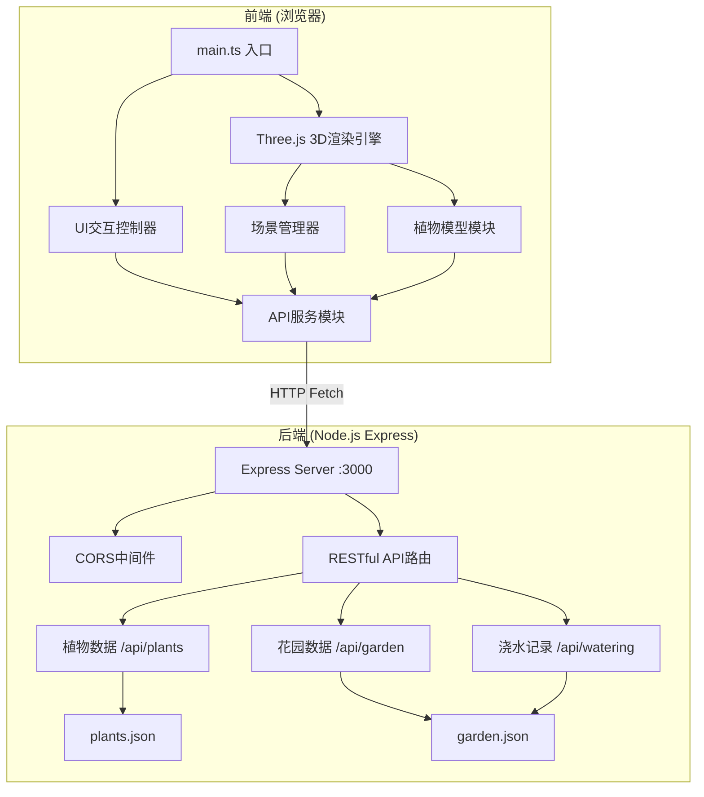
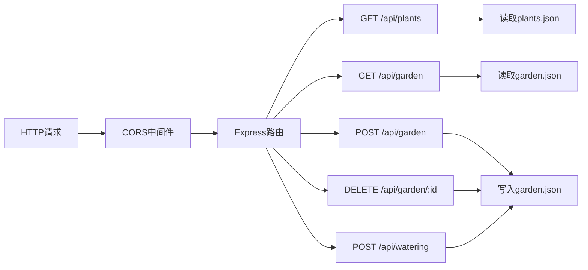

## 1. 架构设计



## 2. 技术选型

| 层级 | 技术栈 | 说明 |
|------|--------|------|
| 前端3D渲染 | Three.js + TypeScript | 3D场景渲染、模型加载、用户交互 |
| 前端构建 | Vite | 快速开发构建，base: './' |
| 前端UI | 原生TypeScript + CSS | 轻量级DOM操作，无需UI框架 |
| 后端 | Express 4.x | RESTful API服务，端口3000 |
| 数据存储 | JSON文件 | server/data/plants.json, garden.json |
| 类型安全 | TypeScript 5.x | strict模式，target: ES2020 |
| 工具库 | uuid | 生成唯一ID |
| 跨域 | cors | 前后端通信 |

## 3. 项目结构

```
auto88/
├── package.json
├── vite.config.js
├── tsconfig.json
├── index.html
├── src/
│   ├── main.ts              # 应用入口
│   ├── sceneManager.ts      # 场景管理
│   ├── plantModel.ts        # 植物模型
│   ├── uiController.ts      # UI控制
│   └── apiService.ts        # API服务
└── server/
    ├── index.js             # Express服务
    └── data/
        ├── plants.json      # 植物基础数据
        └── garden.json      # 花园实例数据
```

## 4. API定义

### 4.1 类型定义

```typescript
// 植物基础数据
interface PlantData {
  id: string;
  name: string;
  lightPreference: 'sunny' | 'shady' | 'neutral';
  defaultHeight: number;
  color: string;
  modelVertices: number[][];
}

// 花园植物实例
interface GardenPlant {
  id: string;
  plantId: string;
  position: { x: number; y: number; z: number };
  potColor: string;
  addedDate: string;
  currentHeight: number;
  wateringRecords: WateringRecord[];
}

// 浇水记录
interface WateringRecord {
  id: string;
  date: string;
  amount: number;
  note: string;
}
```

### 4.2 API接口

| 方法 | 路径 | 说明 | 请求体 | 响应 |
|------|------|------|--------|------|
| GET | `/api/plants` | 获取植物列表 | - | `PlantData[]` |
| GET | `/api/garden` | 获取花园植物 | - | `GardenPlant[]` |
| POST | `/api/garden` | 添加植物 | `{plantId, position, potColor}` | `GardenPlant` |
| DELETE | `/api/garden/:id` | 删除植物 | - | `{success: true}` |
| POST | `/api/watering` | 记录浇水 | `{plantId, amount, note}` | `WateringRecord` |

## 5. 核心模块设计

### 5.1 SceneManager (场景管理器)
- 职责：创建Three.js场景、相机、渲染器、光源、地面、雾效
- 管理植物实例列表，提供addPlant/removePlant方法
- 处理相机控制：旋转、缩放、平移
- 处理射线检测：点击植物、点击地面
- 提供选中植物的脉动光环效果

### 5.2 PlantModel (植物模型模块)
- 职责：从API获取植物列表数据
- 为每种植物生成低多边形3D模型（顶点数<500）
- 模型缓存机制，避免重复创建
- 生成花盆模型（支持自定义颜色）

### 5.3 UIController (UI控制器)
- 职责：管理左侧植物库面板DOM
- 管理右侧详情面板DOM
- 管理浇水记录模态框和取色器
- 处理植物卡片点击、拖放、预览逻辑
- 接收SceneManager回调更新UI

### 5.4 ApiService (API服务)
- 职责：封装所有fetch请求
- 统一错误处理和toast提示
- 超时和异常处理

## 6. 后端架构



## 7. 数据模型

### 7.1 plants.json 结构
```json
[
  {
    "id": "succulent",
    "name": "多肉",
    "lightPreference": "sunny",
    "defaultHeight": 15,
    "color": "#8bc34a",
    "modelVertices": [...]
  }
]
```

### 7.2 garden.json 结构
```json
{
  "plants": [
    {
      "id": "uuid-xxx",
      "plantId": "succulent",
      "position": {"x": 0, "y": 0, "z": 0},
      "potColor": "#d84315",
      "addedDate": "2024-01-15",
      "currentHeight": 15.5,
      "wateringRecords": []
    }
  ]
}
```

## 8. 性能优化策略

1. **模型优化**：低多边形模型（顶点数<500），使用BufferGeometry
2. **材质复用**：相同植物共享材质实例
3. **阴影优化**：限制阴影投射/接收对象，阴影贴图2048x2048
4. **渲染优化**：按需渲染，交互时才更新
5. **资源缓存**：植物模型缓存，避免重复创建
6. **事件防抖**：鼠标移动事件节流，减少计算
7. **内存管理**：删除植物时清理Geometry和Material

## 9. 开发与运行

- 安装依赖：`npm install`
- 启动开发：`npm run dev`
- 构建生产：`npm run build`
- 后端服务：Vite开发代理到Express :3000
