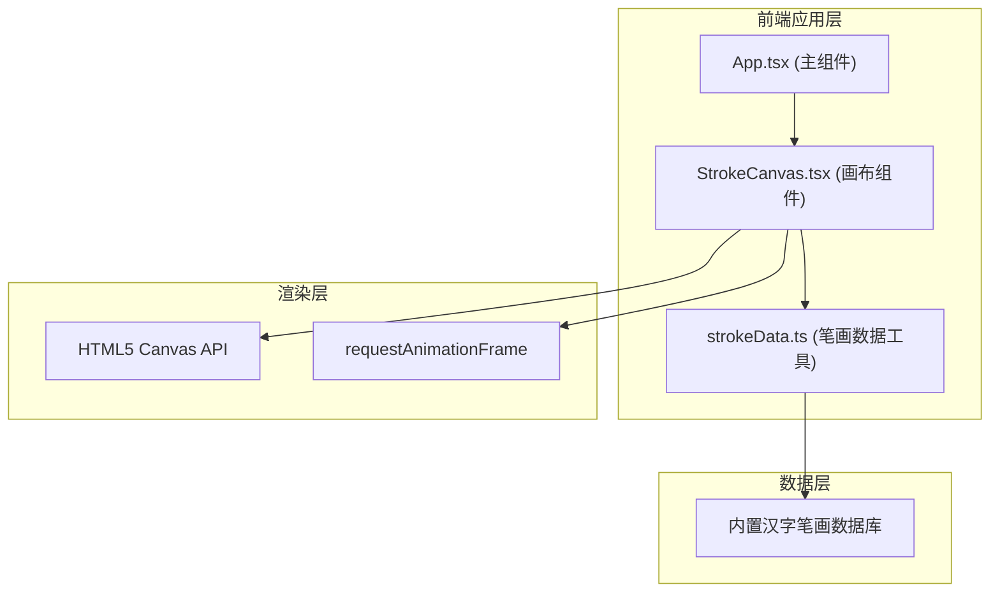

## 1. 架构设计



## 2. 技术选型
- **前端框架**：React 18 + TypeScript（严格模式）
- **构建工具**：Vite 5
- **渲染技术**：HTML5 Canvas 2D API + requestAnimationFrame
- **样式方案**：CSS Modules（内联样式+CSS变量）
- **JSX模式**：react-jsx（无需手动import React）

## 3. 项目结构
```
d:\demo-Solo\tasks\auto1\
├── index.html                 # 入口HTML
├── package.json               # 依赖配置
├── vite.config.js             # Vite构建配置
├── tsconfig.json              # TypeScript配置
└── src/
    ├── App.tsx                # 主组件：状态管理、输入处理
    ├── components/
    │   └── StrokeCanvas.tsx   # 画布组件：动画渲染、交互控制
    └── utils/
        └── strokeData.ts      # 笔画数据：汉字拆解、笔画数据库
```

## 4. 数据模型

### 4.1 笔画数据接口
```typescript
interface StrokePoint {
  x: number;           // 坐标X (0-640范围)
  y: number;           // 坐标Y (0-480范围)
}

interface Stroke {
  id: number;          // 笔顺编号 (1,2,3...)
  startPoint: StrokePoint;  // 起笔位置
  endPoint: StrokePoint;    // 落笔位置
  controlPoints?: StrokePoint[]; // 贝塞尔曲线控制点（用于曲线笔画）
  direction: string;   // 方向描述（横、竖、撇、捺等）
  type: 'line' | 'curve'; // 笔画类型
}

interface CharacterStrokes {
  character: string;   // 汉字
  strokes: Stroke[];   // 所有笔画
  totalStrokes: number;// 总笔画数
}
```

### 4.2 汉字数据库
内置10个常用汉字的笔画数据：大、小、上、下、中、人、水、火、山、石

### 4.3 播放状态接口
```typescript
interface PlayState {
  isPlaying: boolean;      // 是否播放中
  isPaused: boolean;       // 是否暂停
  currentStrokeIndex: number; // 当前笔画索引
  progress: number;        // 当前笔画绘制进度 (0-1)
  speed: 'slow' | 'normal' | 'fast'; // 播放速度
}
```

## 5. 核心算法与性能

### 5.1 笔画插值算法
- 线性笔画：起点→终点线性插值 `point = start + (end - start) * progress`
- 曲线笔画：二次贝塞尔曲线 `B(t) = (1-t)²P₀ + 2(1-t)tP₁ + t²P₂`
- 使用Canvas `lineCap: 'round'` 实现末端圆形效果

### 5.2 动画循环
- 使用 `requestAnimationFrame` 驱动动画，保证帧率≥50fps
- 基于时间差(deltaTime)计算进度，避免帧率波动影响
- 进度计算公式：`progress += deltaTime / strokeDuration`

### 5.3 速度映射
| 档位 | 每笔时长 |
|------|---------|
| 慢(slow) | 0.8秒 |
| 中(normal) | 0.5秒 |
| 快(fast) | 0.3秒 |

### 5.4 悬停检测
- 暂停状态下，根据鼠标坐标与笔画线段距离进行碰撞检测
- 使用点到线段最短距离公式，阈值设为6px

## 6. API接口（模块内部）

### 6.1 strokeData.ts 导出
```typescript
// 主函数：拆解汉字为笔画数据
export function getCharacterStrokes(characters: string): CharacterStrokes[]

// 获取单个汉字笔画
export function getSingleCharacterStroke(char: string): CharacterStrokes | null

// 检查汉字是否支持
export function isCharacterSupported(char: string): boolean
```

### 6.2 StrokeCanvas.tsx Props
```typescript
interface StrokeCanvasProps {
  characters: string;              // 输入的汉字
  speed: 'slow' | 'normal' | 'fast';
  isPlaying: boolean;
  onPlayStateChange?: (state: PlayState) => void;
  onComplete?: () => void;
}
```
