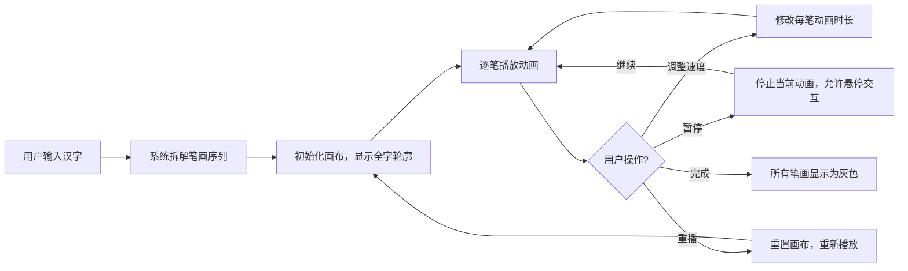

## 1. 产品概述
交互式手写汉字笔顺演示工具，帮助学中文的小朋友或外国人正确掌握汉字的书写顺序。通过动画清晰展示每个笔画的起笔、落笔和先后顺序，提供交互式学习体验。
- 核心目的：以可视化动画形式教授汉字书写笔顺
- 目标用户：学习中文的儿童、外国人、汉语初学者

## 2. 核心功能

### 2.1 用户角色
无需登录，所有用户拥有相同权限。

### 2.2 功能模块
1. **主页（单页应用）**：汉字输入、笔顺动画演示、播放控制、全字预览缩略图、交互反馈

### 2.3 页面详情
| 页面名称 | 模块名称 | 功能描述 |
|---------|---------|---------|
| 主页 | 顶部操作栏 | 汉字输入框（最多4字）、速度控制滑块（慢/中/快）、暂停/继续按钮、重播按钮 |
| 主页 | 主画布区域 | 640x480透明画布，逐笔演示书写，深蓝色笔顺编号标记，黑色细线描边，已完成笔画变灰 |
| 主页 | 全字预览缩略图 | 80x80px浅灰背景缩略图，浅色标注已完成笔画比例，旁边显示当前笔数/总笔数 |
| 主页 | 笔画交互反馈 | 暂停时鼠标悬停笔画，显示笔顺编号和方向提示，0.2s缩放和颜色变化动效 |

## 3. 核心流程

用户在输入框输入1-4个简体汉字 → 系统拆解笔画序列并初始化画布 → 自动逐笔演示书写动画（每笔约0.5秒） → 每笔完成后该笔画变为灰色 → 用户可随时调整速度、暂停/继续、重播 → 暂停时可悬停笔画查看详情

## 4. 用户界面设计

### 4.1 设计风格
- **主色调**：淡米色背景 #faf3e0，中性暖色调
- **操作栏**：白色背景，高度64px（移动端56px），底部2px边框 #e0d8c8
- **输入框**：圆角8px，边框1px solid #d4c5a9，聚焦时边框变 #8d6e63
- **按钮**：圆角6px，填充色 #8d6e63，悬浮变 #6d4c41，文字白色
- **画布**：640x480px，白色背景，8px淡灰 #e0d8c8 内阴影
- **笔画**：黑色细线3px，末端圆形cap，完成后变灰色 #9e9e9e
- **笔顺标记**：深蓝色 #1565c0 小圆点
- **缩略图**：80x80px，浅灰背景 #f5f5f5
- **文字提示**：14px，颜色 #424242

### 4.2 页面设计概述
| 页面名称 | 模块名称 | UI元素 |
|---------|---------|-------|
| 主页 | 顶部操作栏 | 水平布局：输入框（左）、速度滑块（中）、控制按钮组（右），居中对齐 |
| 主页 | 主画布区域 | 居中放置，四周留白，画布内阴影营造深度感 |
| 主页 | 信息面板 | 画布左下角，缩略图+文字提示水平排列 |
| 主页 | 悬停提示 | Tooltip风格，跟随鼠标，显示笔顺编号和笔画方向 |

### 4.3 响应式设计
- 桌面端优先：画布640x480px，操作栏64px高
- 移动端适配：操作栏高度56px，画布宽度缩放到96%，高度等比缩放
- 触摸优化：按钮最小触控区域44x44px，滑块触摸区域扩大

### 4.4 动画与性能
- 笔画动画：每笔0.5秒（可配置0.3/0.5/0.8秒），帧率≥50fps
- 输入响应：汉字拆解和渲染≤200ms
- 悬停反馈：0.2s轻微缩放+颜色变化过渡
- 笔画间衔接：自然流畅，无卡顿感
