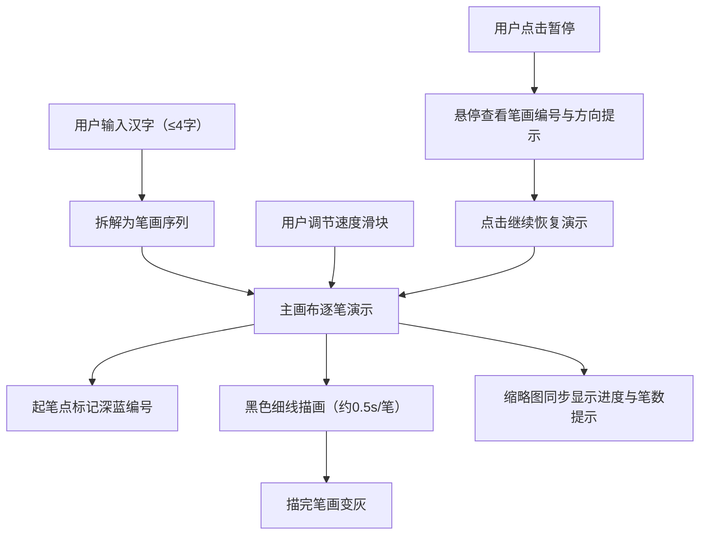

# 汉字笔顺演示工具 PRD

## 1. 产品概述

本项目是一个交互式手写汉字笔顺演示工具，旨在帮助学中文的小朋友或外国学习者正确掌握汉字的书写顺序。系统通过动画形式清晰展示每个笔画的起笔、落笔及先后顺序，支持逐笔演示、速度控制、暂停查看等交互功能。

- 主要目的：以动画方式拆解汉字笔画并演示书写过程，降低汉字书写学习门槛
- 目标用户：中文初学者（儿童、外国学习者）、汉字书写教学场景
- 产品价值：可视化、可交互的笔顺学习体验，提升学习效率与趣味性

## 2. 核心功能

### 2.1 用户角色

本产品为单页工具类应用，无角色区分，所有用户共享同一交互界面。

### 2.2 功能模块

1. **主操作页**：顶部操作栏（汉字输入 + 播放控制）、主画布演示区、缩略图预览区

### 2.3 页面详情

| 页面名称 | 模块名称 | 功能描述 |
|-----------|-------------|---------------------|
| 主操作页 | 顶部操作栏 | 汉字输入框（最多4字）、播放/暂停按钮、速度滑块（慢/中/快） |
| 主操作页 | 主画布区 | 640×480 白色画布，逐笔演示笔画，起笔点深蓝编号，已完成笔画变灰 |
| 主操作页 | 缩略图预览区 | 80×80 全字预览，显示当前笔/总笔数文字提示 |
| 主操作页 | 悬停提示 | 暂停时鼠标悬停笔画显示笔顺编号与方向提示（横、竖撇等），带缩放与颜色变化反馈 |

## 3. 核心流程

用户在输入框输入一个简体汉字（最多4字）→ 系统将字拆解为笔画序列 → 画布逐笔演示书写过程（起笔点深蓝编号、黑色细线从起笔描到落笔、描完变灰）→ 缩略图同步显示进度 → 用户可调节速度或暂停查看笔画提示。

## 4. 用户界面设计

### 4.1 设计风格

- **主色调**：淡米色背景 `#faf3e0`，中性暖色调
- **次色调**：白色操作栏、深蓝编号点 `#1565c0`、灰色已完成笔画 `#9e9e9e`
- **强调色**：操作按钮棕色 `#8d6e63`，悬浮 `#6d4c41`，文字提示灰 `#424242`
- **按钮样式**：圆角（输入框8px、按钮6px），扁平填充
- **字体**：系统无衬线字体，操作栏文字14px
- **布局风格**：顶部操作栏 + 居中画布 + 左下角缩略图
- **图标风格**：简约线性图标（播放、暂停、速度档位）

### 4.2 页面设计概览

| 页面名称 | 模块名称 | UI 元素 |
|-----------|-----------|---------|
| 主操作页 | 顶部操作栏 | 白色背景，高64px，底部2px边框 `#e0d8c8`；输入框圆角8px边框 `#d4c5a9`，聚焦变 `#8d6e63`；按钮圆角6px填充 `#8d6e63` 悬浮 `#6d4c41` 白字 |
| 主操作页 | 主画布区 | 640×480 白色画布，四周8px内阴影 `#e0d8c8`，居中放置 |
| 主操作页 | 缩略图预览 | 80×80 浅灰背景 `#f5f5f5`，旁边14px `#424242` 笔数提示文字 |

### 4.3 响应式

- 桌面优先设计，移动端自适应适配
- 移动端：操作栏高度变为56px，画布宽度自动缩放到96%
- 触摸优化：按钮与滑块尺寸适配触摸操作

## 5. 性能要求

- 笔画动画帧率不低于 50fps
- 输入汉字后拆解和渲染响应时间不超过 200ms
- 支持10个常用汉字笔画数据库（大、小、上、下、中、人、水、火、山、石）
