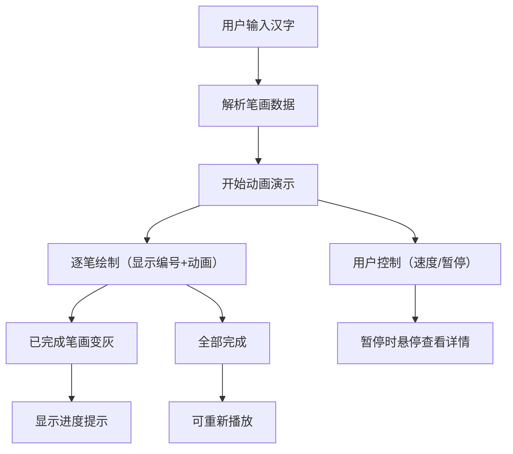

## 1. 产品概述

交互式手写汉字笔顺演示工具，帮助学中文的小朋友或外国人正确掌握汉字的书写顺序。通过动画清晰展示每个笔画的起笔、落笔和先后顺序，提供直观的学习体验。

- 目标用户：学习中文的儿童和外国人
- 核心价值：通过可视化动画降低汉字书写学习门槛
- 市场定位：轻量级在线汉字学习辅助工具

## 2. 核心功能

### 2.1 功能模块
1. **主页面**：汉字输入、笔顺动画演示、播放控制、全字预览

### 2.2 页面详情

| 页面名称 | 模块名称 | 功能描述 |
|-----------|-------------|---------------------|
| 主页面 | 汉字输入模块 | 支持输入1-4个简体汉字，实时响应输入变化 |
| 主页面 | 笔顺动画模块 | 在画布上逐笔演示书写过程，显示笔顺编号，已完成笔画变灰 |
| 主页面 | 播放控制模块 | 速度滑块（慢/中/快三档）、暂停/继续按钮、重新播放 |
| 主页面 | 全字预览模块 | 左下角小型缩略图，显示已完成笔画比例和当前笔画进度 |
| 主页面 | 交互反馈模块 | 暂停时鼠标悬停显示笔画编号和方向提示，带缩放动画效果 |

## 3. 核心流程

用户在输入框中输入汉字 → 系统解析汉字笔画数据 → 自动开始逐笔动画演示 → 用户可随时调整速度或暂停 → 暂停时可悬停查看笔画详情 → 演示完成后可重新播放

## 4. 用户界面设计

### 4.1 设计风格
- 主色调：淡米色 #faf3e0 作为主体背景
- 辅助色：深蓝色 #1565c0（笔顺编号）、灰色 #9e9e9e（已完成笔画）
- 强调色：棕色系 #8d6e63（按钮）、#6d4c41（按钮悬停）
- 字体：清晰易读的无衬线字体，适合中文显示
- 按钮风格：圆角矩形，填充色 #8d6e63，悬停时颜色加深
- 整体风格：温暖、中性、教育感，适合学习场景

### 4.2 页面设计概述

| 页面名称 | 模块名称 | UI 元素 |
|-----------|-------------|-------------|
| 主页面 | 顶部操作栏 | 白色背景，高度 64px，底部 2px 边框 #e0d8c8，包含输入框和控制按钮 |
| 主页面 | 汉字输入框 | 圆角 8px，边框 1px solid #d4c5a9，聚焦时边框变 #8d6e63 |
| 主页面 | 控制按钮 | 圆角 6px，填充色 #8d6e63，悬停 #6d4c41，白色文字 |
| 主页面 | 主画布区域 | 宽 640px 高 480px，白色背景，四周 8px 淡灰 #e0d8c8 内阴影，居中 |
| 主页面 | 全字预览 | 80x80px，浅灰背景 #f5f5f5，浅色标注已完成比例 |
| 主页面 | 进度文字 | 14px 字体，颜色 #424242，显示当前笔画/总笔画 |
| 主页面 | 速度滑块 | 三档（慢 0.8s/中 0.5s/快 0.3s），直观的速度控制 |

### 4.3 动画效果
- 笔画绘制：流畅的线条动画，末端圆形 cap，线宽 3px
- 笔顺编号：深蓝 #1565c0 小圆点标记在起笔位置
- 悬停交互：0.2s 轻微缩放和颜色变化
- 整体帧率：不低于 50fps，输入响应时间不超过 200ms

### 4.4 响应式设计
- 桌面端：操作栏高度 64px，画布 640x480px
- 移动端：操作栏高度 56px，画布宽度自动缩放到 96%
- 触摸优化：确保按钮和交互元素足够大，适合触控操作
