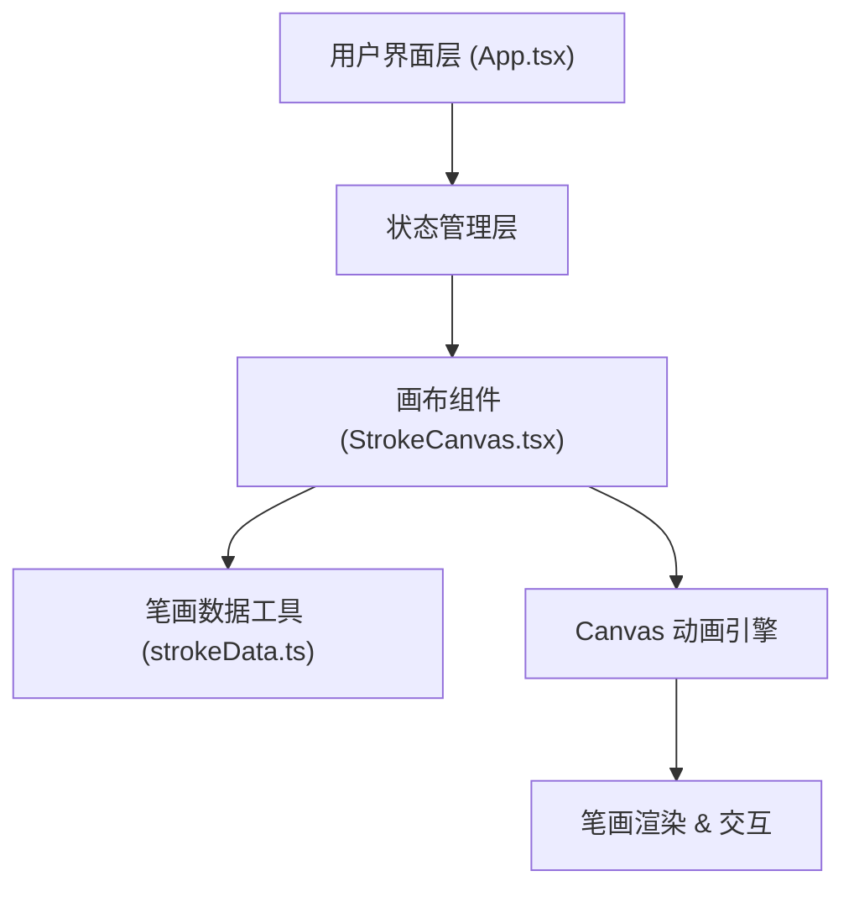

## 1. 架构设计



## 2. 技术描述

- 前端框架：React@18 + TypeScript
- 构建工具：Vite@5
- 渲染技术：HTML5 Canvas API（笔画动画渲染）
- 状态管理：React Hooks (useState, useRef, useEffect)
- 动画方案：requestAnimationFrame + Canvas 路径动画
- 初始化方式：Vite 项目脚手架

## 3. 项目结构

```
d:\demo-Solo\tasks\auto1\
├── package.json
├── index.html
├── vite.config.js
├── tsconfig.json
└── src\
    ├── App.tsx
    ├── components\
    │   └── StrokeCanvas.tsx
    └── utils\
        └── strokeData.ts
```

## 4. 核心模块说明

### 4.1 src/utils/strokeData.ts
- 功能：提供汉字笔画数据查询接口
- 包含：内置 10 个常用汉字的笔画数据库（大、小、上、下、中、人、水、火、山、石）
- 输出：每个笔画的起点坐标、终点坐标、方向描述、笔顺编号
- 接口：`getStrokeData(char: string): Stroke[]`

### 4.2 src/components/StrokeCanvas.tsx
- 功能：核心画布组件，负责笔画动画渲染和交互
- 主要职责：
  - 解析笔画数据
  - 控制动画播放状态（播放/暂停/速度）
  - Canvas 绘制逻辑（逐笔动画、编号标记、已完成笔画）
  - 鼠标悬停交互（暂停时）
  - 全字预览缩略图渲染
- 性能要求：帧率 ≥ 50fps，输入响应 ≤ 200ms

### 4.3 src/App.tsx
- 功能：主应用组件
- 主要职责：
  - 管理汉字输入状态
  - 管理播放状态（播放/暂停/速度）
  - 布局组织（顶部操作栏 + 主画布区）
  - 响应式适配

## 5. 数据模型

### 5.1 Stroke 类型定义

```typescript
interface Point {
  x: number;
  y: number;
}

interface Stroke {
  id: number;           // 笔顺编号
  startPoint: Point;    // 起点坐标
  endPoint: Point;      // 终点坐标
  controlPoints?: Point[]; // 贝塞尔曲线控制点（可选，用于复杂笔画）
  direction: string;    // 方向描述（如"横"、"竖撇"）
  path: string;         // SVG path 数据，用于绘制
}
```

### 5.2 播放状态类型

```typescript
interface PlayState {
  isPlaying: boolean;
  currentStroke: number;  // 当前正在绘制的笔画索引
  currentProgress: number; // 当前笔画绘制进度 (0-1)
  speed: 'slow' | 'medium' | 'fast';
}
```

## 6. 性能优化

- 笔画数据预解析，避免重复计算
- Canvas 分层渲染（主画布 + 预览缩略图）
- requestAnimationFrame 动画调度
- 合理的脏区域重绘，避免全画布重绘
- 笔画路径缓存，减少重复路径计算
