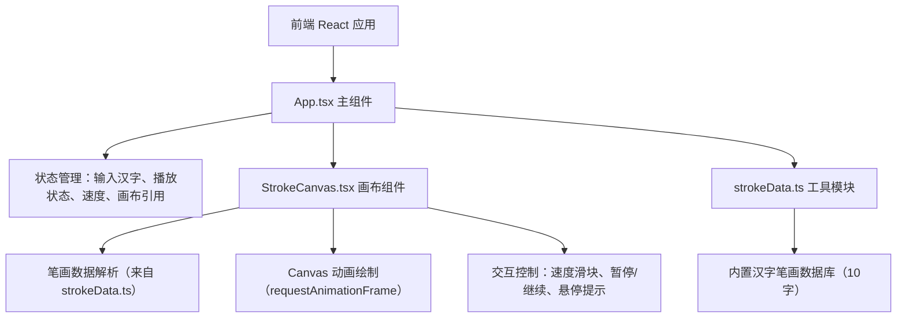

# 汉字笔顺演示工具 技术架构文档

## 1. 架构设计

本项目为纯前端单页应用，无后端服务。所有笔画数据内置于前端工具模块，画布渲染基于 HTML5 Canvas + requestAnimationFrame 动画循环。



## 2. 技术说明

- **前端**：React@18 + TypeScript + Vite
- **初始化工具**：手动创建项目文件（按用户指定文件结构）
- **后端**：无
- **数据库**：无（笔画数据内置于 `src/utils/strokeData.ts`）
- **动画**：HTML5 Canvas 2D API + requestAnimationFrame
- **包管理器**：npm

### 依赖清单

- `react`、`react-dom`：UI 框架
- `typescript`：类型系统（严格模式）
- `vite`、`@vitejs/plugin-react`：构建与开发服务器
- `@types/react`、`@types/react-dom`：类型定义

### 脚本

- `npm run dev`：启动开发服务器（端口3000）

## 3. 文件结构

| 文件 | 职责 |
|------|------|
| `package.json` | 依赖与启动脚本 |
| `index.html` | 入口 HTML |
| `vite.config.js` | Vite 构建配置，开发服务器端口3000 |
| `tsconfig.json` | TypeScript 严格模式配置，jsx: react-jsx，dom lib |
| `src/App.tsx` | 主组件，管理输入、播放状态和画布引用 |
| `src/components/StrokeCanvas.tsx` | 画布组件，负责笔画数据解析、动画绘制、暂停/速度控制 |
| `src/utils/strokeData.ts` | 工具模块，提供笔画查询函数，内置10字笔画数据库 |

## 4. 核心数据结构

```typescript
// 单个笔画定义
interface Stroke {
  id: number;          // 笔顺编号（从1开始）
  start: { x: number; y: number };  // 起笔坐标（画布坐标系）
  end: { x: number; y: number };    // 落笔坐标
  direction: string;   // 方向提示，如 "横"、"竖撇"
  control?: { x: number; y: number }; // 可选控制点（用于曲线笔画如撇、捺）
}

// 笔画查询函数返回结果
type StrokeResult = Stroke[] | null;
```

## 5. 关键技术点

### 5.1 画布渲染

- 主画布尺寸 640×480，缩略图 80×80
- 笔画线宽 3px，lineCap 为 round
- 起笔点：深蓝 `#1565c0` 小圆点 + 编号文字
- 进行中笔画：黑色 `#000000`
- 已完成笔画：灰色 `#9e9e9e`

### 5.2 动画控制

- 使用 requestAnimationFrame 实现逐笔描画
- 速度档位：慢 0.8s、中 0.5s、快 0.3s 每笔
- 通过时间插值计算当前笔画绘制进度

### 5.3 交互处理

- 暂停时记录鼠标位置，命中检测判断悬停笔画
- 悬停反馈：0.2s 缩放 + 颜色变化（CSS transition）
- 速度滑块实时调整下一笔绘制时长

## 6. 响应式适配

- 桌面：操作栏64px，画布640px
- 移动端：操作栏56px，画布宽度96%，通过 CSS media query 实现
