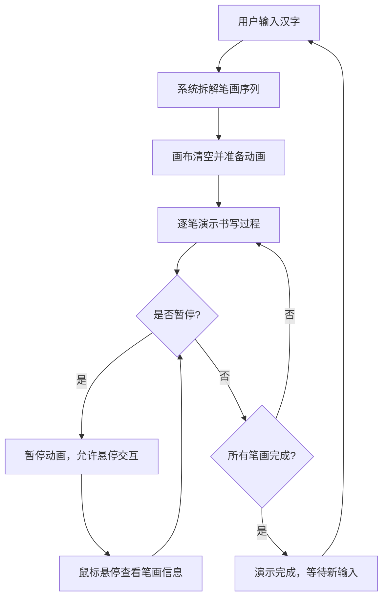

## 1. 产品概述

交互式手写汉字笔顺演示工具，帮助学中文的小朋友或外国人正确掌握汉字书写顺序。通过逐笔动画演示每个笔画的起笔、落笔和先后顺序，让用户直观理解汉字书写规则。

- 目标用户：学中文的儿童及外国学习者
- 核心价值：将抽象的笔顺规则转化为可视化、可交互的动态演示

## 2. 核心功能

### 2.1 用户角色

无需角色区分，所有用户均可直接使用全部功能。

### 2.2 功能模块

1. **主页（唯一页面）**：汉字输入、笔顺动画演示、播放控制、笔画交互

### 2.3 页面详情

| 页面名称 | 模块名称 | 功能描述 |
|---------|---------|---------|
| 主页 | 汉字输入框 | 输入简体汉字（最多4个字），聚焦时边框变#8d6e63 |
| 主页 | 主画布区域 | 640x480px白色画布，逐笔演示书写过程，每笔用#1565c0小圆点标记起笔位置和笔顺编号，笔画用黑色3px线宽圆角末端绘制，描完后先以半透明浅蓝色#bbdefb闪烁高亮0.3秒，再变为#9e9e9e灰色 |
| 主页 | 缩略图预览 | 左下角80x80px浅灰背景缩略图，标注已完成笔画比例，旁边显示"第X笔/共Y笔"文字（14px,#424242） |
| 主页 | 播放控制 | 连续速度滑块（范围0.3~1.0秒，步长0.1秒），下方显示当前速度数值（秒/笔），暂停/继续按钮，暂停时鼠标悬停笔画显示圆角白色标签（带浅灰边框和轻微阴影），标签内14px深色文字显示笔顺编号和方向提示，标签跟随鼠标移动避免遮挡 |

## 3. 核心流程

用户在输入框输入汉字 → 系统解析笔画数据 → 画布逐笔动画演示 → 用户可通过滑块调速或暂停 → 暂停时可悬停查看笔画详情 → 演示完毕可重新输入

## 4. 用户界面设计

### 4.1 设计风格

- 主色调：淡米色#faf3e0为背景，暖棕#8d6e63为强调色
- 按钮风格：圆角6px，填充色#8d6e63，悬浮#6d4c41，文字白色
- 输入框：圆角8px，边框1px solid #d4c5a9，聚焦边框#8d6e63
- 字体：中文使用系统默认衬线字体展示汉字，UI文字使用无衬线字体
- 布局风格：顶部操作栏 + 居中画布，简洁温暖
- 图标风格：简洁线条图标

### 4.2 页面设计概述

| 页面名称 | 模块名称 | UI元素 |
|---------|---------|--------|
| 主页 | 顶部操作栏 | 白色背景，高64px（移动端56px），底部2px边框#e0d8c8，内含输入框和控制按钮 |
| 主页 | 主画布区域 | 640x480px白色背景，四周8px淡灰#e0d8c8内阴影，居中放置，笔画完成时有半透明浅蓝色#bbdefb闪烁高亮0.3秒 |
| 主页 | 缩略图+进度提示 | 左下角80x80px缩略图，#f5f5f5浅灰背景，旁边14px文字#424242 |
| 主页 | 速度滑块 | 连续滑块（0.3s-1.0s，步长0.1s），下方显示当前速度数值（秒/笔） |
| 主页 | 暂停/继续按钮 | 圆角6px，#8d6e63填充，悬浮#6d4c41 |
| 主页 | 悬停提示标签 | 白色圆角背景，浅灰色边框，轻微阴影，14px深色文字，跟随鼠标移动 |

### 4.3 响应式适配

- 桌面端：操作栏高64px，画布640x480px固定尺寸
- 移动端：操作栏高56px，画布宽度缩放至96%，高度按比例自适应
- 触摸优化：控制按钮足够大（最小44px触控区域），滑块易于操作

### 4.4 性能要求

- 笔画动画帧率不低于50fps
- 输入汉字后拆解和渲染响应时间不超过200ms
- 每笔动画时长约0.3~0.8秒（可调）
