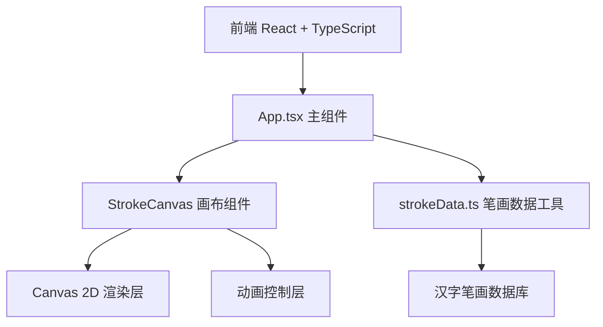

## 1. 架构设计



纯前端项目，无后端服务。所有笔画数据内置于前端工具模块中。

## 2. 技术说明

- 前端：React@18 + TypeScript + Vite
- 初始化工具：vite-init（react-ts模板）
- 状态管理：React useState/useRef（项目规模小，无需zustand）
- 后端：无
- 数据库：无（笔画数据硬编码在前端）

## 3. 路由定义

| 路由 | 用途 |
|------|------|
| / | 主页，包含输入、画布、控制全部功能 |

单页应用，无需路由。

## 4. 数据模型

### 4.1 笔画数据结构

```typescript
interface StrokePoint {
  x: number;
  y: number;
}

interface Stroke {
  id: number;
  start: StrokePoint;
  end: StrokePoint;
  direction: string;
  controlPoints?: StrokePoint[];
}

interface CharacterStrokes {
  char: string;
  strokes: Stroke[];
}
```

### 4.2 文件结构

| 文件 | 职责 |
|------|------|
| package.json | 依赖管理，启动脚本 |
| index.html | 入口HTML |
| vite.config.js | Vite构建配置，开发服务器端口3000 |
| tsconfig.json | TypeScript严格模式，jsx: react-jsx |
| src/App.tsx | 主组件，管理输入、播放状态和画布引用 |
| src/components/StrokeCanvas.tsx | 画布组件，笔画解析、动画绘制、暂停/速度控制 |
| src/utils/strokeData.ts | 笔画数据工具，解析汉字返回笔画序列 |

### 4.3 支持的汉字

至少包含：大、小、上、下、中、人、水、火、山、石

## 5. 动画实现策略

- 使用 Canvas 2D API 和 requestAnimationFrame 实现流畅动画
- 每笔动画通过插值（lerp）从起点到终点逐帧绘制
- 笔画路径使用贝塞尔曲线（controlPoints）实现曲线笔画
- 动画状态机：IDLE → PLAYING → PAUSED → COMPLETED
- 笔画完成高亮：刚完成的笔画用半透明浅蓝色#bbdefb闪烁0.3秒，再转为灰色#9e9e9e
- 缩略图使用独立的小Canvas或从主Canvas缩放渲染
- 速度控制：连续滑块（0.3-1.0秒，步长0.1秒），实时显示当前速度值
- 悬停提示：暂停时鼠标悬停显示跟随鼠标的圆角标签，包含笔画编号和方向描述
