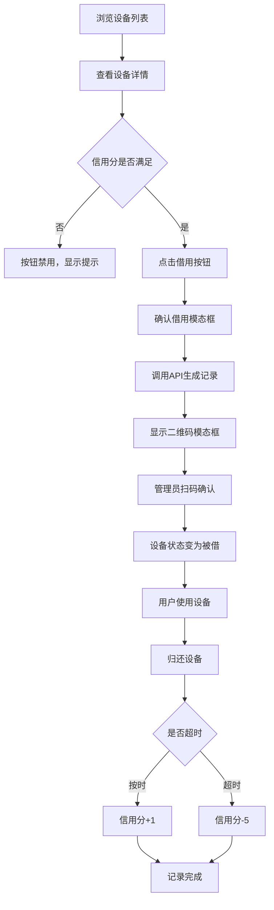

## 1. 产品概述

共享办公空间设备借用与信用评级应用，解决自由职业者临时借用设备时缺少统一登记系统的问题，实现设备可追溯、借还流程规范化、用户信用透明化。

- 目标用户：共享办公空间的自由职业者和设备管理员
- 核心价值：提高设备利用率，减少设备丢失，建立信用激励机制

## 2. 核心功能

### 2.1 用户角色

| 角色 | 注册方式 | 核心权限 |
|------|----------|----------|
| 普通用户 | 系统预设 | 浏览设备、发起借用、查看信用分、查看个人借用记录 |
| 管理员 | 系统预设 | 管理设备清单、处理超时归还、查看所有借用记录、标记归还 |

### 2.2 功能模块

1. **设备总览页**：设备卡片网格展示、状态筛选、借用操作
2. **设备详情页**：设备大图、技术参数、历史记录、借用按钮
3. **用户档案页**：头像展示、信用评分进度条、个人借用历史表格
4. **管理面板**：所有借用记录列表、归还操作、设备状态管理
5. **借用流程**：确认模态框、二维码生成与展示、状态自动更新

### 2.3 页面详情

| 页面名称 | 模块名称 | 功能描述 |
|---------|---------|----------|
| 设备总览页 | 设备卡片网格 | 每行4/3/2列响应式布局，显示缩略图、名称、类型、状态徽章、借用按钮 |
| 设备总览页 | 导航栏 | 固定高度60px，Logo、导航链接、当前页面下划线指示 |
| 设备详情页 | 设备信息展示 | 大图、技术参数、当前状态、最低信用分要求 |
| 设备详情页 | 历史记录列表 | 用户名首字母、借用时间、归还时间 |
| 用户档案页 | 信用评分展示 | 圆形进度条，0-100分红到绿渐变 |
| 用户档案页 | 借用历史表格 | 设备名称、借用时间、归还时间、状态色块 |
| 管理面板 | 记录管理 | 所有借用记录列表、标记归还操作 |
| 借用模态框 | 二维码展示 | 借用记录ID二维码，256px大小，居中显示 |

## 3. 核心流程

用户浏览设备列表 → 点击设备查看详情 → 点击借用按钮 → 确认借用 → 生成借用记录 → 显示二维码 → 管理员扫码确认 → 用户使用设备 → 归还设备 → 信用分更新

## 4. 用户界面设计

### 4.1 设计风格

- **主色调**：深蓝 #1e293b，渐变蓝 #3b82f6
- **背景色**：灰白 #f8fafc，卡片白色 #ffffff
- **状态色**：绿色 #22c55e（空闲/按时），黄色 #eab308（被借/超时），红色 #ef4444（维修/禁用）
- **按钮**：圆角8px，主色深蓝，禁用态 #94a3b8，悬浮时颜色加深
- **字体**：现代无衬线字体，标题18px semibold，正文14px regular，辅助文字12px
- **布局**：卡片式布局，顶部导航栏，内容区域留白充足
- **动效**：所有过渡0.3s ease-out，卡片悬浮上移4px，阴影加深

### 4.2 页面设计概述

| 页面名称 | 模块名称 | UI元素 |
|---------|---------|--------|
| 设备总览页 | 导航栏 | 深色背景，Logo文字，导航链接下划线指示 |
| 设备总览页 | 设备卡片 | 240×320px，圆角12px，白色背景，阴影0 2px 8px，悬浮上移4px |
| 设备总览页 | 状态徽章 | 圆角4px，8px内边距，12px文字 |
| 设备详情页 | 设备大图 | 100%宽度，圆角8px，自适应高度 |
| 设备详情页 | 借用按钮 | 底部固定，全宽，深蓝背景 |
| 用户档案页 | 信用进度条 | 圆形60px，边框2px，颜色渐变 |
| 用户档案页 | 历史表格 | 斑马纹，状态色块指示 |
| 二维码模态框 | 半透明遮罩 | #00000080，居中显示 |
| 二维码模态框 | 内容容器 | 白色背景，圆角12px，内边距16px |

### 4.3 响应式设计

- **大屏幕（≥1024px）**：每行4张卡片，间距24px
- **中屏幕（768-1023px）**：每行3张卡片，间距20px
- **小屏幕（<768px）**：每行2张卡片，宽度100%，高度自适应
- 导航栏在小屏幕转为汉堡菜单（简化为文字链接）
- 表格在小屏幕转为卡片式展示

### 4.4 性能指标

- 首次页面加载时间 ≤ 2秒
- API响应时间 ≤ 500毫秒
- 页面切换流畅度 60fps
- 用户操作反馈延迟 ≤ 100毫秒
- 设备列表分页，每页最多20个
- 使用虚拟滚动优化长列表渲染
