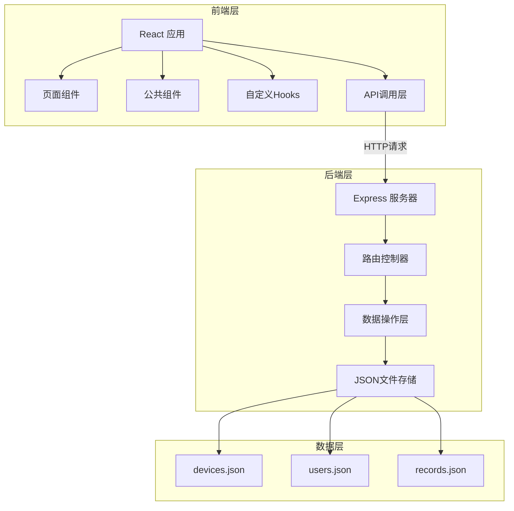
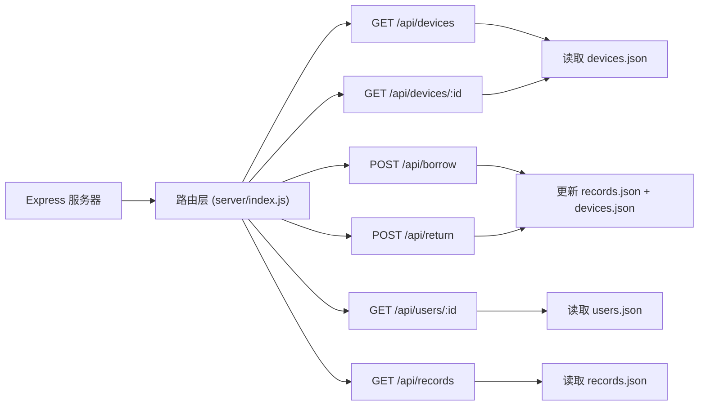
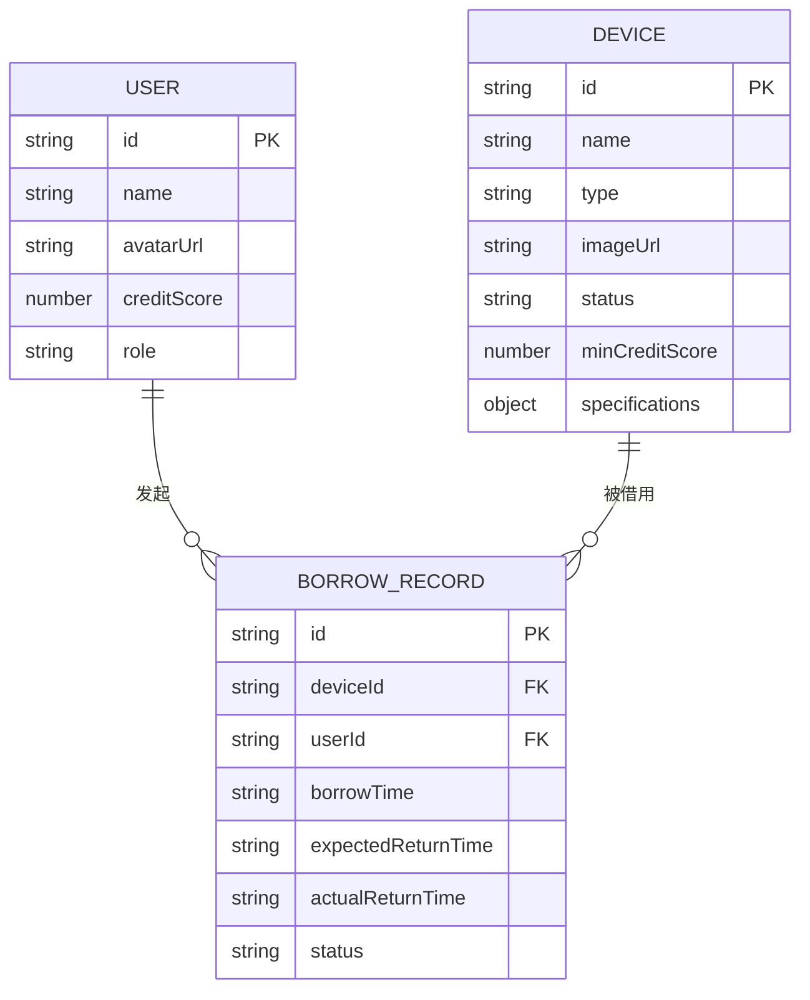

## 1. 架构设计



## 2. 技术描述

- **前端**：React 18 + TypeScript + Vite + React Router DOM 6
- **后端**：Express 4 + CORS + UUID + Day.js
- **构建工具**：Vite 5，开发服务器端口3000
- **数据存储**：JSON文件（devices.json, users.json, records.json）
- **UI库**：自定义组件，使用qrcode.react生成二维码
- **状态管理**：React useState/useEffect + 自定义Hook
- **图标**：lucide-react

## 3. 路由定义

| 路由 | 页面组件 | 功能描述 |
|------|---------|----------|
| `/overview` | Overview.tsx | 设备总览页，卡片网格展示 |
| `/device/:id` | DeviceDetail.tsx | 设备详情页，大图+参数+历史记录 |
| `/profile` | Profile.tsx | 用户档案页，信用分+历史表格 |
| `/admin` | Admin.tsx | 管理面板，所有记录管理 |
| `*` | Overview.tsx | 默认重定向到设备总览 |

## 4. API定义

```typescript
// 类型定义
interface Device {
  id: string;
  name: string;
  type: string;
  imageUrl: string;
  status: 'available' | 'borrowed' | 'maintenance';
  minCreditScore: number;
  specifications: Record<string, string>;
}

interface User {
  id: string;
  name: string;
  avatarUrl: string;
  creditScore: number;
  role: 'user' | 'admin';
}

interface BorrowRecord {
  id: string;
  deviceId: string;
  userId: string;
  borrowTime: string;
  expectedReturnTime: string;
  actualReturnTime: string | null;
  status: 'borrowing' | 'returned_on_time' | 'returned_overdue';
}

// API响应类型
interface ApiResponse<T> {
  success: boolean;
  data?: T;
  error?: string;
}

// API接口
// GET /api/devices - 获取所有设备列表
// GET /api/devices/:id - 获取设备详情
// POST /api/borrow - 创建借用记录
// POST /api/return - 归还设备
// GET /api/users/:id - 获取用户信息
// GET /api/records?userId=xxx - 获取借用记录列表
```

## 5. 服务器架构图



## 6. 数据模型

### 6.1 数据模型定义



### 6.2 初始数据

**devices.json**：预置8-12个设备，包含显示器、耳机、投影仪等类型，状态混合（空闲/被借/维修）

**users.json**：预置3-5个用户，包含1个管理员，信用分在70-100之间

**records.json**：预置5-8条借用记录，包含不同状态（借用中/按时归还/超时归还）

## 7. 文件结构与调用关系

```
├── package.json              # 项目依赖与脚本
├── vite.config.js            # Vite构建配置
├── tsconfig.json             # TypeScript配置
├── index.html                # 入口HTML
├── src/
│   ├── App.tsx               # 根组件，路由配置
│   ├── main.tsx              # 应用入口
│   ├── api/
│   │   └── borrowApi.ts      # API调用模块 → 被useBorrow调用
│   ├── hooks/
│   │   └── useBorrow.ts      # 自定义Hook → 调用borrowApi，被组件调用
│   ├── components/
│   │   ├── DeviceCard.tsx    # 设备卡片 → 使用useBorrow
│   │   ├── Navbar.tsx        # 导航栏组件
│   │   ├── QRModal.tsx       # 二维码模态框
│   │   └── ConfirmModal.tsx  # 确认模态框
│   ├── pages/
│   │   ├── Overview.tsx      # 设备总览页 → 使用DeviceCard
│   │   ├── DeviceDetail.tsx  # 设备详情页 → 使用useBorrow
│   │   ├── Profile.tsx       # 用户档案页
│   │   └── Admin.tsx         # 管理面板
│   ├── types/
│   │   └── index.ts          # 类型定义
│   └── utils/
│       └── constants.ts      # 常量配置
├── server/
│   └── index.js              # Express后端 → 读取data目录JSON文件
└── data/
    ├── devices.json          # 设备数据
    ├── users.json            # 用户数据
    └── records.json          # 借用记录数据

调用流向：
页面组件 → 自定义Hook(useBorrow) → API层(borrowApi) → Express后端 → JSON文件存储
```
