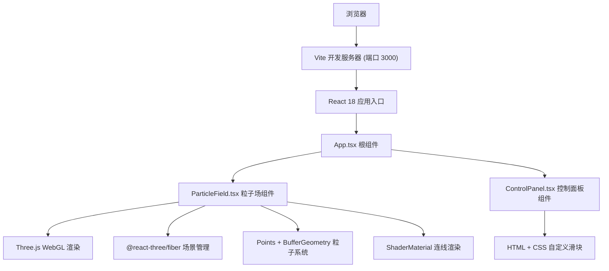

## 1. 架构设计



## 2. 技术描述

- **前端框架**：React 18 + TypeScript
- **3D渲染引擎**：Three.js + @react-three/fiber + @react-three/drei
- **构建工具**：Vite 5.x
- **开发服务器端口**：3000
- **粒子系统**：Three.js Points + BufferGeometry 批量渲染800个粒子
- **连线渲染**：自定义 ShaderMaterial 实现动态粒子连线
- **粒子发光**：片段着色器径向渐变模拟发光效果
- **颜色系统**：基于速度的三色渐变（深蓝→青色→亮黄）
- **物理模拟**：自定义粒子运动系统（推力、阻尼、抖动、平滑恢复）

### 项目依赖清单
| 依赖包 | 版本范围 | 用途 |
|-------|---------|------|
| react | ^18.2.0 | UI框架 |
| react-dom | ^18.2.0 | React DOM渲染 |
| three | ^0.160.0 | 3D渲染引擎 |
| @react-three/fiber | ^8.15.0 | React Three.js 绑定 |
| @react-three/drei | ^9.92.0 | Three.js 工具组件 |
| typescript | ^5.3.0 | 类型系统 |
| vite | ^5.0.0 | 构建工具 |
| @vitejs/plugin-react | ^4.2.0 | React Vite插件 |
| @types/react | ^18.2.0 | React类型定义 |
| @types/react-dom | ^18.2.0 | React DOM类型定义 |
| @types/three | ^0.160.0 | Three.js类型定义 |

## 3. 项目结构

```
auto22/
├── package.json           # 依赖配置
├── vite.config.js         # Vite构建配置
├── tsconfig.json          # TypeScript配置
├── index.html             # 入口HTML
└── src/
    ├── main.tsx           # React应用入口
    ├── App.tsx            # 根组件
    ├── ParticleField.tsx  # 粒子场核心组件
    └── ControlPanel.tsx   # 控制面板组件
```

## 4. 数据模型

### 4.1 粒子数据结构
```typescript
interface ParticleData {
  positions: Float32Array;    // 粒子位置 (x, y, z) * 800
  velocities: Float32Array;   // 粒子速度 (vx, vy) * 800
  colors: Float32Array;       // 粒子颜色 (r, g, b) * 800
  sizes: Float32Array;        // 粒子大小 * 800
}
```

### 4.2 控制面板参数
```typescript
interface ControlParams {
  thrustStrength: number;     // 推力强度 0.5 - 3.0
  particleSize: number;       // 粒子大小 1 - 6px
  lineThreshold: number;      // 连线阈值 10 - 60px
}
```

### 4.3 鼠标状态
```typescript
interface MouseState {
  isDragging: boolean;        // 是否按住鼠标
  position: { x: number; y: number };  // 鼠标位置（归一化坐标）
  releaseTime: number;        // 释放时间戳，用于平滑恢复
}
```

## 5. 核心算法

### 5.1 粒子颜色渐变
```
速度区间映射：
speed < 0.5: 深蓝 #1565c0 → 青色 #00bcd4 (线性插值)
0.5 ≤ speed < 2.0: 青色 #00bcd4 → 亮黄 #fdd835 (线性插值)
speed ≥ 2.0: 亮黄 #fdd835
```

### 5.2 推力计算
```
distance = 粒子到鼠标距离
if distance < 80:
  thrustFactor = (1 - distance / 80) * thrustStrength
  direction = normalize(particlePos - mousePos)  // 向外推开
  velocity += direction * thrustFactor + randomJitter
```

### 5.3 运动更新
```
velocity *= damping  // damping = 0.9
velocity += randomNoise * jitter  // jitter = 1.2
position += velocity
```

### 5.4 平滑恢复算法
```
recoveryTime = 1000ms
elapsed = currentTime - releaseTime
if elapsed < recoveryTime:
  t = elapsed / recoveryTime
  userForceInfluence = 1 - t
  randomWalkInfluence = t
  velocity = velocity * userForceInfluence + randomVelocity * randomWalkInfluence
else:
  // 完全随机游走
```

## 6. 性能优化策略

1. **BufferGeometry批量渲染**：800个粒子使用单个Points对象，避免多次draw call
2. **ShaderMaterial连线**：使用着色器计算连线，减少CPU-GPU数据传输
3. **requestAnimationFrame帧循环**：与浏览器刷新率同步，稳定50FPS+
4. **TypedArray数据存储**：使用Float32Array存储粒子数据，内存高效
5. **距离平方比较**：连线检测使用距离平方避免开方运算
6. **对象池复用**：避免在动画循环中创建新对象，减少GC
