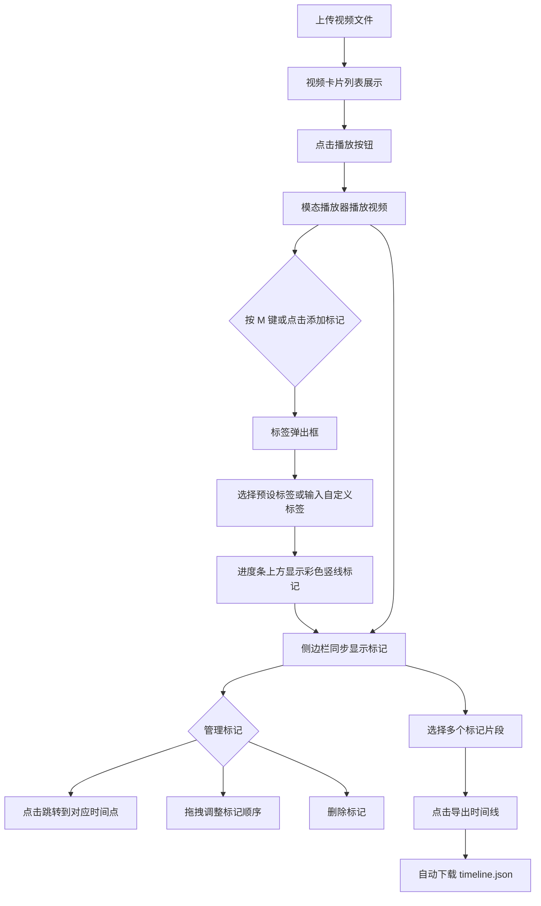

## 1. 产品概述

ClipMarker 是一款面向音视频创作者的素材标记与分类工具，帮助用户快速标记和分类视频片段，并导出剪辑时间线草稿。主要解决大量原始素材难以检索和人工整理耗时的问题。

- 目标用户：视频剪辑师、自媒体创作者、影视后期制作人员
- 核心价值：将素材标记流程从人工记忆转变为结构化数据管理，提升剪辑前期整理效率

## 2. 核心功能

### 2.1 功能模块

1. **视频上传页面**：拖拽/点击上传区域、视频卡片列表展示
2. **视频播放与标记页面**：模态播放器、进度条标记、标签弹出框
3. **标记管理侧边栏**：标记列表展示、排序/删除/跳转操作
4. **时间线导出功能**：多选标记片段、生成 JSON 剪辑草稿

### 2.2 页面详情

| 页面 | 模块 | 功能描述 |
|------|------|----------|
| 主页面 | 视频上传区 | 支持拖拽或点击上传 MP4/MOV 文件（单个≤200MB），上传后以横向卡片展示，卡片 320×180px，圆角 8px，背景 #1e1e1e，右侧显示文件名、时长（mm:ss）、文件大小，左下方播放按钮（圆形 36px，#ff5722 背景，白色三角图标） |
| 主页面 | 模态播放器 | 点击播放按钮弹出，640×360px，带进度条和时间戳标记，支持 M 键或按钮添加标记 |
| 主页面 | 标签弹出框 | 输入框 + 10 个预设标签（A-Roll、B-Roll、采访、空镜、特效等），每个 60×24px，圆角 12px，颜色从 #e53935 到 #1e88e5 渐变 |
| 主页面 | 标记侧边栏 | 宽 240px，背景 #252525，按视频分组、按时间排序，每行含时间戳、标签名、32×32px 缩略图，支持点击跳转、拖拽排序、删除 |
| 主页面 | 导出功能 | 多选标记片段，导出 JSON（含视频路径、起止时间精确到帧、标签信息、排序），自动下载为 timeline.json |

## 3. 核心流程

## 4. 用户界面设计

### 4.1 设计风格

- 主题：暗色工业风，深色背景配高对比度强调色
- 主色：背景 #121212，主文字 #e0e0e0，强调色 #ff5722
- 按钮：圆角按钮，点击时 0.2s 缩放效果（scale 0.95）
- 字体：系统字体栈，标题加粗突出
- 布局：左右结构，左侧 75% 视频区 + 右侧 240px 标记栏

### 4.2 页面设计概览

| 页面 | 模块 | UI 元素 |
|------|------|---------|
| 主页面 | 上传区 | 虚线边框拖拽区、点击上传按钮、文件类型提示 |
| 主页面 | 视频卡片 | 深灰背景卡片、视频缩略图、文件信息、播放按钮 |
| 主页面 | 播放器 | 640×360 视频区、进度条、时间戳、彩色标记线、控制按钮 |
| 主页面 | 标签弹出框 | 输入框、彩色预设标签网格 |
| 主页面 | 侧边栏 | 视频分组标题、标记行列表、复选框、删除按钮 |
| 主页面 | 导出按钮 | 底部固定、强调色背景 |

### 4.3 响应式

- 桌面优先设计，左右布局
- 屏幕 < 768px 时切换为上下单列滚动布局
- 侧边栏转为底部面板

### 4.4 交互细节

- 所有按钮点击时 scale(0.95) 动画 0.2s
- 标记竖线悬停显示标签名和时间 tooltip
- 拖拽标记时有视觉反馈
- 视频播放和标记操作保持 ≥ 30FPS
