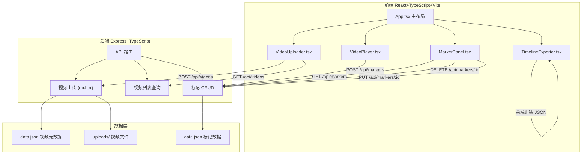
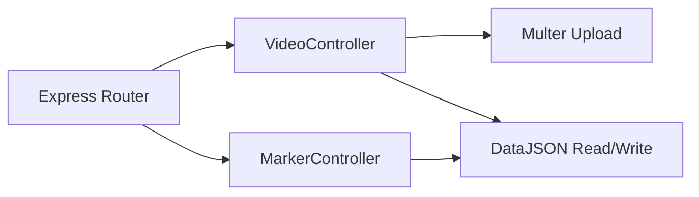
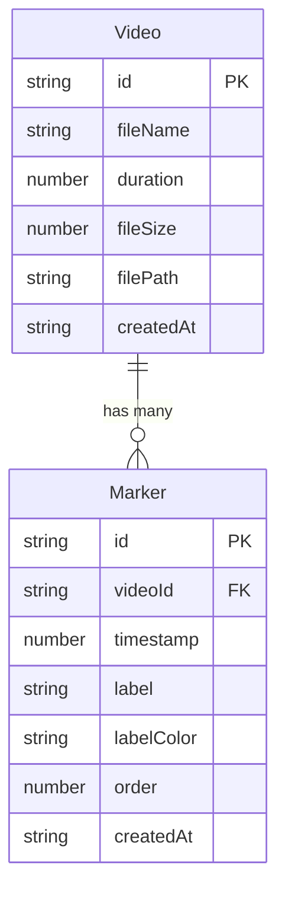

## 1. 架构设计



## 2. 技术说明

- 前端：React 18 + TypeScript + Vite + Tailwind CSS
- 初始化工具：vite-init（react-express-ts 模板）
- 后端：Express 4 + TypeScript + multer（文件上传）+ cors
- 数据存储：JSON 文件（server/data.json）
- 状态管理：Zustand

## 3. 路由定义

| 路由 | 用途 |
|------|------|
| / | 主页面，包含视频上传、播放器、标记面板 |

## 4. API 定义

### 4.1 视频相关

```typescript
// 上传视频
POST /api/videos
Content-Type: multipart/form-data
Body: { video: File }
Response: { id: string, fileName: string, duration: number, fileSize: number, filePath: string, thumbnailPath: string }

// 获取视频列表
GET /api/videos
Response: Array<{
  id: string
  fileName: string
  duration: number
  fileSize: number
  filePath: string
  thumbnailPath: string
  createdAt: string
}>
```

### 4.2 标记相关

```typescript
// 获取某视频的标记
GET /api/markers?videoId=xxx
Response: Array<{
  id: string
  videoId: string
  timestamp: number
  label: string
  labelColor: string
  order: number
  createdAt: string
}>

// 添加标记
POST /api/markers
Body: { videoId: string, timestamp: number, label: string, labelColor: string }
Response: { id: string, videoId: string, timestamp: number, label: string, labelColor: string, order: number }

// 更新标记
PUT /api/markers/:id
Body: { timestamp?: number, label?: string, labelColor?: string, order?: number }
Response: { id: string, ... }

// 删除标记
DELETE /api/markers/:id
Response: { success: boolean }
```

## 5. 服务器架构图



## 6. 数据模型

### 6.1 数据模型定义



### 6.2 数据定义

```json
{
  "videos": [],
  "markers": []
}
```

## 7. 文件组织

| 文件路径 | 用途 |
|----------|------|
| package.json | 依赖与启动脚本 |
| vite.config.js | Vite 配置，端口 3000，代理 /api 到 4000 |
| tsconfig.json | TypeScript 严格模式配置 |
| index.html | 入口页面，标题 ClipMarker |
| src/App.tsx | 主组件，管理路由和整体布局 |
| src/VideoUploader.tsx | 文件上传、拖拽和列表展示 |
| src/VideoPlayer.tsx | 播放器组件，含进度条标记、标签弹出框 |
| src/MarkerPanel.tsx | 侧边栏组件，展示和管理所有标记 |
| src/TimelineExporter.tsx | 导出 JSON 时间线的工具函数组件 |
| server/index.ts | Express 后端，提供 API |
| server/data.json | 初始化空数据文件 |
