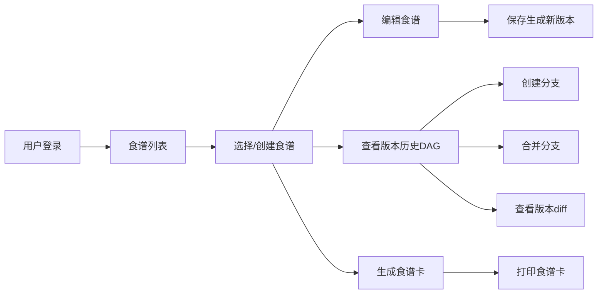

## 1. 产品概述

本项目是一个在线协作食谱编辑与版本管理应用，让家庭厨师们可以像程序员管理代码一样，对食谱进行创建、分支、合并和回滚操作，并生成最终的可打印食谱卡。

- **核心功能**：食谱的版本控制管理（创建、编辑、分支、合并、回滚），DAG版本历史可视化，版本差异对比，可打印食谱卡生成
- **目标用户**：家庭厨师、烹饪爱好者、美食博主
- **产品价值**：提供专业的食谱版本管理工具，让食谱迭代像代码版本控制一样清晰可追溯

## 2. 核心特性

### 2.1 用户角色

| 角色 | 注册方式 | 核心权限 |
|------|----------|----------|
| 普通用户 | 用户名密码注册 | 创建/编辑食谱、管理版本、分支合并、生成食谱卡 |

### 2.2 功能模块

1. **用户认证模块**：用户注册、登录、退出
2. **食谱管理模块**：食谱列表、创建新食谱、编辑食谱、删除食谱
3. **版本控制模块**：自动版本生成、版本历史记录、分支创建、合并分支、版本回滚
4. **版本可视化模块**：DAG有向无环图展示版本历史、节点交互、版本diff对比
5. **食谱卡模块**：食谱卡预览、打印功能

### 2.3 页面详情

| 页面名称 | 模块名称 | 功能描述 |
|----------|----------|----------|
| 登录页 | 用户认证 | 用户输入用户名密码登录或注册新账号 |
| 首页 | 食谱列表 + 编辑区 | 左侧食谱列表，右侧主编辑区（编辑器/版本图/食谱卡） |
| 食谱编辑页 | 编辑器 | 双栏布局：左栏食材输入，右栏步骤输入，支持实时保存生成新版本 |
| 版本历史页 | 版本DAG图 | 力导向图展示版本分支和合并历史，节点可点击查看diff |
| 食谱卡预览页 | 食谱卡组件 | 信用卡大小的食谱卡预览，支持打印 |

## 3. 核心流程

### 用户主流程
用户登录后进入首页，查看左侧食谱列表，选择或创建食谱。在编辑区可以切换编辑器、版本图、食谱卡三种视图。在编辑器中修改食谱后保存自动生成新版本。在版本图中可以创建分支、合并分支、查看版本差异。随时可以从任意版本生成并打印食谱卡。

## 4. 用户界面设计

### 4.1 设计风格

- **主色调**：#f5deb3（小麦色）
- **辅色调**：#8b4513（棕色）
- **背景色**：#fdf5e6（浅米色）
- **卡片背景**：#fff8e7（暖白）
- **按钮样式**：圆角8px，悬停时放大1.05倍、加深阴影，点击时缩回，过渡动画0.15s
- **字体**：使用"Noto Serif SC"和"Noto Sans SC"搭配，标题用衬线字体，正文用无衬线字体
- **布局**：顶部导航栏（60px高，白色，阴影），左侧食谱列表（280px宽，圆角8px，粘性定位），右侧主编辑区
- **图标风格**：使用lucide-react图标库，线性风格，棕色系配色

### 4.2 页面设计概览

| 页面名称 | 模块名称 | UI元素 |
|----------|----------|---------|
| 登录页 | 登录表单 | 居中卡片布局，柔和阴影，输入框聚焦动画 |
| 首页 | 导航栏 | 固定高度60px，白色背景，阴影0 2px 4px rgba(0,0,0,0.1) |
| 首页 | 食谱列表 | 宽280px，圆角8px，粘性定位，卡片悬停背景#fff3e0，过渡0.2s |
| 编辑页 | 编辑器 | 双栏布局，输入框聚焦边框#ffb74d，阴影淡出0.3s |
| 版本图页 | DAG图 | d3-force力导向布局，节点圆形24px，主分支#4caf50，分支#ff9800，合并节点#9c27b0，SVG连线箭头 |
| 食谱卡页 | 食谱卡 | 85mm×55mm，背景#fff8e7，圆角4px，左竖排名称#3e2723粗体，中食材表格，右编号步骤背景#f5f0e1 |

### 4.3 响应式设计

- **桌面优先**：默认三栏布局（导航+列表+主区）
- **平板（<1024px）**：左侧食谱列表宽度缩小到240px
- **移动端（<768px）**：左侧食谱列表变为可折叠抽屉，从左侧滑入，过渡动画0.3s缓动，编辑区域占满全宽

### 4.4 动画与交互

- **页面加载**：元素渐入动画， staggered 延迟显示
- **按钮交互**：hover放大1.05倍+阴影加深，active缩回，0.15s过渡
- **卡片悬停**：背景色变化+轻微上浮，0.2s过渡
- **抽屉动画**：左侧滑入/滑出，0.3s ease-in-out
- **节点拖拽**：d3-force弹簧动画，平滑流畅
- **输入框聚焦**：边框颜色变化+阴影淡出，0.3s过渡

## 5. 性能要求

- **DAG布局计算**：超过50个节点时，布局计算在100ms内完成
- **动画帧率**：版本图动画保持在50FPS以上
- **版本diff**：相邻版本对比在300ms内渲染完成
- **食谱卡打印**：调用浏览器打印功能，隐藏所有UI只显示食谱卡
